# Just Natural Expansion
### A Cookie Clicker Mod

## Table of Contents
* [Installation Directions](https://github.com/dfsw/Just-Natural-Expansion?tab=readme-ov-file#installation-directions)
* [Mod Compatibility](https://github.com/dfsw/Just-Natural-Expansion?tab=readme-ov-file#mod-compatibility)
* [New Achievements](https://github.com/dfsw/Just-Natural-Expansion?tab=readme-ov-file#new-achievements)
* [New Upgrades](https://github.com/dfsw/Just-Natural-Expansion?tab=readme-ov-file#new-upgrades)
* [Mysteries of the Cookie Age](https://github.com/dfsw/Just-Natural-Expansion?tab=readme-ov-file#Mysteries-of-the-Cookie-Age)
* [Javascript Console Minigame: Terminal](https://github.com/dfsw/Just-Natural-Expansion?tab=readme-ov-file#javascript-console-minigame-terminal)
* [Changelog](https://github.com/dfsw/Just-Natural-Expansion?tab=readme-ov-file#changelog)

**The Just Natural Expansion Mod** enhances the Cookie Clicker endgame without disrupting core gameplay, staying true to the spirit of the vanilla experience. It introduces over **450 achievements**, **250 upgrades**, new goals, new stories, and deeply rooted hidden elements, all specifically designed for late-game progression, so early or mid-game players may not immediately notice changes. 

By default, the mod adds no upgrades and marks new achievements as shadow, allowing leaderboard and competition focused players to pursue extra challenges without affecting their current gameplay. 

Players aiming for higher scores and a more rewarding late-game can enable Cookie, Kitten, and Building upgrades, while also converting shadow achievements into regular ones to gain extra milk for their efforts. These upgrades can be disabled at any time, and shadow achievements can be re-enabled via the options menu. However, a permanent shadow achievement will be awarded to mark that you have used the mod outside of leaderboard/competition mode.

Many achievements are tracked across multiple ascensions or involve progress that the base game does not normally record, such as popping Shiny Wrinklers. While you may have already completed some of these, there is no way to determine your progress on them unless the mod was installed at the time they were achieved. Progress on items not tracked by the vanilla game or not carried across ascensions will only start being recorded once the mod is active. You can view additional tracked stats and their current values in the Stats menu.

**All new achievements are designed to be attainable, though some require significant effort, some even taking weeks of focused effort to earn. Thank you for playing! If you enjoy the mod, please spread the word!**

#### Special Thanks

Big, chocolate-covered thanks to the amazing folks in the [Cookie Clicker Discord](https://discord.com/invite/cookie), whose late-game wisdom and strategic tips helped shape this mod into the crunchy masterpiece it is today. 

Thank you to the beta testers who were willing to help me balance and test, I have now struck a balance between people saying these achivements are too hard and these achievements are too easy, which I suspect is the sweet middle ground. 

#### Why This Mod Exists

When I reached the late game of Cookie Clicker, I felt a real sense of loss. I was running out of meaningful goals. I looked for mods that could extend the experience without radically changing the core gameplay.

Most of what I found didn’t fit. Many end-game mods added flashy new buildings or mechanics that didn’t feel true to vanilla and often weren’t balanced. Others offered extremely difficult, sometimes nearly impossible, achievements. Those were closer to what I wanted, but I wasn’t looking for “impossible.” I wanted more of what made the base game fun.

So I set out to imagine what Cookie Clicker would feel like if it simply lasted longer with deeper goals to chase. Achievements are challenging but not unreasonable, designed for active players who like having long-term targets. Nothing breaks the existing formula (though I had to heavily nerf the new kittens to keep them balanced). The intent was always to extend the game, not reinvent it. Do not expect to knock out these achievements or upgrades in a few days. Many require weeks of planning and patience. The idea is to add lasting goals, not hand out free milk and CPS.

I hope this mod hits that mark and gives you years more clicking, planning, and cookie glory. If not, I’ll still enjoy it myself, since I built what I wanted to play. If you do find something broken or unreasonable, reach out on Discord (User: DFSW). I am always happy to discuss and evaluate.

## Installation Directions

Installing mods and add-ons for Cookie Clicker can feel intimidating if you’ve never done it before. To get some background, check out this [guide from the wiki](https://cookieclicker.fandom.com/wiki/Add-Ons) Below, you’ll find specific instructions to help you get everything set up.

#### Web (Preferred)

##### [CookieClickerModManager](https://github.com/klattmose/CookieClickerModManager) - Recommended
`https://cdn.jsdelivr.net/gh/dfsw/Just-Natural-Expansion@latest/JustNaturalExpansion.js`

##### [Bookmarklet](https://www.freecodecamp.org/news/what-are-bookmarklets/)
```javascript
javascript:(function(){Game.LoadMod('https://cdn.jsdelivr.net/gh/dfsw/Just-Natural-Expansion@latest/JustNaturalExpansion.js');})();
```

##### Direct Console Loading
```javascript
Game.LoadMod('https://cdn.jsdelivr.net/gh/dfsw/Just-Natural-Expansion@latest/JustNaturalExpansion.js');
```

#### Steam
Link to [Mod Loader](https://steamcommunity.com/sharedfiles/filedetails/?id=3572744159) on Steam. You can also search for Just Natural Expansion in the Cookie Clicker Steam Workshop.

#### Console (untested - but should work in theory)
```javascript
Game.LoadMod('https://cdn.jsdelivr.net/gh/dfsw/Just-Natural-Expansion@latest/JustNaturalExpansion.js');
```

#### Mobile
The mobile version of Cookie Clicker does not support mods at this time.

#### Compatibility Notes
- **CCSE Compatible**: Works with Cookie Clicker Script Extender
- **CCMM Compatible**: Works with Cookie Clicker Mod Manager
- **Load Order**: For best compatibility, load CCSE first, then this mod
- **Browser Support**: Works in all modern browsers 

#### Mod Compatibility

Just Natural Expansion uses Cookie Clicker’s documented API layer to extend the core game. As a result, Just Natural Expansion should remain functional for years to come—even if I get hit by a bus. However this API is fairly limited, so many modders rely on [CCSE](https://klattmose.github.io/CookieClicker/CCSE-POCs/). 

Unfortunately, CCSE uses code injection to make fundamental changes to the vanilla game’s source code, which breaks the built-in modding API in a handful of places. To address this, I’ve written a CCSE Bridge that allows CCSE mods and Just Natural Expansion to run together. The catch: **CCSE must be loaded before** Just Natural Expansion, so make sure JNE is last in your load order. Other modders are welcome to use my bridge code (located in the same repo) if they prefer a more vanilla mod approach. 

I’ve tested compatibility with many popular [CCSE mods](https://klattmose.github.io/CookieClicker/). If you encounter specific incompatibilities, please let me know so I can look into possible workarounds.

# New Achievements

### Challenge Achievements (19 achievements)
*Note: Yes, these challenges are all doable, and no, none of them are absurdly impossible (No [ECM Style](https://lookas123.github.io/ECM/) Here). But don’t expect a free ride. These achievements will not hold your hand, and they will not go easy on you. Think of them less as a grind and more as puzzles that demand clever planning, precise timing, and maybe a lucky cookie or a well-placed upgrade. This is late-game content meant to extend your playtime, not something to finish in a single week.*

##### Requires Born Again Mode
<table>
<thead>
<tr>
<th width="48">Icon</th>
<th>Achievement Name</th>
<th>Requirement</th>
</tr>
</thead>
<tbody>
<tr>
<td width="48"><a href="./assets/generated-icons/SheetVanilla1306.png"></a></td>
<td><strong>Hardercorest</strong></td>
<td>Bake <strong>3 billion cookies</strong> with no cookie clicks and no upgrades bought in Born Again mode</td>
</tr>
<tr>
<td width="48"><a href="./assets/generated-icons/SheetVanilla1406.png">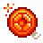</a></td>
<td><strong>Hardercorest-er</strong></td>
<td>Bake <strong>1 billion cookies</strong> with no more than 20 clicks, no more than 20 buildings (no selling), and no more than 20 upgrades in Born Again mode</td>
</tr>
<tr>
<td width="48"><a href="./assets/generated-icons/SheetVanilla1307.png">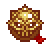</a></td>
<td><strong>The Final Countdown</strong></td>
<td>Own exactly 15 Cursors, 14 Grandmas, 13 Farms, yada yada yada, down to 1 Chancemaker. No selling or sacrificing any buildings. Must be earned in Born Again mode. See <a href="https://github.com/dfsw/Just-Natural-Expansion?tab=readme-ov-file#version-0011">Changelog</a> for Version 0.0.11 for more info.</td>
</tr>
<tr>
<td width="48"><a href="./assets/generated-icons/SheetVanilla1407.png"></a></td>
<td><strong>Really more of a dog person</strong></td>
<td>Bake <strong>1 billion cookies per second</strong> without buying any kitten upgrades in Born Again mode</td>
</tr>
<tr>
<td width="48"><a href="./assets/generated-icons/SheetCustom2309.png"></a></td>
<td><strong>Gilded Restraint</strong></td>
<td>Bake <strong>1 trillion cookies</strong> without ever clicking a golden cookie, must be done in Born Again mode</td>
</tr>
<tr>
<td width="48"><a href="./assets/generated-icons/SheetCustom2310.png"></a></td>
<td><strong>Back to Basic Bakers</strong></td>
<td>Reach <strong>1 million cookies per second</strong> using only Cursors and Grandmas (no other buildings), must be done in Born Again mode</td>
</tr>
<tr>
<td width="48"><a href="./assets/generated-icons/SheetCustom2311.png">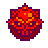</a></td>
<td><strong>Modest Portfolio</strong></td>
<td>Reach <strong>1 quadrillion cookies</strong> without ever owning more than 10 of any building type (no selling), must be done in Born Again mode</td>
</tr>
<tr>
<td width="48"><a href="./assets/generated-icons/SheetCustom2303.png"></a></td>
<td><strong>Difficult Decisions</strong></td>
<td>Bake <strong>1 billion cookies</strong> without ever having more than <strong>25 combined upgrades or buildings</strong> at any given time, must be done in Born Again mode</td>
</tr>
<tr>
<td width="48"><a href="./assets/generated-icons/SheetCustom2304.png"></a></td>
<td><strong>Laid in Plain Sight</strong></td>
<td>Bake <strong>10 cookies per second</strong> without purchasing any buildings, must be done in Born Again mode</td>
</tr>
</tbody>
</table>


##### Can Be Done In Any Mode
<table>
<thead>
<tr>
<th width="48">Icon</th>
<th>Achievement Name</th>
<th>Requirement</th>
</tr>
</thead>
<tbody>
<tr>
<td width="48"><a href="./assets/generated-icons/SheetVanilla2515.png">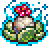</a></td>
<td><strong>I feel the need for seed</strong></td>
<td>Unlock all garden seeds within <strong>5 days</strong> of your last garden sacrifice. Look this one is tricky, if you reload or load a save the 5 day timer is invalidated, so you cant load in a completed garden.</td>
</tr>
<tr>
<td width="48"><a href="./assets/generated-icons/SheetVanilla1804.png">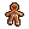</a></td>
<td><strong>Holiday Hoover</strong></td>
<td>Collect all seasonal drops within <strong>60 minutes</strong> of an Ascension start</td>
</tr>
<tr>
<td width="48"><a href="./assets/generated-icons/SheetVanilla1709.png">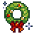</a></td>
<td><strong>Merry Mayhem</strong></td>
<td>Collect all seasonal drops within <strong>40 minutes</strong> of an Ascension start</td>
</tr>
<tr>
<td width="48"><a href="./assets/generated-icons/SheetCustom0009.png"></a></td>
<td><strong>Second Life, First Click</strong></td>
<td>Click a golden cookie within <strong>120 seconds</strong> of ascending</td>
</tr>
<tr>
<td width="48"><a href="./assets/generated-icons/SheetVanilla1207.png">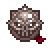</a></td>
<td><strong>We dont need no heavenly chips</strong></td>
<td>Own at least <strong>333 of every building type</strong>, without owning the 'Heavenly chip secret' upgrade</td>
</tr>
<tr>
<td width="48"><a href="./assets/generated-icons/SheetCustom2305.png"></a></td>
<td><strong>Precision Nerd</strong></td>
<td>Have exactly <strong>1,234,567,890 cookies</strong> in your bank and hold it for <strong>60 seconds</strong></td>
</tr>
<tr>
<td width="48"><a href="./assets/generated-icons/SheetCustom2312.png">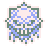</a></td>
<td><strong>Treading water</strong></td>
<td>Have a CPS of 0 while owning more than 1000 buildings with no active buffs or debuffs</td>
</tr>
<tr>
<td width="48"><a href="./assets/generated-icons/SheetCustom2314.png"></a></td>
<td><strong>Bouncing the last cheque</strong></td>
<td>Reach less than 10 cookies in your bank after having at least 1 million cookies</td>
</tr>
<tr>
<td width="48"><a href="./assets/generated-icons/SheetCustom2313.png"></a></td>
<td><strong>Massive Inheritance</strong></td>
<td>Have a bank of at least <strong>1 Novemdecillion cookies</strong> within 10 minutes of ascending</td>
</tr>
<tr>
<td width="48"><a href="./assets/generated-icons/SheetCustom1412.png"></a></td>
<td><strong>The Final Challenger</strong></td>
<td>Win <strong>10</strong> of the Just Natural Expansion <strong>Challenge Achievements</strong></td>
</tr>
</tbody>
</table>


### Minigame Achievements (29 achievements)

#### Stock Market
<table>
<thead>
<tr>
<th width="48">Icon</th>
<th>Achievement Name</th>
<th>Requirement</th>
</tr>
</thead>
<tbody>
<tr>
<td width="48"><a href="./assets/generated-icons/SheetVanilla1706.png"></a></td>
<td><strong>Doughfolio Debut</strong></td>
<td>Have <strong>$25 million</strong> in stock market profits across all ascensions</td>
</tr>
<tr>
<td width="48"><a href="./assets/generated-icons/SheetVanilla2607.png"></a></td>
<td><strong>Crumb Fund Manager</strong></td>
<td>Have <strong>$100 million</strong> in stock market profits across all ascensions</td>
</tr>
<tr>
<td width="48"><a href="./assets/generated-icons/SheetVanilla3333.png">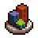</a></td>
<td><strong>Biscuit Market Baron</strong></td>
<td>Have <strong>$250 million</strong> in stock market profits across all ascensions</td>
</tr>
<tr>
<td width="48"><a href="./assets/generated-icons/SheetVanilla2829.png">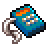</a></td>
<td><strong>Fortune Cookie Tycoon</strong></td>
<td>Have <strong>$500 million</strong> in stock market profits across all ascensions</td>
</tr>
<tr>
<td width="48"><a href="./assets/generated-icons/SheetVanilla3108.png">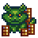</a></td>
<td><strong>Dough Jones Legend</strong></td>
<td>Have <strong>$1 billion</strong> in stock market profits across all ascensions</td>
</tr>
<tr>
<td width="48"><a href="./assets/generated-icons/SheetVanilla1508.png">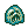</a></td>
<td><strong>The Dough Jones Plunge</strong></td>
<td>Have <strong>$1 million</strong> in stock market losses in one ascension</td>
</tr>
<tr>
<td width="48"><a href="./assets/generated-icons/SheetCustom2301.png"></a></td>
<td><strong>Broiler room</strong></td>
<td>Hire at least <strong>100</strong> stockbrokers in the Stock Market</td>
</tr>
</tbody>
</table>


#### Garden
<table>
<thead>
<tr>
<th width="48">Icon</th>
<th>Achievement Name</th>
<th>Requirement</th>
</tr>
</thead>
<tbody>
<tr>
<td width="48"><a href="./assets/generated-icons/SheetGarden0034.png"></a></td>
<td><strong>Seedless to eternity</strong></td>
<td>Convert a complete seed log into sugar lumps by sacrificing your garden to the sugar hornets <strong>5 times</strong></td>
</tr>
<tr>
<td width="48"><a href="./assets/generated-icons/SheetGarden0134.png">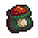</a></td>
<td><strong>Seedless to infinity</strong></td>
<td>Convert a complete seed log into sugar lumps by sacrificing your garden to the sugar hornets <strong>10 times</strong></td>
</tr>
<tr>
<td width="48"><a href="./assets/generated-icons/SheetGarden0234.png">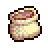</a></td>
<td><strong>Seedless to beyond</strong></td>
<td>Convert a complete seed log into sugar lumps by sacrificing your garden to the sugar hornets <strong>25 times</strong></td>
</tr>
<tr>
<td width="48"><a href="./assets/generated-icons/SheetGarden0402.png">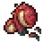</a></td>
<td><strong>Greener, aching thumb</strong></td>
<td>Harvest <strong>2,000 mature garden plants</strong> across all ascensions</td>
</tr>
<tr>
<td width="48"><a href="./assets/generated-icons/SheetGarden0410.png">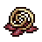</a></td>
<td><strong>Greenest, aching thumb</strong></td>
<td>Harvest <strong>3,000 mature garden plants</strong> across all ascensions</td>
</tr>
<tr>
<td width="48"><a href="./assets/generated-icons/SheetGarden0417.png">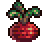</a></td>
<td><strong>Photosynthetic prodigy</strong></td>
<td>Harvest <strong>5,000 mature garden plants</strong> across all ascensions</td>
</tr>
<tr>
<td width="48"><a href="./assets/generated-icons/SheetGarden0418.png">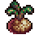</a></td>
<td><strong>Garden master</strong></td>
<td>Harvest <strong>7,500 mature garden plants</strong> across all ascensions</td>
</tr>
<tr>
<td width="48"><a href="./assets/generated-icons/SheetGarden0419.png">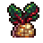</a></td>
<td><strong>Plant whisperer</strong></td>
<td>Harvest <strong>10,000 mature garden plants</strong> across all ascensions</td>
</tr>
<tr>
<td width="48"><a href="./assets/generated-icons/SheetVanilla2715.png">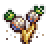</a></td>
<td><strong>Botanical Perfection</strong></td>
<td>Have one of every type of plant in the mature stage at once</td>
</tr>
<tr>
<td width="48"><a href="./assets/generated-icons/SheetGarden0019.png">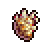</a></td>
<td><strong>Duketater Salad</strong></td>
<td>Harvest <strong>12 mature Duketaters</strong> simultaneously</td>
</tr>
<tr>
<td width="48"><a href="./assets/generated-icons/SheetGarden0334.png">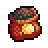</a></td>
<td><strong>Fifty Shades of Clay</strong></td>
<td>Change the soil type of your Garden <strong>100 times</strong> in one ascension</td>
</tr>
</tbody>
</table>

- See also **I feel the need for seed**

#### Grimoire
<table>
<thead>
<tr>
<th width="48">Icon</th>
<th>Achievement Name</th>
<th>Requirement</th>
</tr>
</thead>
<tbody>
<tr>
<td width="48"><a href="./assets/generated-icons/SheetVanilla2212.png">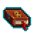</a></td>
<td><strong>Archwizard</strong></td>
<td>Cast <strong>1,999 spells</strong> across all ascensions</td>
</tr>
<tr>
<td width="48"><a href="./assets/generated-icons/SheetCustom2014.png">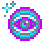</a></td>
<td><strong>Spellmaster</strong></td>
<td>Cast <strong>2,999 spells</strong> across all ascensions</td>
</tr>
<tr>
<td width="48"><a href="./assets/generated-icons/SheetCustom2013.png">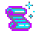</a></td>
<td><strong>Cookieomancer</strong></td>
<td>Cast <strong>3,999 spells</strong> across all ascensions</td>
</tr>
<tr>
<td width="48"><a href="./assets/generated-icons/SheetVanilla2812.png">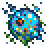</a></td>
<td><strong>Spell lord</strong></td>
<td>Cast <strong>4,999 spells</strong> across all ascensions</td>
</tr>
<tr>
<td width="48"><a href="./assets/generated-icons/SheetVanilla2712.png">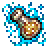</a></td>
<td><strong>Magic emperor</strong></td>
<td>Cast <strong>9,999 spells</strong> across all ascensions</td>
</tr>
<tr>
<td width="48"><a href="./assets/generated-icons/SheetVanilla3020.png"></a></td>
<td><strong>Hogwarts Graduate</strong></td>
<td>Have <strong>3 positive Grimoire spell effects</strong> active at once</td>
</tr>
<tr>
<td width="48"><a href="./assets/generated-icons/SheetVanilla3120.png">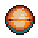</a></td>
<td><strong>Hogwarts Dropout</strong></td>
<td>Have <strong>3 negative Grimoire spell effects</strong> active at once</td>
</tr>
<tr>
<td width="48"><a href="./assets/generated-icons/SheetVanilla3204.png"></a></td>
<td><strong>Spell Slinger</strong></td>
<td>Cast <strong>10 spells</strong> within a 10-second window</td>
</tr>
<tr>
<td width="48"><a href="./assets/generated-icons/SheetCustom2015.png">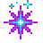</a></td>
<td><strong>Sweet Sorcery</strong></td>
<td>Get the <strong>Free Sugar Lump</strong> outcome from a magically spawned golden cookie</td>
</tr>
</tbody>
</table>


#### Pantheon
<table>
<thead>
<tr>
<th width="48">Icon</th>
<th>Achievement Name</th>
<th>Requirement</th>
</tr>
</thead>
<tbody>
<tr>
<td width="48"><a href="./assets/generated-icons/SheetVanilla2118.png">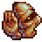</a></td>
<td><strong>Faithless Loyalty</strong></td>
<td>Swap gods in the Pantheon <strong>100 times</strong> in one ascension</td>
</tr>
<tr>
<td width="48"><a href="./assets/generated-icons/SheetVanilla2218.png"></a></td>
<td><strong>God of All Gods</strong></td>
<td>Use each pantheon god for at least <strong>24 hours</strong> total across all ascensions</td>
</tr>
</tbody>
</table>


### Seasonal Achievements (9 achievements)
<table>
<thead>
<tr>
<th width="48">Icon</th>
<th>Achievement Name</th>
<th>Requirement</th>
</tr>
</thead>
<tbody>
<tr>
<td width="48"><a href="./assets/generated-icons/SheetVanilla1606.png">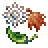</a></td>
<td><strong>Calendar Abuser</strong></td>
<td>Switch seasons <strong>50 times</strong> in one ascension</td>
</tr>
<tr>
<td width="48"><a href="./assets/generated-icons/SheetCustom1917.png"></a></td>
<td><strong>Reindeer destroyer</strong></td>
<td>Pop <strong>500 reindeer</strong> across all ascensions</td>
</tr>
<tr>
<td width="48"><a href="./assets/generated-icons/SheetCustom1916.png">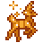</a></td>
<td><strong>Reindeer obliterator</strong></td>
<td>Pop <strong>1,000 reindeer</strong> across all ascensions</td>
</tr>
<tr>
<td width="48"><a href="./assets/generated-icons/SheetCustom1915.png">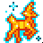</a></td>
<td><strong>Reindeer extinction event</strong></td>
<td>Pop <strong>2,000 reindeer</strong> across all ascensions</td>
</tr>
<tr>
<td width="48"><a href="./assets/generated-icons/SheetCustom1914.png">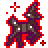</a></td>
<td><strong>Reindeer apocalypse</strong></td>
<td>Pop <strong>5,000 reindeer</strong> across all ascensions</td>
</tr>
<tr>
<td width="48"><a href="./assets/generated-icons/SheetCustom1816.png">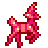</a></td>
<td><strong>Cupid's Reindeer</strong></td>
<td>Pop a reindeer during <strong>Valentine's Day season</strong></td>
</tr>
<tr>
<td width="48"><a href="./assets/generated-icons/SheetCustom1815.png">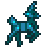</a></td>
<td><strong>Business Reindeer</strong></td>
<td>Pop a reindeer during <strong>Business Day season</strong></td>
</tr>
<tr>
<td width="48"><a href="./assets/generated-icons/SheetCustom1814.png"></a></td>
<td><strong>Bundeer</strong></td>
<td>Pop a reindeer during <strong>Easter season</strong></td>
</tr>
<tr>
<td width="48"><a href="./assets/generated-icons/SheetCustom1817.png">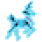</a></td>
<td><strong>Ghost Reindeer</strong></td>
<td>Pop a reindeer during <strong>Halloween season</strong></td>
</tr>
</tbody>
</table>

- See also **Holiday Hoover** and **Merry Mayhem**

### Completionist Achievements (7 achievements)
<table>
<thead>
<tr>
<th width="48">Icon</th>
<th>Achievement Name</th>
<th>Requirement</th>
</tr>
</thead>
<tbody>
<tr>
<td width="48"><a href="./assets/generated-icons/SheetVanilla2207.png"></a></td>
<td><strong>Vanilla Star</strong></td>
<td>Own all <strong>622 original achievements</strong></td>
</tr>
<tr>
<td width="48"><a href="./assets/generated-icons/SheetVanilla2916.png">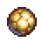</a></td>
<td><strong>Sweet Child of Mine</strong></td>
<td>Own <strong>100 sugar lumps</strong> at once</td>
</tr>
<tr>
<td width="48"><a href="./assets/generated-icons/SheetVanilla2007.png">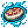</a></td>
<td><strong>Beyond Prestige</strong></td>
<td>Own all <strong>129 original heavenly upgrades</strong></td>
</tr>
<tr>
<td width="48"><a href="./assets/generated-icons/SheetVanilla1814.png"></a></td>
<td><strong>Kitten jamboree</strong></td>
<td>Own all <strong>18 original kittens</strong></td>
</tr>
<tr>
<td width="48"><a href="./assets/generated-icons/SheetVanilla1813.png"></a></td>
<td><strong>Kitten Fiesta</strong></td>
<td>Own all <strong>18 original kittens</strong> and all <strong>11 expansion kittens</strong> at once</td>
</tr>
<tr>
<td width="48"><a href="./assets/generated-icons/SheetCustom1913.png"></a></td>
<td><strong>Bearer of the Cookie Sigil</strong></td>
<td>Fully initiate into the Great Orders of the Cookie Age. Provides <strong>25% faster research</strong> and <strong>10% more random drops</strong> (See Upgrades Section for More Info)</td>
</tr>
<tr>
<td width="48"><a href="./assets/generated-icons/SheetVanilla1705.png"></a></td>
<td><strong>In the Shadows</strong></td>
<td>Unlock all vanilla shadow achievements, except that one.</td>
</tr>
</tbody>
</table>

- See also **The Final Challenger**

### Combo Achievements (7 achievements)
<table>
<thead>
<tr>
<th width="48">Icon</th>
<th>Achievement Name</th>
<th>Requirement</th>
</tr>
</thead>
<tbody>
<tr>
<td width="48"><a href="./assets/generated-icons/SheetVanilla2536.png">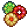</a></td>
<td><strong>Trifecta Combo</strong></td>
<td>Have <strong>3 buffs</strong> active at once</td>
</tr>
<tr>
<td width="48"><a href="./assets/generated-icons/SheetVanilla2611.png">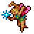</a></td>
<td><strong>Combo Initiate</strong></td>
<td>Have <strong>6 buffs</strong> active at once</td>
</tr>
<tr>
<td width="48"><a href="./assets/generated-icons/SheetVanilla2211.png">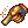</a></td>
<td><strong>Combo God</strong></td>
<td>Have <strong>9 buffs</strong> active at once</td>
</tr>
<tr>
<td width="48"><a href="./assets/generated-icons/SheetVanilla2311.png"></a></td>
<td><strong>Combo Hacker</strong></td>
<td>Have <strong>12 buffs</strong> active at once</td>
</tr>
<tr>
<td width="48"><a href="./assets/generated-icons/SheetCustom2302.png">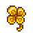</a></td>
<td><strong>Frenzy frenzy</strong></td>
<td>Have all three frenzy buffs active at once</td>
</tr>
<tr>
<td width="48"><a href="./assets/generated-icons/SheetVanilla3012.png">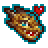</a></td>
<td><strong>Double Dragon Clicker</strong></td>
<td>Have a dragon flight and a click frenzy active at the same time</td>
</tr>
<tr>
<td width="48"><a href="./assets/generated-icons/SheetVanilla2213.png"></a></td>
<td><strong>Frenzy Marathon</strong></td>
<td>Have a frenzy buff with a total duration of at least <strong>10 minutes</strong></td>
</tr>
</tbody>
</table>


### CPS Achievements (9 achievements)
<table>
<thead>
<tr>
<th width="48">Icon</th>
<th>Achievement Name</th>
<th>Requirement</th>
</tr>
</thead>
<tbody>
<tr>
<td width="48"><a href="./assets/generated-icons/SheetCustom0012.png"></a></td>
<td><strong>Beyond the speed of dough</strong></td>
<td>Bake <strong>1 octodecillion</strong> per second</td>
</tr>
<tr>
<td width="48"><a href="./assets/generated-icons/SheetCustom0112.png"></a></td>
<td><strong>Speed of sound</strong></td>
<td>Bake <strong>10 octodecillion</strong> per second</td>
</tr>
<tr>
<td width="48"><a href="./assets/generated-icons/SheetCustom0212.png"></a></td>
<td><strong>Speed of light</strong></td>
<td>Bake <strong>100 octodecillion</strong> per second</td>
</tr>
<tr>
<td width="48"><a href="./assets/generated-icons/SheetCustom0312.png">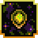</a></td>
<td><strong>Faster than light</strong></td>
<td>Bake <strong>1 novemdecillion</strong> per second</td>
</tr>
<tr>
<td width="48"><a href="./assets/generated-icons/SheetCustom0412.png">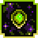</a></td>
<td><strong>Speed of thought</strong></td>
<td>Bake <strong>10 novemdecillion</strong> per second</td>
</tr>
<tr>
<td width="48"><a href="./assets/generated-icons/SheetCustom0512.png">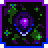</a></td>
<td><strong>Faster than speed of thought</strong></td>
<td>Bake <strong>100 novemdecillion</strong> per second</td>
</tr>
<tr>
<td width="48"><a href="./assets/generated-icons/SheetCustom0612.png">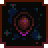</a></td>
<td><strong>Plaid</strong></td>
<td>Bake <strong>1 vigintillion</strong> per second</td>
</tr>
<tr>
<td width="48"><a href="./assets/generated-icons/SheetCustom0712.png">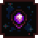</a></td>
<td><strong>Somehow faster than plaid</strong></td>
<td>Bake <strong>10 vigintillion</strong> per second</td>
</tr>
<tr>
<td width="48"><a href="./assets/generated-icons/SheetCustom0812.png"></a></td>
<td><strong>Transcending the very concept of speed itself</strong></td>
<td>Bake <strong>100 vigintillion</strong> per second</td>
</tr>
</tbody>
</table>


### Click Achievements (9 achievements)
<table>
<thead>
<tr>
<th width="48">Icon</th>
<th>Achievement Name</th>
<th>Requirement</th>
</tr>
</thead>
<tbody>
<tr>
<td width="48"><a href="./assets/generated-icons/SheetCustom0908.png">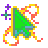</a></td>
<td><strong>Click of the Titans</strong></td>
<td>Generate <strong>1 year of raw CPS</strong> in a single cookie click</td>
</tr>
<tr>
<td width="48"><a href="./assets/generated-icons/SheetVanilla1230.png"></a></td>
<td><strong>Buff Finger</strong></td>
<td>Click the cookie <strong>250,000 times</strong> across all ascensions</td>
</tr>
<tr>
<td width="48"><a href="./assets/generated-icons/SheetCustom1012.png"></a></td>
<td><strong>News ticker addict</strong></td>
<td>Click on the news ticker <strong>1,000 times</strong> in one ascension</td>
</tr>
<tr>
<td width="48"><a href="./assets/generated-icons/SheetCustom0900.png"></a></td>
<td><strong>Clickbait & Switch</strong></td>
<td>Make <strong>1 vigintillion</strong> from clicking</td>
</tr>
<tr>
<td width="48"><a href="./assets/generated-icons/SheetCustom0901.png"></a></td>
<td><strong>Click to the Future</strong></td>
<td>Make <strong>1 duovigintillion</strong> from clicking</td>
</tr>
<tr>
<td width="48"><a href="./assets/generated-icons/SheetCustom0902.png"></a></td>
<td><strong>Clickety Clique</strong></td>
<td>Make <strong>1 quattuorvigintillion</strong> from clicking</td>
</tr>
<tr>
<td width="48"><a href="./assets/generated-icons/SheetCustom0903.png"></a></td>
<td><strong>Clickonomicon</strong></td>
<td>Make <strong>1 sexvigintillion</strong> from clicking</td>
</tr>
<tr>
<td width="48"><a href="./assets/generated-icons/SheetCustom0904.png"></a></td>
<td><strong>Clicks and Stones</strong></td>
<td>Make <strong>1 octovigintillion</strong> from clicking</td>
</tr>
<tr>
<td width="48"><a href="./assets/generated-icons/SheetCustom0905.png"></a></td>
<td><strong>Click It Till You Make It</strong></td>
<td>Make <strong>1 trigintillion</strong> from clicking</td>
</tr>
</tbody>
</table>


### Grandmapocalypse Achievements (15 achievements)
<table>
<thead>
<tr>
<th width="48">Icon</th>
<th>Achievement Name</th>
<th>Requirement</th>
</tr>
</thead>
<tbody>
<tr>
<td width="48"><a href="./assets/generated-icons/SheetCustom2116.png"></a></td>
<td><strong>Wrinkler annihilator</strong></td>
<td>Burst <strong>666 wrinklers</strong> across all ascensions</td>
</tr>
<tr>
<td width="48"><a href="./assets/generated-icons/SheetCustom2117.png"></a></td>
<td><strong>Wrinkler eradicator</strong></td>
<td>Burst <strong>2,666 wrinklers</strong> across all ascensions</td>
</tr>
<tr>
<td width="48"><a href="./assets/generated-icons/SheetCustom2118.png"></a></td>
<td><strong>Wrinkler extinction event</strong></td>
<td>Burst <strong>6,666 wrinklers</strong> across all ascensions</td>
</tr>
<tr>
<td width="48"><a href="./assets/generated-icons/SheetCustom2219.png"></a></td>
<td><strong>Wrinkler apocalypse</strong></td>
<td>Burst <strong>16,666 wrinklers</strong> across all ascensions</td>
</tr>
<tr>
<td width="48"><a href="./assets/generated-icons/SheetCustom2218.png"></a></td>
<td><strong>Wrinkler armageddon</strong></td>
<td>Burst <strong>26,666 wrinklers</strong> across all ascensions</td>
</tr>
<tr>
<td width="48"><a href="./assets/generated-icons/SheetCustom2113.png"></a></td>
<td><strong>Rare specimen collector</strong></td>
<td>Burst <strong>2 shiny wrinklers</strong> across all ascensions</td>
</tr>
<tr>
<td width="48"><a href="./assets/generated-icons/SheetCustom2114.png"></a></td>
<td><strong>Endangered species hunter</strong></td>
<td>Burst <strong>5 shiny wrinklers</strong> across all ascensions</td>
</tr>
<tr>
<td width="48"><a href="./assets/generated-icons/SheetCustom2115.png"></a></td>
<td><strong>Extinction event architect</strong></td>
<td>Burst <strong>10 shiny wrinklers</strong> across all ascensions</td>
</tr>
<tr>
<td width="48"><a href="./assets/generated-icons/SheetCustom2319.png"></a></td>
<td><strong>Golden wrinkler</strong></td>
<td>Burst a wrinkler worth <strong>6.66 years of CPS</strong></td>
</tr>
<tr>
<td width="48"><a href="./assets/generated-icons/SheetCustom2318.png"></a></td>
<td><strong>Wrinkler Rush</strong></td>
<td>Pop a wrinkler within <strong>15 minutes and 30 seconds</strong> of ascending</td>
</tr>
<tr>
<td width="48"><a href="./assets/generated-icons/SheetCustom2119.png"></a></td>
<td><strong>Wrinkler Windfall</strong></td>
<td>Sextuple (6x) your bank with a single wrinkler pop</td>
</tr>
<tr>
<td width="48"><a href="./assets/generated-icons/SheetVanilla0209.png"></a></td>
<td><strong>Deep elder nap</strong></td>
<td>Quash the grandmatriarchs one way or another <strong>666 times</strong> across all ascensions</td>
</tr>
<tr>
<td width="48"><a href="./assets/generated-icons/SheetCustom2018.png"></a></td>
<td><strong>Warm-Up Ritual</strong></td>
<td>Click <strong>66 wrath cookies</strong> across all ascensions</td>
</tr>
<tr>
<td width="48"><a href="./assets/generated-icons/SheetCustom2017.png"></a></td>
<td><strong>Deal of the Slightly Damned</strong></td>
<td>Click <strong>666 wrath cookies</strong> across all ascensions</td>
</tr>
<tr>
<td width="48"><a href="./assets/generated-icons/SheetCustom2016.png"></a></td>
<td><strong>Baker of the Beast</strong></td>
<td>Click <strong>6,666 wrath cookies</strong> across all ascensions</td>
</tr>
</tbody>
</table>


### Golden Cookie Achievements (6 achievements)
<table>
<thead>
<tr>
<th width="48">Icon</th>
<th>Achievement Name</th>
<th>Requirement</th>
</tr>
</thead>
<tbody>
<tr>
<td width="48"><a href="./assets/generated-icons/SheetCustom0013.png"></a></td>
<td><strong>Find a penny, pick it up</strong></td>
<td>Click <strong>17,777 golden cookies</strong> across all ascensions</td>
</tr>
<tr>
<td width="48"><a href="./assets/generated-icons/SheetCustom0113.png"></a></td>
<td><strong>Four-leaf overkill</strong></td>
<td>Click <strong>37,777 golden cookies</strong> across all ascensions</td>
</tr>
<tr>
<td width="48"><a href="./assets/generated-icons/SheetCustom0213.png"></a></td>
<td><strong>Rabbit's footnote</strong></td>
<td>Click <strong>47,777 golden cookies</strong> across all ascensions</td>
</tr>
<tr>
<td width="48"><a href="./assets/generated-icons/SheetCustom0313.png"></a></td>
<td><strong>Knock on wood</strong></td>
<td>Click <strong>57,777 golden cookies</strong> across all ascensions</td>
</tr>
<tr>
<td width="48"><a href="./assets/generated-icons/SheetCustom0413.png"></a></td>
<td><strong>Jackpot jubilee</strong></td>
<td>Click <strong>67,777 golden cookies</strong> across all ascensions</td>
</tr>
<tr>
<td width="48"><a href="./assets/generated-icons/SheetCustom0513.png"></a></td>
<td><strong>Black cat's seventh paw</strong></td>
<td>Click <strong>77,777 golden cookies</strong> across all ascensions</td>
</tr>
</tbody>
</table>

- See also **Gilded Restraint** and **Second Life, First Click**

### Cookies Baked In Ascension Achievements (7 achievements)
<table>
<thead>
<tr>
<th width="48">Icon</th>
<th>Achievement Name</th>
<th>Requirement</th>
</tr>
</thead>
<tbody>
<tr>
<td width="48"><a href="./assets/generated-icons/SheetCustom0012.png"></a></td>
<td><strong>The Doughpocalypse</strong></td>
<td>Bake <strong>10 trevigintillion cookies</strong> in one ascension</td>
</tr>
<tr>
<td width="48"><a href="./assets/generated-icons/SheetCustom0112.png"></a></td>
<td><strong>The Flour Flood</strong></td>
<td>Bake <strong>1 quattuorvigintillion cookies</strong> in one ascension</td>
</tr>
<tr>
<td width="48"><a href="./assets/generated-icons/SheetCustom0212.png"></a></td>
<td><strong>The Ovenverse</strong></td>
<td>Bake <strong>100 quattuorvigintillion cookies</strong> in one ascension</td>
</tr>
<tr>
<td width="48"><a href="./assets/generated-icons/SheetCustom0312.png"></a></td>
<td><strong>The Crumb Crusade</strong></td>
<td>Bake <strong>10 quinvigintillion cookies</strong> in one ascension</td>
</tr>
<tr>
<td width="48"><a href="./assets/generated-icons/SheetCustom0412.png"></a></td>
<td><strong>The Final Batch</strong></td>
<td>Bake <strong>1 sexvigintillion cookies</strong> in one ascension</td>
</tr>
<tr>
<td width="48"><a href="./assets/generated-icons/SheetCustom0512.png"></a></td>
<td><strong>The Ultimate Ascension</strong></td>
<td>Bake <strong>100 sexvigintillion cookies</strong> in one ascension</td>
</tr>
<tr>
<td width="48"><a href="./assets/generated-icons/SheetCustom0612.png"></a></td>
<td><strong>The Transcendent Rise</strong></td>
<td>Bake <strong>10 septenvigintillion cookies</strong> in one ascension</td>
</tr>
</tbody>
</table>


### Forfeited Cookies Achievements (13 achievements)
<table>
<thead>
<tr>
<th width="48">Icon</th>
<th>Achievement Name</th>
<th>Requirement</th>
</tr>
</thead>
<tbody>
<tr>
<td width="48"><a href="./assets/generated-icons/SheetVanilla0011.png"></a></td>
<td><strong>Dante's unwaking dream</strong></td>
<td>Forfeit <strong>1 novemdecillion cookies</strong> total across all ascensions</td>
</tr>
<tr>
<td width="48"><a href="./assets/generated-icons/SheetVanilla0111.png"></a></td>
<td><strong>The abyss gazes back</strong></td>
<td>Forfeit <strong>1 vigintillion cookies</strong> total across all ascensions</td>
</tr>
<tr>
<td width="48"><a href="./assets/generated-icons/SheetVanilla0211.png"></a></td>
<td><strong>Charon's final toll</strong></td>
<td>Forfeit <strong>1 unvigintillion cookies</strong> total across all ascensions</td>
</tr>
<tr>
<td width="48"><a href="./assets/generated-icons/SheetVanilla0311.png"></a></td>
<td><strong>Cerberus's third head</strong></td>
<td>Forfeit <strong>1 duovigintillion cookies</strong> total across all ascensions</td>
</tr>
<tr>
<td width="48"><a href="./assets/generated-icons/SheetVanilla0411.png"></a></td>
<td><strong>Minos's eternal judgment</strong></td>
<td>Forfeit <strong>1 trevigintillion cookies</strong> total across all ascensions</td>
</tr>
<tr>
<td width="48"><a href="./assets/generated-icons/SheetVanilla0511.png"></a></td>
<td><strong>The river Styx flows backward</strong></td>
<td>Forfeit <strong>1 quattuorvigintillion cookies</strong> total across all ascensions</td>
</tr>
<tr>
<td width="48"><a href="./assets/generated-icons/SheetVanilla0611.png"></a></td>
<td><strong>Ixion's wheel spins faster</strong></td>
<td>Forfeit <strong>1 quinvigintillion cookies</strong> total across all ascensions</td>
</tr>
<tr>
<td width="48"><a href="./assets/generated-icons/SheetVanilla0711.png"></a></td>
<td><strong>Sisyphus's boulder crumbles</strong></td>
<td>Forfeit <strong>1 sexvigintillion cookies</strong> total across all ascensions</td>
</tr>
<tr>
<td width="48"><a href="./assets/generated-icons/SheetVanilla0811.png"></a></td>
<td><strong>Tantalus's eternal thirst</strong></td>
<td>Forfeit <strong>1 septenvigintillion cookies</strong> total across all ascensions</td>
</tr>
<tr>
<td width="48"><a href="./assets/generated-icons/SheetVanilla0911.png"></a></td>
<td><strong>The ninth circle's center</strong></td>
<td>Forfeit <strong>1 octovigintillion cookies</strong> total across all ascensions</td>
</tr>
<tr>
<td width="48"><a href="./assets/generated-icons/SheetVanilla1011.png"></a></td>
<td><strong>Lucifer's frozen tears</strong></td>
<td>Forfeit <strong>1 novemvigintillion cookies</strong> total across all ascensions</td>
</tr>
<tr>
<td width="48"><a href="./assets/generated-icons/SheetVanilla1111.png"></a></td>
<td><strong>Beyond the void's edge</strong></td>
<td>Forfeit <strong>1 trigintillion cookies</strong> total across all ascensions</td>
</tr>
<tr>
<td width="48"><a href="./assets/generated-icons/SheetVanilla1211.png"></a></td>
<td><strong>The final descent's end</strong></td>
<td>Forfeit <strong>1 untrigintillion cookies</strong> total across all ascensions</td>
</tr>
</tbody>
</table>


### Building Ownership Achievements (13 achievements)
<table>
<thead>
<tr>
<th width="48">Icon</th>
<th>Achievement Name</th>
<th>Requirement</th>
</tr>
</thead>
<tbody>
<tr>
<td width="48"><a href="./assets/generated-icons/SheetCustom1612.png"></a></td>
<td><strong>Septcentennial and a half</strong></td>
<td>Have at least <strong>750 of everything</strong></td>
</tr>
<tr>
<td width="48"><a href="./assets/generated-icons/SheetCustom1712.png"></a></td>
<td><strong>Octcentennial</strong></td>
<td>Have at least <strong>800 of everything</strong></td>
</tr>
<tr>
<td width="48"><a href="./assets/generated-icons/SheetCustom1812.png"></a></td>
<td><strong>Octcentennial and a half</strong></td>
<td>Have at least <strong>850 of everything</strong></td>
</tr>
<tr>
<td width="48"><a href="./assets/generated-icons/SheetCustom1912.png"></a></td>
<td><strong>Nonacentennial</strong></td>
<td>Have at least <strong>900 of everything</strong></td>
</tr>
<tr>
<td width="48"><a href="./assets/generated-icons/SheetCustom2012.png"></a></td>
<td><strong>Nonacentennial and a half</strong></td>
<td>Have at least <strong>950 of everything</strong></td>
</tr>
<tr>
<td width="48"><a href="./assets/generated-icons/SheetCustom2112.png"></a></td>
<td><strong>Millennial</strong></td>
<td>Have at least <strong>1,000 of everything</strong></td>
</tr>
<tr>
<td width="48"><a href="./assets/generated-icons/SheetCustom2212.png"></a></td>
<td><strong>Building behemoth</strong></td>
<td>Own <strong>15,000 buildings</strong></td>
</tr>
<tr>
<td width="48"><a href="./assets/generated-icons/SheetCustom2213.png"></a></td>
<td><strong>Construction colossus</strong></td>
<td>Own <strong>20,000 buildings</strong></td>
</tr>
<tr>
<td width="48"><a href="./assets/generated-icons/SheetCustom2214.png"></a></td>
<td><strong>Architectural apex</strong></td>
<td>Own <strong>25,000 buildings</strong></td>
</tr>
<tr>
<td width="48"><a href="./assets/generated-icons/SheetVanilla2826.png"></a></td>
<td><strong>Asset Liquidator</strong></td>
<td>Sell <strong>25,000 buildings</strong> in one ascension</td>
</tr>
<tr>
<td width="48"><a href="./assets/generated-icons/SheetVanilla1509.png"></a></td>
<td><strong>Flip City</strong></td>
<td>Sell <strong>50,000 buildings</strong> in one ascension</td>
</tr>
<tr>
<td width="48"><a href="./assets/generated-icons/SheetVanilla3233.png"></a></td>
<td><strong>Ghost Town Tycoon</strong></td>
<td>Sell <strong>100,000 buildings</strong> in one ascension</td>
</tr>
<tr>
<td width="48"><a href="./assets/generated-icons/SheetVanilla2627.png"></a></td>
<td><strong>Have your sugar and eat it too</strong></td>
<td>Have every building reach <strong>level 10</strong></td>
</tr>
</tbody>
</table>

- See also **The Final Countdown**, **Back to Basic Bakers**, **Modest Portfolio**, **Difficult Decisions**, and **Treading water**

### Reincarnation Achievements (3 achievements)
<table>
<thead>
<tr>
<th width="48">Icon</th>
<th>Achievement Name</th>
<th>Requirement</th>
</tr>
</thead>
<tbody>
<tr>
<td width="48"><a href="./assets/generated-icons/SheetCustom1716.png"></a></td>
<td><strong>Ascension master</strong></td>
<td>Ascend <strong>250 times</strong></td>
</tr>
<tr>
<td width="48"><a href="./assets/generated-icons/SheetCustom1715.png"></a></td>
<td><strong>Ascension legend</strong></td>
<td>Ascend <strong>500 times</strong></td>
</tr>
<tr>
<td width="48"><a href="./assets/generated-icons/SheetCustom1714.png"></a></td>
<td><strong>Ascension deity</strong></td>
<td>Ascend <strong>999 times</strong></td>
</tr>
</tbody>
</table>


### Building Achievements by Building

#### Cursor (16 Achievements)
<table>
<thead>
<tr>
<th width="48">Icon</th>
<th>Achievement</th>
<th>Requirement</th>
</tr>
</thead>
<tbody>
<tr>
<td width="48"><a href="./assets/generated-icons/SheetCustom0000.png"></a></td>
<td><strong>Carpal diem</strong></td>
<td>Own <strong>1,100 cursors</strong></td>
</tr>
<tr>
<td width="48"><a href="./assets/generated-icons/SheetCustom0001.png"></a></td>
<td><strong>Hand over fist</strong></td>
<td>Own <strong>1,150 cursors</strong></td>
</tr>
<tr>
<td width="48"><a href="./assets/generated-icons/SheetCustom0002.png"></a></td>
<td><strong>Finger guns</strong></td>
<td>Own <strong>1,250 cursors</strong></td>
</tr>
<tr>
<td width="48"><a href="./assets/generated-icons/SheetCustom0003.png"></a></td>
<td><strong>Thumbs up, buttercup</strong></td>
<td>Own <strong>1,300 cursors</strong></td>
</tr>
<tr>
<td width="48"><a href="./assets/generated-icons/SheetCustom0004.png"></a></td>
<td><strong>Pointer sisters</strong></td>
<td>Own <strong>1,400 cursors</strong></td>
</tr>
<tr>
<td width="48"><a href="./assets/generated-icons/SheetCustom0005.png"></a></td>
<td><strong>Knuckle sandwich</strong></td>
<td>Own <strong>1,450 cursors</strong></td>
</tr>
<tr>
<td width="48"><a href="./assets/generated-icons/SheetCustom0006.png"></a></td>
<td><strong>Phalanx formation</strong></td>
<td>Own <strong>1,550 cursors</strong></td>
</tr>
<tr>
<td width="48"><a href="./assets/generated-icons/SheetCustom0007.png"></a></td>
<td><strong>Manual override</strong></td>
<td>Own <strong>1,600 cursors</strong></td>
</tr>
<tr>
<td width="48"><a href="./assets/generated-icons/SheetCustom0008.png"></a></td>
<td><strong>Clickbaiter-in-chief</strong></td>
<td>Own <strong>1,700 cursors</strong></td>
</tr>
<tr>
<td width="48"><a href="./assets/generated-icons/SheetCustom0009.png"></a></td>
<td><strong>With flying digits</strong></td>
<td>Own <strong>1,750 cursors</strong></td>
</tr>
<tr>
<td width="48"><a href="./assets/generated-icons/SheetCustom0010.png"></a></td>
<td><strong>Palm before the storm</strong></td>
<td>Own <strong>1,850 cursors</strong></td>
</tr>
<tr>
<td width="48"><a href="./assets/generated-icons/SheetCustom0021.png"></a></td>
<td><strong>Click II: the sequel</strong></td>
<td>Make <strong>100 sexdecillion cookies</strong> just from cursors</td>
</tr>
<tr>
<td width="48"><a href="./assets/generated-icons/SheetCustom0022.png"></a></td>
<td><strong>Click III: we couldn't get Adam so it stars Jerry Seinfeld for some reason</strong></td>
<td>Make <strong>100 novemdecillion cookies</strong> just from cursors</td>
</tr>
<tr>
<td width="48"><a href="./assets/generated-icons/SheetCustom0023.png"></a></td>
<td><strong>Click IV: 3% on rotten tomatoes</strong></td>
<td>Make <strong>100 vigintillion cookies</strong> just from cursors</td>
</tr>
<tr>
<td width="48"><a href="./assets/generated-icons/SheetCustom0019.png"></a></td>
<td><strong>Rowdy shadow puppets</strong></td>
<td>Reach <strong>level 15</strong> Cursors</td>
</tr>
<tr>
<td width="48"><a href="./assets/generated-icons/SheetCustom0020.png"></a></td>
<td><strong>Frantic finger guns</strong></td>
<td>Reach <strong>level 20</strong> Cursors</td>
</tr>
</tbody>
</table>

#### Grandma (16 Achievements)
<table>
<thead>
<tr>
<th width="48">Icon</th>
<th>Achievement</th>
<th>Requirement</th>
</tr>
</thead>
<tbody>
<tr>
<td width="48"><a href="./assets/generated-icons/SheetCustom0100.png"></a></td>
<td><strong>All rise for Nana</strong></td>
<td>Own <strong>750 grandmas</strong></td>
</tr>
<tr>
<td width="48"><a href="./assets/generated-icons/SheetCustom0101.png"></a></td>
<td><strong>The crinkle collective</strong></td>
<td>Own <strong>800 grandmas</strong></td>
</tr>
<tr>
<td width="48"><a href="./assets/generated-icons/SheetCustom0102.png"></a></td>
<td><strong>Okay elder</strong></td>
<td>Own <strong>850 grandmas</strong></td>
</tr>
<tr>
<td width="48"><a href="./assets/generated-icons/SheetCustom0103.png"></a></td>
<td><strong>Wrinkle monarchy</strong></td>
<td>Own <strong>900 grandmas</strong></td>
</tr>
<tr>
<td width="48"><a href="./assets/generated-icons/SheetCustom0104.png"></a></td>
<td><strong>The wrinkling hour</strong></td>
<td>Own <strong>950 grandmas</strong></td>
</tr>
<tr>
<td width="48"><a href="./assets/generated-icons/SheetCustom0105.png"></a></td>
<td><strong>Matriarchal meltdown</strong></td>
<td>Own <strong>1,000 grandmas</strong></td>
</tr>
<tr>
<td width="48"><a href="./assets/generated-icons/SheetCustom0106.png"></a></td>
<td><strong>Cookies before crones</strong></td>
<td>Own <strong>1,050 grandmas</strong></td>
</tr>
<tr>
<td width="48"><a href="./assets/generated-icons/SheetCustom0107.png"></a></td>
<td><strong>Dust to crust</strong></td>
<td>Own <strong>1,100 grandmas</strong></td>
</tr>
<tr>
<td width="48"><a href="./assets/generated-icons/SheetCustom0108.png"></a></td>
<td><strong>Bingo bloodbath</strong></td>
<td>Own <strong>1,150 grandmas</strong></td>
</tr>
<tr>
<td width="48"><a href="./assets/generated-icons/SheetCustom0109.png"></a></td>
<td><strong>Supreme doughmother</strong></td>
<td>Own <strong>1,200 grandmas</strong></td>
</tr>
<tr>
<td width="48"><a href="./assets/generated-icons/SheetCustom0110.png"></a></td>
<td><strong>The last custodian</strong></td>
<td>Own <strong>1,250 grandmas</strong></td>
</tr>
<tr>
<td width="48"><a href="./assets/generated-icons/SheetCustom0121.png"></a></td>
<td><strong>Scone with the wind</strong></td>
<td>Make <strong>100 sexdecillion cookies</strong> just from grandmas</td>
</tr>
<tr>
<td width="48"><a href="./assets/generated-icons/SheetCustom0122.png"></a></td>
<td><strong>The flour of youth</strong></td>
<td>Make <strong>100 novemdecillion cookies</strong> just from grandmas</td>
</tr>
<tr>
<td width="48"><a href="./assets/generated-icons/SheetCustom0123.png"></a></td>
<td><strong>Bake-ageddon</strong></td>
<td>Make <strong>100 vigintillion cookies</strong> just from grandmas</td>
</tr>
<tr>
<td width="48"><a href="./assets/generated-icons/SheetCustom0119.png"></a></td>
<td><strong>Loaf & behold</strong></td>
<td>Reach <strong>level 15</strong> Grandmas</td>
</tr>
<tr>
<td width="48"><a href="./assets/generated-icons/SheetCustom0120.png"></a></td>
<td><strong>Forbidden fruitcake</strong></td>
<td>Reach <strong>level 20</strong> Grandmas</td>
</tr>
</tbody>
</table>

#### Farm (16 Achievements)
<table>
<thead>
<tr>
<th width="48">Icon</th>
<th>Achievement</th>
<th>Requirement</th>
</tr>
</thead>
<tbody>
<tr>
<td width="48"><a href="./assets/generated-icons/SheetCustom0200.png"></a></td>
<td><strong>Little house on the dairy</strong></td>
<td>Own <strong>750 farms</strong></td>
</tr>
<tr>
<td width="48"><a href="./assets/generated-icons/SheetCustom0201.png"></a></td>
<td><strong>The plow thickens</strong></td>
<td>Own <strong>800 farms</strong></td>
</tr>
<tr>
<td width="48"><a href="./assets/generated-icons/SheetCustom0202.png"></a></td>
<td><strong>Cabbage patch dynasty</strong></td>
<td>Own <strong>850 farms</strong></td>
</tr>
<tr>
<td width="48"><a href="./assets/generated-icons/SheetCustom0203.png"></a></td>
<td><strong>Grazing amazement</strong></td>
<td>Own <strong>900 farms</strong></td>
</tr>
<tr>
<td width="48"><a href="./assets/generated-icons/SheetCustom0204.png"></a></td>
<td><strong>Field of creams</strong></td>
<td>Own <strong>950 farms</strong></td>
</tr>
<tr>
<td width="48"><a href="./assets/generated-icons/SheetCustom0205.png"></a></td>
<td><strong>Barn to be wild</strong></td>
<td>Own <strong>1,000 farms</strong></td>
</tr>
<tr>
<td width="48"><a href="./assets/generated-icons/SheetCustom0206.png"></a></td>
<td><strong>Crops and robbers</strong></td>
<td>Own <strong>1,050 farms</strong></td>
</tr>
<tr>
<td width="48"><a href="./assets/generated-icons/SheetCustom0207.png"></a></td>
<td><strong>Shoveling it in</strong></td>
<td>Own <strong>1,100 farms</strong></td>
</tr>
<tr>
<td width="48"><a href="./assets/generated-icons/SheetCustom0208.png"></a></td>
<td><strong>Seed syndicate</strong></td>
<td>Own <strong>1,150 farms</strong></td>
</tr>
<tr>
<td width="48"><a href="./assets/generated-icons/SheetCustom0209.png"></a></td>
<td><strong>Harvest high table</strong></td>
<td>Own <strong>1,200 farms</strong></td>
</tr>
<tr>
<td width="48"><a href="./assets/generated-icons/SheetCustom0210.png"></a></td>
<td><strong>Emperor of dirt</strong></td>
<td>Own <strong>1,250 farms</strong></td>
</tr>
<tr>
<td width="48"><a href="./assets/generated-icons/SheetCustom0221.png"></a></td>
<td><strong>Rake in the greens</strong></td>
<td>Make <strong>1 quindecillion cookies</strong> just from farms</td>
</tr>
<tr>
<td width="48"><a href="./assets/generated-icons/SheetCustom0222.png"></a></td>
<td><strong>The great threshering</strong></td>
<td>Make <strong>1 octodecillion cookies</strong> just from farms</td>
</tr>
<tr>
<td width="48"><a href="./assets/generated-icons/SheetCustom0223.png"></a></td>
<td><strong>Bushels of burden</strong></td>
<td>Make <strong>1 novemdecillion cookies</strong> just from farms</td>
</tr>
<tr>
<td width="48"><a href="./assets/generated-icons/SheetCustom0219.png"></a></td>
<td><strong>Huge-er tracts of land</strong></td>
<td>Reach <strong>level 15</strong> Farms</td>
</tr>
<tr>
<td width="48"><a href="./assets/generated-icons/SheetCustom0220.png"></a></td>
<td><strong>Hoedown showdown</strong></td>
<td>Reach <strong>level 20</strong> Farms</td>
</tr>
</tbody>
</table>

#### Mine (16 Achievements)
<table>
<thead>
<tr>
<th width="48">Icon</th>
<th>Achievement</th>
<th>Requirement</th>
</tr>
</thead>
<tbody>
<tr>
<td width="48"><a href="./assets/generated-icons/SheetCustom0300.png"></a></td>
<td><strong>Shafted</strong></td>
<td>Own <strong>750 mines</strong></td>
</tr>
<tr>
<td width="48"><a href="./assets/generated-icons/SheetCustom0301.png"></a></td>
<td><strong>Shiny object syndrome</strong></td>
<td>Own <strong>800 mines</strong></td>
</tr>
<tr>
<td width="48"><a href="./assets/generated-icons/SheetCustom0302.png"></a></td>
<td><strong>Ore what?</strong></td>
<td>Own <strong>850 mines</strong></td>
</tr>
<tr>
<td width="48"><a href="./assets/generated-icons/SheetCustom0303.png"></a></td>
<td><strong>Rubble without a cause</strong></td>
<td>Own <strong>900 mines</strong></td>
</tr>
<tr>
<td width="48"><a href="./assets/generated-icons/SheetCustom0304.png"></a></td>
<td><strong>Tunnel visionaries</strong></td>
<td>Own <strong>950 mines</strong></td>
</tr>
<tr>
<td width="48"><a href="./assets/generated-icons/SheetCustom0305.png"></a></td>
<td><strong>Stalag-might</strong></td>
<td>Own <strong>1,000 mines</strong></td>
</tr>
<tr>
<td width="48"><a href="./assets/generated-icons/SheetCustom0306.png"></a></td>
<td><strong>Pyrite and prejudice</strong></td>
<td>Own <strong>1,050 mines</strong></td>
</tr>
<tr>
<td width="48"><a href="./assets/generated-icons/SheetCustom0307.png"></a></td>
<td><strong>Bedrock 'n roll</strong></td>
<td>Own <strong>1,100 mines</strong></td>
</tr>
<tr>
<td width="48"><a href="./assets/generated-icons/SheetCustom0308.png"></a></td>
<td><strong>Mantle management</strong></td>
<td>Own <strong>1,150 mines</strong></td>
</tr>
<tr>
<td width="48"><a href="./assets/generated-icons/SheetCustom0309.png"></a></td>
<td><strong>Hollow crown jewels</strong></td>
<td>Own <strong>1,200 mines</strong></td>
</tr>
<tr>
<td width="48"><a href="./assets/generated-icons/SheetCustom0310.png"></a></td>
<td><strong>Emperor of ore</strong></td>
<td>Own <strong>1,250 mines</strong></td>
</tr>
<tr>
<td width="48"><a href="./assets/generated-icons/SheetCustom0321.png"></a></td>
<td><strong>Ore d'oeuvres</strong></td>
<td>Make <strong>10 quindecillion cookies</strong> just from mines</td>
</tr>
<tr>
<td width="48"><a href="./assets/generated-icons/SheetCustom0322.png"></a></td>
<td><strong>Seismic yield</strong></td>
<td>Make <strong>10 octodecillion cookies</strong> just from mines</td>
</tr>
<tr>
<td width="48"><a href="./assets/generated-icons/SheetCustom0323.png"></a></td>
<td><strong>Billionaire's bedrock</strong></td>
<td>Make <strong>10 novemdecillion cookies</strong> just from mines</td>
</tr>
<tr>
<td width="48"><a href="./assets/generated-icons/SheetCustom0319.png"></a></td>
<td><strong>Cave-in king</strong></td>
<td>Reach <strong>level 15</strong> Mines</td>
</tr>
<tr>
<td width="48"><a href="./assets/generated-icons/SheetCustom0320.png"></a></td>
<td><strong>Digging destiny</strong></td>
<td>Reach <strong>level 20</strong> Mines</td>
</tr>
</tbody>
</table>

#### Factory (16 Achievements)
<table>
<thead>
<tr>
<th width="48">Icon</th>
<th>Achievement</th>
<th>Requirement</th>
</tr>
</thead>
<tbody>
<tr>
<td width="48"><a href="./assets/generated-icons/SheetCustom0400.png"></a></td>
<td><strong>Assembly required</strong></td>
<td>Own <strong>750 factories</strong></td>
</tr>
<tr>
<td width="48"><a href="./assets/generated-icons/SheetCustom0401.png"></a></td>
<td><strong>Quality unassured</strong></td>
<td>Own <strong>800 factories</strong></td>
</tr>
<tr>
<td width="48"><a href="./assets/generated-icons/SheetCustom0402.png"></a></td>
<td><strong>Error 404-manpower not found</strong></td>
<td>Own <strong>850 factories</strong></td>
</tr>
<tr>
<td width="48"><a href="./assets/generated-icons/SheetCustom0403.png"></a></td>
<td><strong>Spare parts department</strong></td>
<td>Own <strong>900 factories</strong></td>
</tr>
<tr>
<td width="48"><a href="./assets/generated-icons/SheetCustom0404.png"></a></td>
<td><strong>Conveyor belters</strong></td>
<td>Own <strong>950 factories</strong></td>
</tr>
<tr>
<td width="48"><a href="./assets/generated-icons/SheetCustom0405.png"></a></td>
<td><strong>Planned obsolescence</strong></td>
<td>Own <strong>1,000 factories</strong></td>
</tr>
<tr>
<td width="48"><a href="./assets/generated-icons/SheetCustom0406.png"></a></td>
<td><strong>Punch-card prophets</strong></td>
<td>Own <strong>1,050 factories</strong></td>
</tr>
<tr>
<td width="48"><a href="./assets/generated-icons/SheetCustom0407.png"></a></td>
<td><strong>Rust in peace</strong></td>
<td>Own <strong>1,100 factories</strong></td>
</tr>
<tr>
<td width="48"><a href="./assets/generated-icons/SheetCustom0408.png"></a></td>
<td><strong>Algorithm and blues</strong></td>
<td>Own <strong>1,150 factories</strong></td>
</tr>
<tr>
<td width="48"><a href="./assets/generated-icons/SheetCustom0409.png"></a></td>
<td><strong>Profit motive engine</strong></td>
<td>Own <strong>1,200 factories</strong></td>
</tr>
<tr>
<td width="48"><a href="./assets/generated-icons/SheetCustom0410.png"></a></td>
<td><strong>Lord of the assembly</strong></td>
<td>Own <strong>1,250 factories</strong></td>
</tr>
<tr>
<td width="48"><a href="./assets/generated-icons/SheetCustom0421.png"></a></td>
<td><strong>Sweatshop symphony</strong></td>
<td>Make <strong>100 quindecillion cookies</strong> just from factories</td>
</tr>
<tr>
<td width="48"><a href="./assets/generated-icons/SheetCustom0422.png"></a></td>
<td><strong>Cookieconomics 101</strong></td>
<td>Make <strong>100 octodecillion cookies</strong> just from factories</td>
</tr>
<tr>
<td width="48"><a href="./assets/generated-icons/SheetCustom0423.png"></a></td>
<td><strong>Mass production messiah</strong></td>
<td>Make <strong>100 novemdecillion cookies</strong> just from factories</td>
</tr>
<tr>
<td width="48"><a href="./assets/generated-icons/SheetCustom0419.png"></a></td>
<td><strong>Boilerplate overlord</strong></td>
<td>Reach <strong>level 15</strong> Factories</td>
</tr>
<tr>
<td width="48"><a href="./assets/generated-icons/SheetCustom0420.png"></a></td>
<td><strong>Cookie standard time</strong></td>
<td>Reach <strong>level 20</strong> Factories</td>
</tr>
</tbody>
</table>

#### Bank (16 Achievements)
<table>
<thead>
<tr>
<th width="48">Icon</th>
<th>Achievement</th>
<th>Requirement</th>
</tr>
</thead>
<tbody>
<tr>
<td width="48"><a href="./assets/generated-icons/SheetCustom1300.png"></a></td>
<td><strong>Petty cash splash</strong></td>
<td>Own <strong>750 banks</strong></td>
</tr>
<tr>
<td width="48"><a href="./assets/generated-icons/SheetCustom1301.png"></a></td>
<td><strong>The Invisible Hand That Feeds</strong></td>
<td>Own <strong>800 banks</strong></td>
</tr>
<tr>
<td width="48"><a href="./assets/generated-icons/SheetCustom1302.png"></a></td>
<td><strong>Under-mattress banking</strong></td>
<td>Own <strong>850 banks</strong></td>
</tr>
<tr>
<td width="48"><a href="./assets/generated-icons/SheetCustom1303.png"></a></td>
<td><strong>Interest-ing times</strong></td>
<td>Own <strong>900 banks</strong></td>
</tr>
<tr>
<td width="48"><a href="./assets/generated-icons/SheetCustom1304.png"></a></td>
<td><strong>Fee-fi-fo-fund</strong></td>
<td>Own <strong>950 banks</strong></td>
</tr>
<tr>
<td width="48"><a href="./assets/generated-icons/SheetCustom1305.png"></a></td>
<td><strong>Liquidity theater</strong></td>
<td>Own <strong>1,000 banks</strong></td>
</tr>
<tr>
<td width="48"><a href="./assets/generated-icons/SheetCustom1306.png"></a></td>
<td><strong>Risk appetite: unlimited</strong></td>
<td>Own <strong>1,050 banks</strong></td>
</tr>
<tr>
<td width="48"><a href="./assets/generated-icons/SheetCustom1307.png"></a></td>
<td><strong>Quantitative cheesing</strong></td>
<td>Own <strong>1,100 banks</strong></td>
</tr>
<tr>
<td width="48"><a href="./assets/generated-icons/SheetCustom1308.png"></a></td>
<td><strong>Number go up economics</strong></td>
<td>Own <strong>1,150 banks</strong></td>
</tr>
<tr>
<td width="48"><a href="./assets/generated-icons/SheetCustom1309.png"></a></td>
<td><strong>Sovereign cookie fund</strong></td>
<td>Own <strong>1,200 banks</strong></td>
</tr>
<tr>
<td width="48"><a href="./assets/generated-icons/SheetCustom1310.png"></a></td>
<td><strong>Seigniorage supreme</strong></td>
<td>Own <strong>1,250 banks</strong></td>
</tr>
<tr>
<td width="48"><a href="./assets/generated-icons/SheetCustom1521.png"></a></td>
<td><strong>Compound interest, compounded</strong></td>
<td>Make <strong>1 sexdecillion cookies</strong> just from banks</td>
</tr>
<tr>
<td width="48"><a href="./assets/generated-icons/SheetCustom1522.png"></a></td>
<td><strong>Arbitrage avalanche</strong></td>
<td>Make <strong>1 novemdecillion cookies</strong> just from banks</td>
</tr>
<tr>
<td width="48"><a href="./assets/generated-icons/SheetCustom1523.png"></a></td>
<td><strong>Ponzi à la mode</strong></td>
<td>Make <strong>1 vigintillion cookies</strong> just from banks</td>
</tr>
<tr>
<td width="48"><a href="./assets/generated-icons/SheetCustom1119.png"></a></td>
<td><strong>Credit conjurer</strong></td>
<td>Reach <strong>level 15</strong> Banks</td>
</tr>
<tr>
<td width="48"><a href="./assets/generated-icons/SheetCustom1120.png"></a></td>
<td><strong>Master of the Mint</strong></td>
<td>Reach <strong>level 20</strong> Banks</td>
</tr>
</tbody>
</table>

#### Temple (16 Achievements)
<table>
<thead>
<tr>
<th width="48">Icon</th>
<th>Achievement</th>
<th>Requirement</th>
</tr>
</thead>
<tbody>
<tr>
<td width="48"><a href="./assets/generated-icons/SheetCustom1400.png"></a></td>
<td><strong>Monk mode</strong></td>
<td>Own <strong>750 temples</strong></td>
</tr>
<tr>
<td width="48"><a href="./assets/generated-icons/SheetCustom1401.png"></a></td>
<td><strong>Ritual and error</strong></td>
<td>Own <strong>800 temples</strong></td>
</tr>
<tr>
<td width="48"><a href="./assets/generated-icons/SheetCustom1402.png"></a></td>
<td><strong>Chant and deliver</strong></td>
<td>Own <strong>850 temples</strong></td>
</tr>
<tr>
<td width="48"><a href="./assets/generated-icons/SheetCustom1403.png"></a></td>
<td><strong>Incensed and consecrated</strong></td>
<td>Own <strong>900 temples</strong></td>
</tr>
<tr>
<td width="48"><a href="./assets/generated-icons/SheetCustom1404.png"></a></td>
<td><strong>Shrine of the times</strong></td>
<td>Own <strong>950 temples</strong></td>
</tr>
<tr>
<td width="48"><a href="./assets/generated-icons/SheetCustom1405.png"></a></td>
<td><strong>Hallowed be thy grain</strong></td>
<td>Own <strong>1,000 temples</strong></td>
</tr>
<tr>
<td width="48"><a href="./assets/generated-icons/SheetCustom1406.png"></a></td>
<td><strong>Relic and roll</strong></td>
<td>Own <strong>1,050 temples</strong></td>
</tr>
<tr>
<td width="48"><a href="./assets/generated-icons/SheetCustom1407.png"></a></td>
<td><strong>Pilgrimage of crumbs</strong></td>
<td>Own <strong>1,100 temples</strong></td>
</tr>
<tr>
<td width="48"><a href="./assets/generated-icons/SheetCustom1408.png"></a></td>
<td><strong>The cookie pantheon</strong></td>
<td>Own <strong>1,150 temples</strong></td>
</tr>
<tr>
<td width="48"><a href="./assets/generated-icons/SheetCustom1409.png"></a></td>
<td><strong>Tithes and cookies</strong></td>
<td>Own <strong>1,200 temples</strong></td>
</tr>
<tr>
<td width="48"><a href="./assets/generated-icons/SheetCustom1410.png"></a></td>
<td><strong>Om-nom-nipotent</strong></td>
<td>Own <strong>1,250 temples</strong></td>
</tr>
<tr>
<td width="48"><a href="./assets/generated-icons/SheetCustom1621.png"></a></td>
<td><strong>Temple treasury overflow</strong></td>
<td>Make <strong>10 sexdecillion cookies</strong> just from temples</td>
</tr>
<tr>
<td width="48"><a href="./assets/generated-icons/SheetCustom1622.png"></a></td>
<td><strong>Pantheon payout</strong></td>
<td>Make <strong>10 novemdecillion cookies</strong> just from temples</td>
</tr>
<tr>
<td width="48"><a href="./assets/generated-icons/SheetCustom1623.png"></a></td>
<td><strong>Sacred surplus</strong></td>
<td>Make <strong>10 vigintillion cookies</strong> just from temples</td>
</tr>
<tr>
<td width="48"><a href="./assets/generated-icons/SheetCustom1219.png"></a></td>
<td><strong>Acolyte ascendant</strong></td>
<td>Reach <strong>level 15</strong> Temples</td>
</tr>
<tr>
<td width="48"><a href="./assets/generated-icons/SheetCustom1220.png"></a></td>
<td><strong>Grand hierophant</strong></td>
<td>Reach <strong>level 20</strong> Temples</td>
</tr>
</tbody>
</table>

#### Wizard Tower (16 Achievements)
<table>
<thead>
<tr>
<th width="48">Icon</th>
<th>Achievement</th>
<th>Requirement</th>
</tr>
</thead>
<tbody>
<tr>
<td width="48"><a href="./assets/generated-icons/SheetCustom1500.png"></a></td>
<td><strong>Is this your cardamom?</strong></td>
<td>Own <strong>750 wizard towers</strong></td>
</tr>
<tr>
<td width="48"><a href="./assets/generated-icons/SheetCustom1501.png"></a></td>
<td><strong>Rabbit optional, hat mandatory</strong></td>
<td>Own <strong>800 wizard towers</strong></td>
</tr>
<tr>
<td width="48"><a href="./assets/generated-icons/SheetCustom1502.png"></a></td>
<td><strong>Wand and done</strong></td>
<td>Own <strong>850 wizard towers</strong></td>
</tr>
<tr>
<td width="48"><a href="./assets/generated-icons/SheetCustom1503.png"></a></td>
<td><strong>Critical spellcheck failed</strong></td>
<td>Own <strong>900 wizard towers</strong></td>
</tr>
<tr>
<td width="48"><a href="./assets/generated-icons/SheetCustom1504.png"></a></td>
<td><strong>Tome Raider</strong></td>
<td>Own <strong>950 wizard towers</strong></td>
</tr>
<tr>
<td width="48"><a href="./assets/generated-icons/SheetCustom1505.png"></a></td>
<td><strong>Prestidigitation station</strong></td>
<td>Own <strong>1,000 wizard towers</strong></td>
</tr>
<tr>
<td width="48"><a href="./assets/generated-icons/SheetCustom1506.png"></a></td>
<td><strong>Counterspell culture</strong></td>
<td>Own <strong>1,050 wizard towers</strong></td>
</tr>
<tr>
<td width="48"><a href="./assets/generated-icons/SheetCustom1507.png"></a></td>
<td><strong>Glitter is a material component</strong></td>
<td>Own <strong>1,100 wizard towers</strong></td>
</tr>
<tr>
<td width="48"><a href="./assets/generated-icons/SheetCustom1508.png"></a></td>
<td><strong>Evocation nation</strong></td>
<td>Own <strong>1,150 wizard towers</strong></td>
</tr>
<tr>
<td width="48"><a href="./assets/generated-icons/SheetCustom1509.png"></a></td>
<td><strong>Sphere of influence</strong></td>
<td>Own <strong>1,200 wizard towers</strong></td>
</tr>
<tr>
<td width="48"><a href="./assets/generated-icons/SheetCustom1510.png"></a></td>
<td><strong>The Last Archmage</strong></td>
<td>Own <strong>1,250 wizard towers</strong></td>
</tr>
<tr>
<td width="48"><a href="./assets/generated-icons/SheetCustom1721.png"></a></td>
<td><strong>Rabbits per minute</strong></td>
<td>Make <strong>100 sexdecillion cookies</strong> just from wizard towers</td>
</tr>
<tr>
<td width="48"><a href="./assets/generated-icons/SheetCustom1722.png"></a></td>
<td><strong>Hocus bonus</strong></td>
<td>Make <strong>100 novemdecillion cookies</strong> just from wizard towers</td>
</tr>
<tr>
<td width="48"><a href="./assets/generated-icons/SheetCustom1723.png"></a></td>
<td><strong>Magic dividends</strong></td>
<td>Make <strong>100 vigintillion cookies</strong> just from wizard towers</td>
</tr>
<tr>
<td width="48"><a href="./assets/generated-icons/SheetCustom1319.png"></a></td>
<td><strong>Archmage of Meringue</strong></td>
<td>Reach <strong>level 15</strong> Wizard Towers</td>
</tr>
<tr>
<td width="48"><a href="./assets/generated-icons/SheetCustom1320.png"></a></td>
<td><strong>Chronomancer emeritus</strong></td>
<td>Reach <strong>level 20</strong> Wizard Towers</td>
</tr>
</tbody>
</table>

#### Shipment (16 Achievements)
<table>
<thead>
<tr>
<th width="48">Icon</th>
<th>Achievement</th>
<th>Requirement</th>
</tr>
</thead>
<tbody>
<tr>
<td width="48"><a href="./assets/generated-icons/SheetCustom0500.png"></a></td>
<td><strong>Door-to-airlock</strong></td>
<td>Own <strong>750 shipments</strong></td>
</tr>
<tr>
<td width="48"><a href="./assets/generated-icons/SheetCustom0501.png"></a></td>
<td><strong>Contents may shift in zero-G</strong></td>
<td>Own <strong>800 shipments</strong></td>
</tr>
<tr>
<td width="48"><a href="./assets/generated-icons/SheetCustom0502.png"></a></td>
<td><strong>Fragile: vacuum inside</strong></td>
<td>Own <strong>850 shipments</strong></td>
</tr>
<tr>
<td width="48"><a href="./assets/generated-icons/SheetCustom0503.png"></a></td>
<td><strong>Cosmic courier service</strong></td>
<td>Own <strong>900 shipments</strong></td>
</tr>
<tr>
<td width="48"><a href="./assets/generated-icons/SheetCustom0504.png"></a></td>
<td><strong>Porch pirates of Andromeda</strong></td>
<td>Own <strong>950 shipments</strong></td>
</tr>
<tr>
<td width="48"><a href="./assets/generated-icons/SheetCustom0505.png"></a></td>
<td><strong>Tracking number: ∞</strong></td>
<td>Own <strong>1,000 shipments</strong></td>
</tr>
<tr>
<td width="48"><a href="./assets/generated-icons/SheetCustom0506.png"></a></td>
<td><strong>Relativistic courier</strong></td>
<td>Own <strong>1,050 shipments</strong></td>
</tr>
<tr>
<td width="48"><a href="./assets/generated-icons/SheetCustom0507.png"></a></td>
<td><strong>Orbital rendezvous only</strong></td>
<td>Own <strong>1,100 shipments</strong></td>
</tr>
<tr>
<td width="48"><a href="./assets/generated-icons/SheetCustom0508.png"></a></td>
<td><strong>Return to sender: event horizon</strong></td>
<td>Own <strong>1,150 shipments</strong></td>
</tr>
<tr>
<td width="48"><a href="./assets/generated-icons/SheetCustom0509.png"></a></td>
<td><strong>Address: Unknown Quadrant</strong></td>
<td>Own <strong>1,200 shipments</strong></td>
</tr>
<tr>
<td width="48"><a href="./assets/generated-icons/SheetCustom0510.png"></a></td>
<td><strong>Postmaster Galactic</strong></td>
<td>Own <strong>1,250 shipments</strong></td>
</tr>
<tr>
<td width="48"><a href="./assets/generated-icons/SheetCustom0521.png"></a></td>
<td><strong>Cargo cult classic</strong></td>
<td>Make <strong>1 septendecillion cookies</strong> just from shipments</td>
</tr>
<tr>
<td width="48"><a href="./assets/generated-icons/SheetCustom0522.png"></a></td>
<td><strong>Universal basic shipping</strong></td>
<td>Make <strong>1 vigintillion cookies</strong> just from shipments</td>
</tr>
<tr>
<td width="48"><a href="./assets/generated-icons/SheetCustom0523.png"></a></td>
<td><strong>Comet-to-consumer</strong></td>
<td>Make <strong>1 unvigintillion cookies</strong> just from shipments</td>
</tr>
<tr>
<td width="48"><a href="./assets/generated-icons/SheetCustom0519.png"></a></td>
<td><strong>Quartermaster of Orbits</strong></td>
<td>Reach <strong>level 15</strong> Shipments</td>
</tr>
<tr>
<td width="48"><a href="./assets/generated-icons/SheetCustom0520.png"></a></td>
<td><strong>Docking director</strong></td>
<td>Reach <strong>level 20</strong> Shipments</td>
</tr>
</tbody>
</table>

#### Alchemy Lab (16 Achievements)
<table>
<thead>
<tr>
<th width="48">Icon</th>
<th>Achievement</th>
<th>Requirement</th>
</tr>
</thead>
<tbody>
<tr>
<td width="48"><a href="./assets/generated-icons/SheetCustom0600.png"></a></td>
<td><strong>Stir-crazy crucible</strong></td>
<td>Own <strong>750 alchemy labs</strong></td>
</tr>
<tr>
<td width="48"><a href="./assets/generated-icons/SheetCustom0601.png"></a></td>
<td><strong>Flask dance</strong></td>
<td>Own <strong>800 alchemy labs</strong></td>
</tr>
<tr>
<td width="48"><a href="./assets/generated-icons/SheetCustom0602.png"></a></td>
<td><strong>Beaker than fiction</strong></td>
<td>Own <strong>850 alchemy labs</strong></td>
</tr>
<tr>
<td width="48"><a href="./assets/generated-icons/SheetCustom0603.png"></a></td>
<td><strong>Alloy-oop</strong></td>
<td>Own <strong>900 alchemy labs</strong></td>
</tr>
<tr>
<td width="48"><a href="./assets/generated-icons/SheetCustom0604.png"></a></td>
<td><strong>Distill my beating heart</strong></td>
<td>Own <strong>950 alchemy labs</strong></td>
</tr>
<tr>
<td width="48"><a href="./assets/generated-icons/SheetCustom0605.png"></a></td>
<td><strong>Lead Zeppelin</strong></td>
<td>Own <strong>1,000 alchemy labs</strong></td>
</tr>
<tr>
<td width="48"><a href="./assets/generated-icons/SheetCustom0606.png"></a></td>
<td><strong>Hg Wells</strong></td>
<td>Own <strong>1,050 alchemy labs</strong></td>
</tr>
<tr>
<td width="48"><a href="./assets/generated-icons/SheetCustom0607.png"></a></td>
<td><strong>Fe-fi-fo-fum</strong></td>
<td>Own <strong>1,100 alchemy labs</strong></td>
</tr>
<tr>
<td width="48"><a href="./assets/generated-icons/SheetCustom0608.png"></a></td>
<td><strong>Breaking bread with Walter White</strong></td>
<td>Own <strong>1,150 alchemy labs</strong></td>
</tr>
<tr>
<td width="48"><a href="./assets/generated-icons/SheetCustom0609.png"></a></td>
<td><strong>Prima materia manager</strong></td>
<td>Own <strong>1,200 alchemy labs</strong></td>
</tr>
<tr>
<td width="48"><a href="./assets/generated-icons/SheetCustom0610.png"></a></td>
<td><strong>The Philosopher's Scone</strong></td>
<td>Own <strong>1,250 alchemy labs</strong></td>
</tr>
<tr>
<td width="48"><a href="./assets/generated-icons/SheetCustom0621.png"></a></td>
<td><strong>Lead into bread</strong></td>
<td>Make <strong>10 septendecillion cookies</strong> just from alchemy labs</td>
</tr>
<tr>
<td width="48"><a href="./assets/generated-icons/SheetCustom0622.png"></a></td>
<td><strong>Philosopher's yield</strong></td>
<td>Make <strong>10 vigintillion cookies</strong> just from alchemy labs</td>
</tr>
<tr>
<td width="48"><a href="./assets/generated-icons/SheetCustom0623.png"></a></td>
<td><strong>Auronomical returns</strong></td>
<td>Make <strong>10 unvigintillion cookies</strong> just from alchemy labs</td>
</tr>
<tr>
<td width="48"><a href="./assets/generated-icons/SheetCustom0619.png"></a></td>
<td><strong>Retort wrangler</strong></td>
<td>Reach <strong>level 15</strong> Alchemy Labs</td>
</tr>
<tr>
<td width="48"><a href="./assets/generated-icons/SheetCustom0620.png"></a></td>
<td><strong>Circle of Quintessence</strong></td>
<td>Reach <strong>level 20</strong> Alchemy Labs</td>
</tr>
</tbody>
</table>

#### Portal (16 Achievements)
<table>
<thead>
<tr>
<th width="48">Icon</th>
<th>Achievement</th>
<th>Requirement</th>
</tr>
</thead>
<tbody>
<tr>
<td width="48"><a href="./assets/generated-icons/SheetCustom0700.png"></a></td>
<td><strong>Open sesameseed</strong></td>
<td>Own <strong>750 portals</strong></td>
</tr>
<tr>
<td width="48"><a href="./assets/generated-icons/SheetCustom0701.png"></a></td>
<td><strong>Mind the rift</strong></td>
<td>Own <strong>800 portals</strong></td>
</tr>
<tr>
<td width="48"><a href="./assets/generated-icons/SheetCustom0702.png"></a></td>
<td><strong>Doorway to s'moreway</strong></td>
<td>Own <strong>850 portals</strong></td>
</tr>
<tr>
<td width="48"><a href="./assets/generated-icons/SheetCustom0703.png"></a></td>
<td><strong>Contents may phase in transit</strong></td>
<td>Own <strong>900 portals</strong></td>
</tr>
<tr>
<td width="48"><a href="./assets/generated-icons/SheetCustom0704.png"></a></td>
<td><strong>Wormhole warranty voided</strong></td>
<td>Own <strong>950 portals</strong></td>
</tr>
<tr>
<td width="48"><a href="./assets/generated-icons/SheetCustom0705.png"></a></td>
<td><strong>Glitch in the Crumbatrix</strong></td>
<td>Own <strong>1,000 portals</strong></td>
</tr>
<tr>
<td width="48"><a href="./assets/generated-icons/SheetCustom0706.png"></a></td>
<td><strong>Second pantry to the right</strong></td>
<td>Own <strong>1,050 portals</strong></td>
</tr>
<tr>
<td width="48"><a href="./assets/generated-icons/SheetCustom0707.png"></a></td>
<td><strong>Liminal sprinkles</strong></td>
<td>Own <strong>1,100 portals</strong></td>
</tr>
<tr>
<td width="48"><a href="./assets/generated-icons/SheetCustom0708.png"></a></td>
<td><strong>Please do not feed the void</strong></td>
<td>Own <strong>1,150 portals</strong></td>
</tr>
<tr>
<td width="48"><a href="./assets/generated-icons/SheetCustom0709.png"></a></td>
<td><strong>Echoes from the other oven</strong></td>
<td>Own <strong>1,200 portals</strong></td>
</tr>
<tr>
<td width="48"><a href="./assets/generated-icons/SheetCustom0710.png"></a></td>
<td><strong>Out past the exit sign</strong></td>
<td>Own <strong>1,250 portals</strong></td>
</tr>
<tr>
<td width="48"><a href="./assets/generated-icons/SheetCustom0721.png"></a></td>
<td><strong>Spacetime surcharge</strong></td>
<td>Make <strong>100 septendecillion cookies</strong> just from portals</td>
</tr>
<tr>
<td width="48"><a href="./assets/generated-icons/SheetCustom0722.png"></a></td>
<td><strong>Interdimensional yield farming</strong></td>
<td>Make <strong>100 vigintillion cookies</strong> just from portals</td>
</tr>
<tr>
<td width="48"><a href="./assets/generated-icons/SheetCustom0723.png"></a></td>
<td><strong>Event-horizon markup</strong></td>
<td>Make <strong>100 unvigintillion cookies</strong> just from portals</td>
</tr>
<tr>
<td width="48"><a href="./assets/generated-icons/SheetCustom0719.png"></a></td>
<td><strong>Non-Euclidean doorman</strong></td>
<td>Reach <strong>level 15</strong> Portals</td>
</tr>
<tr>
<td width="48"><a href="./assets/generated-icons/SheetCustom0720.png"></a></td>
<td><strong>Warden of Elsewhere</strong></td>
<td>Reach <strong>level 20</strong> Portals</td>
</tr>
</tbody>
</table>

#### Time Machine (16 Achievements)
<table>
<thead>
<tr>
<th width="48">Icon</th>
<th>Achievement</th>
<th>Requirement</th>
</tr>
</thead>
<tbody>
<tr>
<td width="48"><a href="./assets/generated-icons/SheetCustom0800.png"></a></td>
<td><strong>Yeasterday</strong></td>
<td>Own <strong>750 time machines</strong></td>
</tr>
<tr>
<td width="48"><a href="./assets/generated-icons/SheetCustom0801.png"></a></td>
<td><strong>Tick-tock, bake o'clock</strong></td>
<td>Own <strong>800 time machines</strong></td>
</tr>
<tr>
<td width="48"><a href="./assets/generated-icons/SheetCustom0802.png"></a></td>
<td><strong>Back to the batter</strong></td>
<td>Own <strong>850 time machines</strong></td>
</tr>
<tr>
<td width="48"><a href="./assets/generated-icons/SheetCustom0803.png"></a></td>
<td><strong>Déjà chewed</strong></td>
<td>Own <strong>900 time machines</strong></td>
</tr>
<tr>
<td width="48"><a href="./assets/generated-icons/SheetCustom0804.png"></a></td>
<td><strong>Borrowed thyme</strong></td>
<td>Own <strong>950 time machines</strong></td>
</tr>
<tr>
<td width="48"><a href="./assets/generated-icons/SheetCustom0805.png"></a></td>
<td><strong>Second breakfast paradox</strong></td>
<td>Own <strong>1,000 time machines</strong></td>
</tr>
<tr>
<td width="48"><a href="./assets/generated-icons/SheetCustom0806.png"></a></td>
<td><strong>Next week's news, fresh today</strong></td>
<td>Own <strong>1,050 time machines</strong></td>
</tr>
<tr>
<td width="48"><a href="./assets/generated-icons/SheetCustom0807.png"></a></td>
<td><strong>Live, die, bake, repeat</strong></td>
<td>Own <strong>1,100 time machines</strong></td>
</tr>
<tr>
<td width="48"><a href="./assets/generated-icons/SheetCustom0808.png"></a></td>
<td><strong>Entropy-proof frosting</strong></td>
<td>Own <strong>1,150 time machines</strong></td>
</tr>
<tr>
<td width="48"><a href="./assets/generated-icons/SheetCustom0809.png"></a></td>
<td><strong>Past the last tick</strong></td>
<td>Own <strong>1,200 time machines</strong></td>
</tr>
<tr>
<td width="48"><a href="./assets/generated-icons/SheetCustom0810.png"></a></td>
<td><strong>Emperor of when</strong></td>
<td>Own <strong>1,250 time machines</strong></td>
</tr>
<tr>
<td width="48"><a href="./assets/generated-icons/SheetCustom0821.png"></a></td>
<td><strong>Future Profits, Past Tense</strong></td>
<td>Make <strong>1 octodecillion cookies</strong> just from time machines</td>
</tr>
<tr>
<td width="48"><a href="./assets/generated-icons/SheetCustom0822.png"></a></td>
<td><strong>Infinite Loop, Infinite Loot</strong></td>
<td>Make <strong>1 unvigintillion cookies</strong> just from time machines</td>
</tr>
<tr>
<td width="48"><a href="./assets/generated-icons/SheetCustom0823.png"></a></td>
<td><strong>Back Pay from the Big Bang</strong></td>
<td>Make <strong>1 duovigintillion cookies</strong> just from time machines</td>
</tr>
<tr>
<td width="48"><a href="./assets/generated-icons/SheetCustom0819.png"></a></td>
<td><strong>Minute handler</strong></td>
<td>Reach <strong>level 15</strong> Time Machines</td>
</tr>
<tr>
<td width="48"><a href="./assets/generated-icons/SheetCustom0820.png"></a></td>
<td><strong>Chronarch supreme</strong></td>
<td>Reach <strong>level 20</strong> Time Machines</td>
</tr>
</tbody>
</table>

#### Antimatter Condenser (16 Achievements)
<table>
<thead>
<tr>
<th width="48">Icon</th>
<th>Achievement</th>
<th>Requirement</th>
</tr>
</thead>
<tbody>
<tr>
<td width="48"><a href="./assets/generated-icons/SheetCustom1100.png"></a></td>
<td><strong>Up and atom!</strong></td>
<td>Own <strong>750 antimatter condensers</strong></td>
</tr>
<tr>
<td width="48"><a href="./assets/generated-icons/SheetCustom1101.png"></a></td>
<td><strong>Boson buddies</strong></td>
<td>Own <strong>800 antimatter condensers</strong></td>
</tr>
<tr>
<td width="48"><a href="./assets/generated-icons/SheetCustom1102.png"></a></td>
<td><strong>Schrödinger's snack</strong></td>
<td>Own <strong>850 antimatter condensers</strong></td>
</tr>
<tr>
<td width="48"><a href="./assets/generated-icons/SheetCustom1103.png"></a></td>
<td><strong>Quantum foam party</strong></td>
<td>Own <strong>900 antimatter condensers</strong></td>
</tr>
<tr>
<td width="48"><a href="./assets/generated-icons/SheetCustom1104.png"></a></td>
<td><strong>Twenty years away (always)</strong></td>
<td>Own <strong>950 antimatter condensers</strong></td>
</tr>
<tr>
<td width="48"><a href="./assets/generated-icons/SheetCustom1105.png"></a></td>
<td><strong>Higgs and kisses</strong></td>
<td>Own <strong>1,000 antimatter condensers</strong></td>
</tr>
<tr>
<td width="48"><a href="./assets/generated-icons/SheetCustom1106.png"></a></td>
<td><strong>Zero-point frosting</strong></td>
<td>Own <strong>1,050 antimatter condensers</strong></td>
</tr>
<tr>
<td width="48"><a href="./assets/generated-icons/SheetCustom1107.png"></a></td>
<td><strong>Some like it dark (matter)</strong></td>
<td>Own <strong>1,100 antimatter condensers</strong></td>
</tr>
<tr>
<td width="48"><a href="./assets/generated-icons/SheetCustom1108.png"></a></td>
<td><strong>Vacuum energy bar</strong></td>
<td>Own <strong>1,150 antimatter condensers</strong></td>
</tr>
<tr>
<td width="48"><a href="./assets/generated-icons/SheetCustom1109.png"></a></td>
<td><strong>Singularity of flavor</strong></td>
<td>Own <strong>1,200 antimatter condensers</strong></td>
</tr>
<tr>
<td width="48"><a href="./assets/generated-icons/SheetCustom1110.png"></a></td>
<td><strong>Emperor of mass</strong></td>
<td>Own <strong>1,250 antimatter condensers</strong></td>
</tr>
<tr>
<td width="48"><a href="./assets/generated-icons/SheetCustom1321.png"></a></td>
<td><strong>Pair production payout</strong></td>
<td>Make <strong>10 octodecillion cookies</strong> just from antimatter condensers</td>
</tr>
<tr>
<td width="48"><a href="./assets/generated-icons/SheetCustom1322.png"></a></td>
<td><strong>Cross-section surplus</strong></td>
<td>Make <strong>10 unvigintillion cookies</strong> just from antimatter condensers</td>
</tr>
<tr>
<td width="48"><a href="./assets/generated-icons/SheetCustom1323.png"></a></td>
<td><strong>Powers of crumbs</strong></td>
<td>Make <strong>10 duovigintillion cookies</strong> just from antimatter condensers</td>
</tr>
<tr>
<td width="48"><a href="./assets/generated-icons/SheetCustom0919.png"></a></td>
<td><strong>Quark wrangler</strong></td>
<td>Reach <strong>level 15</strong> Antimatter Condensers</td>
</tr>
<tr>
<td width="48"><a href="./assets/generated-icons/SheetCustom0920.png"></a></td>
<td><strong>Symmetry breaker</strong></td>
<td>Reach <strong>level 20</strong> Antimatter Condensers</td>
</tr>
</tbody>
</table>

#### Prism (16 Achievements)
<table>
<thead>
<tr>
<th width="48">Icon</th>
<th>Achievement</th>
<th>Requirement</th>
</tr>
</thead>
<tbody>
<tr>
<td width="48"><a href="./assets/generated-icons/SheetCustom1200.png"></a></td>
<td><strong>Light reading</strong></td>
<td>Own <strong>750 prisms</strong></td>
</tr>
<tr>
<td width="48"><a href="./assets/generated-icons/SheetCustom1201.png"></a></td>
<td><strong>Refraction action</strong></td>
<td>Own <strong>800 prisms</strong></td>
</tr>
<tr>
<td width="48"><a href="./assets/generated-icons/SheetCustom1202.png"></a></td>
<td><strong>Snacktrum of light</strong></td>
<td>Own <strong>850 prisms</strong></td>
</tr>
<tr>
<td width="48"><a href="./assets/generated-icons/SheetCustom1203.png"></a></td>
<td><strong>My cones and rods</strong></td>
<td>Own <strong>900 prisms</strong></td>
</tr>
<tr>
<td width="48"><a href="./assets/generated-icons/SheetCustom1204.png"></a></td>
<td><strong>Prism break</strong></td>
<td>Own <strong>950 prisms</strong></td>
</tr>
<tr>
<td width="48"><a href="./assets/generated-icons/SheetCustom1205.png"></a></td>
<td><strong>Prism prelate</strong></td>
<td>Own <strong>1,000 prisms</strong></td>
</tr>
<tr>
<td width="48"><a href="./assets/generated-icons/SheetCustom1206.png"></a></td>
<td><strong>Glare force one</strong></td>
<td>Own <strong>1,050 prisms</strong></td>
</tr>
<tr>
<td width="48"><a href="./assets/generated-icons/SheetCustom1207.png"></a></td>
<td><strong>Hues Your Own Adventure</strong></td>
<td>Own <strong>1,100 prisms</strong></td>
</tr>
<tr>
<td width="48"><a href="./assets/generated-icons/SheetCustom1208.png"></a></td>
<td><strong>Devour the spectrum</strong></td>
<td>Own <strong>1,150 prisms</strong></td>
</tr>
<tr>
<td width="48"><a href="./assets/generated-icons/SheetCustom1209.png"></a></td>
<td><strong>Crown of rainbows</strong></td>
<td>Own <strong>1,200 prisms</strong></td>
</tr>
<tr>
<td width="48"><a href="./assets/generated-icons/SheetCustom1210.png"></a></td>
<td><strong>Radiant consummation</strong></td>
<td>Own <strong>1,250 prisms</strong></td>
</tr>
<tr>
<td width="48"><a href="./assets/generated-icons/SheetCustom1421.png"></a></td>
<td><strong>Photons pay dividends</strong></td>
<td>Make <strong>100 octodecillion cookies</strong> just from prisms</td>
</tr>
<tr>
<td width="48"><a href="./assets/generated-icons/SheetCustom1422.png"></a></td>
<td><strong>Spectral surplus</strong></td>
<td>Make <strong>100 unvigintillion cookies</strong> just from prisms</td>
</tr>
<tr>
<td width="48"><a href="./assets/generated-icons/SheetCustom1423.png"></a></td>
<td><strong>Dawn of plenty</strong></td>
<td>Make <strong>100 duovigintillion cookies</strong> just from prisms</td>
</tr>
<tr>
<td width="48"><a href="./assets/generated-icons/SheetCustom1019.png"></a></td>
<td><strong>Master of refraction</strong></td>
<td>Reach <strong>level 15</strong> Prisms</td>
</tr>
<tr>
<td width="48"><a href="./assets/generated-icons/SheetCustom1020.png"></a></td>
<td><strong>Keeper of the seven hues</strong></td>
<td>Reach <strong>level 20</strong> Prisms</td>
</tr>
</tbody>
</table>

#### Chancemaker (16 Achievements)
<table>
<thead>
<tr>
<th width="48">Icon</th>
<th>Achievement</th>
<th>Requirement</th>
</tr>
</thead>
<tbody>
<tr>
<td width="48"><a href="./assets/generated-icons/SheetCustom1700.png"></a></td>
<td><strong>Beginner's lucked-in</strong></td>
<td>Own <strong>750 chancemakers</strong></td>
</tr>
<tr>
<td width="48"><a href="./assets/generated-icons/SheetCustom1701.png"></a></td>
<td><strong>Risk it for the biscuit</strong></td>
<td>Own <strong>800 chancemakers</strong></td>
</tr>
<tr>
<td width="48"><a href="./assets/generated-icons/SheetCustom1702.png"></a></td>
<td><strong>Roll, baby, roll</strong></td>
<td>Own <strong>850 chancemakers</strong></td>
</tr>
<tr>
<td width="48"><a href="./assets/generated-icons/SheetCustom1703.png"></a></td>
<td><strong>Luck be a ladyfinger</strong></td>
<td>Own <strong>900 chancemakers</strong></td>
</tr>
<tr>
<td width="48"><a href="./assets/generated-icons/SheetCustom1704.png"></a></td>
<td><strong>RNG on the range</strong></td>
<td>Own <strong>950 chancemakers</strong></td>
</tr>
<tr>
<td width="48"><a href="./assets/generated-icons/SheetCustom1705.png"></a></td>
<td><strong>Monte Carlo kitchen</strong></td>
<td>Own <strong>1,000 chancemakers</strong></td>
</tr>
<tr>
<td width="48"><a href="./assets/generated-icons/SheetCustom1706.png"></a></td>
<td><strong>Gambler's fallacy, baker's edition</strong></td>
<td>Own <strong>1,050 chancemakers</strong></td>
</tr>
<tr>
<td width="48"><a href="./assets/generated-icons/SheetCustom1707.png"></a></td>
<td><strong>Schrödinger's jackpot</strong></td>
<td>Own <strong>1,100 chancemakers</strong></td>
</tr>
<tr>
<td width="48"><a href="./assets/generated-icons/SheetCustom1708.png"></a></td>
<td><strong>RNGesus take the wheel</strong></td>
<td>Own <strong>1,150 chancemakers</strong></td>
</tr>
<tr>
<td width="48"><a href="./assets/generated-icons/SheetCustom1709.png"></a></td>
<td><strong>Hand of Fate: Full House</strong></td>
<td>Own <strong>1,200 chancemakers</strong></td>
</tr>
<tr>
<td width="48"><a href="./assets/generated-icons/SheetCustom1710.png"></a></td>
<td><strong>RNG seed of fortune</strong></td>
<td>Own <strong>1,250 chancemakers</strong></td>
</tr>
<tr>
<td width="48"><a href="./assets/generated-icons/SheetCustom1821.png"></a></td>
<td><strong>Against all odds & ends</strong></td>
<td>Make <strong>1 novemdecillion cookies</strong> just from chancemakers</td>
</tr>
<tr>
<td width="48"><a href="./assets/generated-icons/SheetCustom1822.png"></a></td>
<td><strong>Monte Carlo windfall</strong></td>
<td>Make <strong>1 duovigintillion cookies</strong> just from chancemakers</td>
</tr>
<tr>
<td width="48"><a href="./assets/generated-icons/SheetCustom1823.png"></a></td>
<td><strong>Fate-backed securities</strong></td>
<td>Make <strong>1 trevigintillion cookies</strong> just from chancemakers</td>
</tr>
<tr>
<td width="48"><a href="./assets/generated-icons/SheetCustom1419.png"></a></td>
<td><strong>Seedkeeper of Fortune</strong></td>
<td>Reach <strong>level 15</strong> Chancemakers</td>
</tr>
<tr>
<td width="48"><a href="./assets/generated-icons/SheetCustom1420.png"></a></td>
<td><strong>Master of Maybe</strong></td>
<td>Reach <strong>level 20</strong> Chancemakers</td>
</tr>
</tbody>
</table>

#### Fractal Engine (16 Achievements)
<table>
<thead>
<tr>
<th width="48">Icon</th>
<th>Achievement</th>
<th>Requirement</th>
</tr>
</thead>
<tbody>
<tr>
<td width="48"><a href="./assets/generated-icons/SheetCustom1800.png"></a></td>
<td><strong>Copy-paste-ry</strong></td>
<td>Own <strong>750 fractal engines</strong></td>
</tr>
<tr>
<td width="48"><a href="./assets/generated-icons/SheetCustom1801.png"></a></td>
<td><strong>Again, but smaller</strong></td>
<td>Own <strong>800 fractal engines</strong></td>
</tr>
<tr>
<td width="48"><a href="./assets/generated-icons/SheetCustom1802.png"></a></td>
<td><strong>Edge-case frosting</strong></td>
<td>Own <strong>850 fractal engines</strong></td>
</tr>
<tr>
<td width="48"><a href="./assets/generated-icons/SheetCustom1803.png"></a></td>
<td><strong>Mandelbread set</strong></td>
<td>Own <strong>900 fractal engines</strong></td>
</tr>
<tr>
<td width="48"><a href="./assets/generated-icons/SheetCustom1804.png"></a></td>
<td><strong>Strange attractor, stranger baker</strong></td>
<td>Own <strong>950 fractal engines</strong></td>
</tr>
<tr>
<td width="48"><a href="./assets/generated-icons/SheetCustom1805.png"></a></td>
<td><strong>Recursive taste test</strong></td>
<td>Own <strong>1,000 fractal engines</strong></td>
</tr>
<tr>
<td width="48"><a href="./assets/generated-icons/SheetCustom1806.png"></a></td>
<td><strong>Zoom & enhance & enhance</strong></td>
<td>Own <strong>1,050 fractal engines</strong></td>
</tr>
<tr>
<td width="48"><a href="./assets/generated-icons/SheetCustom1807.png"></a></td>
<td><strong>The limit does not exist</strong></td>
<td>Own <strong>1,100 fractal engines</strong></td>
</tr>
<tr>
<td width="48"><a href="./assets/generated-icons/SheetCustom1808.png"></a></td>
<td><strong>Halting? Never heard of it</strong></td>
<td>Own <strong>1,150 fractal engines</strong></td>
</tr>
<tr>
<td width="48"><a href="./assets/generated-icons/SheetCustom1809.png"></a></td>
<td><strong>The set contains you</strong></td>
<td>Own <strong>1,200 fractal engines</strong></td>
</tr>
<tr>
<td width="48"><a href="./assets/generated-icons/SheetCustom1810.png"></a></td>
<td><strong>Emperor of self-similarity</strong></td>
<td>Own <strong>1,250 fractal engines</strong></td>
</tr>
<tr>
<td width="48"><a href="./assets/generated-icons/SheetCustom1921.png"></a></td>
<td><strong>Infinite series surplus</strong></td>
<td>Make <strong>10 novemdecillion cookies</strong> just from fractal engines</td>
</tr>
<tr>
<td width="48"><a href="./assets/generated-icons/SheetCustom1922.png"></a></td>
<td><strong>Geometric mean feast</strong></td>
<td>Make <strong>10 duovigintillion cookies</strong> just from fractal engines</td>
</tr>
<tr>
<td width="48"><a href="./assets/generated-icons/SheetCustom1923.png"></a></td>
<td><strong>Fractal jackpot</strong></td>
<td>Make <strong>10 trevigintillion cookies</strong> just from fractal engines</td>
</tr>
<tr>
<td width="48"><a href="./assets/generated-icons/SheetCustom1519.png"></a></td>
<td><strong>Archfractal</strong></td>
<td>Reach <strong>level 15</strong> Fractal Engines</td>
</tr>
<tr>
<td width="48"><a href="./assets/generated-icons/SheetCustom1520.png"></a></td>
<td><strong>Lord of Infinite Detail</strong></td>
<td>Reach <strong>level 20</strong> Fractal Engines</td>
</tr>
</tbody>
</table>

#### Javascript Console (16 Achievements)
<table>
<thead>
<tr>
<th width="48">Icon</th>
<th>Achievement</th>
<th>Requirement</th>
</tr>
</thead>
<tbody>
<tr>
<td width="48"><a href="./assets/generated-icons/SheetCustom1900.png"></a></td>
<td><strong>F12, open sesame</strong></td>
<td>Own <strong>750 javascript consoles</strong></td>
</tr>
<tr>
<td width="48"><a href="./assets/generated-icons/SheetCustom1901.png"></a></td>
<td><strong>console.log('crumbs')</strong></td>
<td>Own <strong>800 javascript consoles</strong></td>
</tr>
<tr>
<td width="48"><a href="./assets/generated-icons/SheetCustom1902.png"></a></td>
<td><strong>Semicolons optional, sprinkles mandatory</strong></td>
<td>Own <strong>850 javascript consoles</strong></td>
</tr>
<tr>
<td width="48"><a href="./assets/generated-icons/SheetCustom1903.png"></a></td>
<td><strong>Undefined is not a function (nor a cookie)</strong></td>
<td>Own <strong>900 javascript consoles</strong></td>
</tr>
<tr>
<td width="48"><a href="./assets/generated-icons/SheetCustom1904.png"></a></td>
<td><strong>await fresh_from_oven()</strong></td>
<td>Own <strong>950 javascript consoles</strong></td>
</tr>
<tr>
<td width="48"><a href="./assets/generated-icons/SheetCustom1905.png"></a></td>
<td><strong>Event loop-de-loop</strong></td>
<td>Own <strong>1,000 javascript consoles</strong></td>
</tr>
<tr>
<td width="48"><a href="./assets/generated-icons/SheetCustom1906.png"></a></td>
<td><strong>Regexorcism</strong></td>
<td>Own <strong>1,050 javascript consoles</strong></td>
</tr>
<tr>
<td width="48"><a href="./assets/generated-icons/SheetCustom1907.png"></a></td>
<td><strong>Infinite scroll of dough</strong></td>
<td>Own <strong>1,100 javascript consoles</strong></td>
</tr>
<tr>
<td width="48"><a href="./assets/generated-icons/SheetCustom1908.png"></a></td>
<td><strong>Unhandled promise confection</strong></td>
<td>Own <strong>1,150 javascript consoles</strong></td>
</tr>
<tr>
<td width="48"><a href="./assets/generated-icons/SheetCustom1909.png"></a></td>
<td><strong>Single-threaded, single-minded</strong></td>
<td>Own <strong>1,200 javascript consoles</strong></td>
</tr>
<tr>
<td width="48"><a href="./assets/generated-icons/SheetCustom1910.png"></a></td>
<td><strong>Emperor of Runtime</strong></td>
<td>Own <strong>1,250 javascript consoles</strong></td>
</tr>
<tr>
<td width="48"><a href="./assets/generated-icons/SheetCustom2021.png"></a></td>
<td><strong>Cookies per second()++</strong></td>
<td>Make <strong>100 novemdecillion cookies</strong> just from javascript consoles</td>
</tr>
<tr>
<td width="48"><a href="./assets/generated-icons/SheetCustom2022.png"></a></td>
<td><strong>Promise.all(paydays)</strong></td>
<td>Make <strong>100 duovigintillion cookies</strong> just from javascript consoles</td>
</tr>
<tr>
<td width="48"><a href="./assets/generated-icons/SheetCustom2023.png"></a></td>
<td><strong>Async and ye shall receive</strong></td>
<td>Make <strong>100 trevigintillion cookies</strong> just from javascript consoles</td>
</tr>
<tr>
<td width="48"><a href="./assets/generated-icons/SheetCustom1619.png"></a></td>
<td><strong>Stack tracer</strong></td>
<td>Reach <strong>level 15</strong> Javascript Consoles</td>
</tr>
<tr>
<td width="48"><a href="./assets/generated-icons/SheetCustom1620.png"></a></td>
<td><strong>Event-loop overlord</strong></td>
<td>Reach <strong>level 20</strong> Javascript Consoles</td>
</tr>
</tbody>
</table>

#### Idleverse (16 Achievements)
<table>
<thead>
<tr>
<th width="48">Icon</th>
<th>Achievement</th>
<th>Requirement</th>
</tr>
</thead>
<tbody>
<tr>
<td width="48"><a href="./assets/generated-icons/SheetCustom2000.png"></a></td>
<td><strong>Pick-a-verse, any verse</strong></td>
<td>Own <strong>750 idleverses</strong></td>
</tr>
<tr>
<td width="48"><a href="./assets/generated-icons/SheetCustom2001.png"></a></td>
<td><strong>Open in new universe</strong></td>
<td>Own <strong>800 idleverses</strong></td>
</tr>
<tr>
<td width="48"><a href="./assets/generated-icons/SheetCustom2002.png"></a></td>
<td><strong>Meanwhile, in a parallel tab</strong></td>
<td>Own <strong>850 idleverses</strong></td>
</tr>
<tr>
<td width="48"><a href="./assets/generated-icons/SheetCustom2003.png"></a></td>
<td><strong>Idle hands, infinite plans</strong></td>
<td>Own <strong>900 idleverses</strong></td>
</tr>
<tr>
<td width="48"><a href="./assets/generated-icons/SheetCustom2004.png"></a></td>
<td><strong>Press any world to continue</strong></td>
<td>Own <strong>950 idleverses</strong></td>
</tr>
<tr>
<td width="48"><a href="./assets/generated-icons/SheetCustom2005.png"></a></td>
<td><strong>NPC in someone else's save</strong></td>
<td>Own <strong>1,000 idleverses</strong></td>
</tr>
<tr>
<td width="48"><a href="./assets/generated-icons/SheetCustom2006.png"></a></td>
<td><strong>Cookie of Theseus</strong></td>
<td>Own <strong>1,050 idleverses</strong></td>
</tr>
<tr>
<td width="48"><a href="./assets/generated-icons/SheetCustom2007.png"></a></td>
<td><strong>Crossover episode</strong></td>
<td>Own <strong>1,100 idleverses</strong></td>
</tr>
<tr>
<td width="48"><a href="./assets/generated-icons/SheetCustom2008.png"></a></td>
<td><strong>Cosmic load balancer</strong></td>
<td>Own <strong>1,150 idleverses</strong></td>
</tr>
<tr>
<td width="48"><a href="./assets/generated-icons/SheetCustom2009.png"></a></td>
<td><strong>Prime instance</strong></td>
<td>Own <strong>1,200 idleverses</strong></td>
</tr>
<tr>
<td width="48"><a href="./assets/generated-icons/SheetCustom2010.png"></a></td>
<td><strong>The bakery at the end of everything</strong></td>
<td>Own <strong>1,250 idleverses</strong></td>
</tr>
<tr>
<td width="48"><a href="./assets/generated-icons/SheetCustom2121.png"></a></td>
<td><strong>Crossover dividends</strong></td>
<td>Make <strong>1 vigintillion cookies</strong> just from idleverses</td>
</tr>
<tr>
<td width="48"><a href="./assets/generated-icons/SheetCustom2122.png"></a></td>
<td><strong>Many-Worlds ROI</strong></td>
<td>Make <strong>1 trevigintillion cookies</strong> just from idleverses</td>
</tr>
<tr>
<td width="48"><a href="./assets/generated-icons/SheetCustom2123.png"></a></td>
<td><strong>Continuity bonus</strong></td>
<td>Make <strong>1 quattuorvigintillion cookies</strong> just from idleverses</td>
</tr>
<tr>
<td width="48"><a href="./assets/generated-icons/SheetCustom1719.png"></a></td>
<td><strong>Canon custodian</strong></td>
<td>Reach <strong>level 15</strong> Idleverses</td>
</tr>
<tr>
<td width="48"><a href="./assets/generated-icons/SheetCustom1720.png"></a></td>
<td><strong>Keeper of the Uncountable</strong></td>
<td>Reach <strong>level 20</strong> Idleverses</td>
</tr>
</tbody>
</table>

#### Cortex Baker (16 Achievements)
<table>
<thead>
<tr>
<th width="48">Icon</th>
<th>Achievement</th>
<th>Requirement</th>
</tr>
</thead>
<tbody>
<tr>
<td width="48"><a href="./assets/generated-icons/SheetCustom2100.png"></a></td>
<td><strong>Gray matter batter</strong></td>
<td>Own <strong>750 cortex bakers</strong></td>
</tr>
<tr>
<td width="48"><a href="./assets/generated-icons/SheetCustom2101.png"></a></td>
<td><strong>Outside the cookie box</strong></td>
<td>Own <strong>800 cortex bakers</strong></td>
</tr>
<tr>
<td width="48"><a href="./assets/generated-icons/SheetCustom2102.png"></a></td>
<td><strong>Prefrontal glaze</strong></td>
<td>Own <strong>850 cortex bakers</strong></td>
</tr>
<tr>
<td width="48"><a href="./assets/generated-icons/SheetCustom2103.png"></a></td>
<td><strong>Snap, crackle, synapse</strong></td>
<td>Own <strong>900 cortex bakers</strong></td>
</tr>
<tr>
<td width="48"><a href="./assets/generated-icons/SheetCustom2104.png"></a></td>
<td><strong>Temporal batch processing</strong></td>
<td>Own <strong>950 cortex bakers</strong></td>
</tr>
<tr>
<td width="48"><a href="./assets/generated-icons/SheetCustom2105.png"></a></td>
<td><strong>Cogito, ergo crumb</strong></td>
<td>Own <strong>1,000 cortex bakers</strong></td>
</tr>
<tr>
<td width="48"><a href="./assets/generated-icons/SheetCustom2106.png"></a></td>
<td><strong>Galaxy brain, local oven</strong></td>
<td>Own <strong>1,050 cortex bakers</strong></td>
</tr>
<tr>
<td width="48"><a href="./assets/generated-icons/SheetCustom2107.png"></a></td>
<td><strong>The bicameral ovens</strong></td>
<td>Own <strong>1,100 cortex bakers</strong></td>
</tr>
<tr>
<td width="48"><a href="./assets/generated-icons/SheetCustom2108.png"></a></td>
<td><strong>Theory of crumb</strong></td>
<td>Own <strong>1,150 cortex bakers</strong></td>
</tr>
<tr>
<td width="48"><a href="./assets/generated-icons/SheetCustom2109.png"></a></td>
<td><strong>Lobe service</strong></td>
<td>Own <strong>1,200 cortex bakers</strong></td>
</tr>
<tr>
<td width="48"><a href="./assets/generated-icons/SheetCustom2110.png"></a></td>
<td><strong>Mind the monarch</strong></td>
<td>Own <strong>1,250 cortex bakers</strong></td>
</tr>
<tr>
<td width="48"><a href="./assets/generated-icons/SheetCustom2221.png"></a></td>
<td><strong>Brainstorm dividend</strong></td>
<td>Make <strong>10 vigintillion cookies</strong> just from cortex bakers</td>
</tr>
<tr>
<td width="48"><a href="./assets/generated-icons/SheetCustom2222.png"></a></td>
<td><strong>Thought economy boom</strong></td>
<td>Make <strong>10 trevigintillion cookies</strong> just from cortex bakers</td>
</tr>
<tr>
<td width="48"><a href="./assets/generated-icons/SheetCustom2223.png"></a></td>
<td><strong>Neural net worth</strong></td>
<td>Make <strong>10 quattuorvigintillion cookies</strong> just from cortex bakers</td>
</tr>
<tr>
<td width="48"><a href="./assets/generated-icons/SheetCustom1819.png"></a></td>
<td><strong>Chief Thinker Officer</strong></td>
<td>Reach <strong>level 15</strong> Cortex Bakers</td>
</tr>
<tr>
<td width="48"><a href="./assets/generated-icons/SheetCustom1820.png"></a></td>
<td><strong>Mind over batter</strong></td>
<td>Reach <strong>level 20</strong> Cortex Bakers</td>
</tr>
</tbody>
</table>

#### You (16 Achievements)
<table>
<thead>
<tr>
<th width="48">Icon</th>
<th>Achievement</th>
<th>Requirement</th>
</tr>
</thead>
<tbody>
<tr>
<td width="48"><a href="./assets/generated-icons/SheetCustom2200.png"></a></td>
<td><strong>Me, myself, and Icing</strong></td>
<td>Own <strong>750 You</strong></td>
</tr>
<tr>
<td width="48"><a href="./assets/generated-icons/SheetCustom2201.png"></a></td>
<td><strong>Copy of a copy</strong></td>
<td>Own <strong>800 You</strong></td>
</tr>
<tr>
<td width="48"><a href="./assets/generated-icons/SheetCustom2202.png"></a></td>
<td><strong>Echo chamber</strong></td>
<td>Own <strong>850 You</strong></td>
</tr>
<tr>
<td width="48"><a href="./assets/generated-icons/SheetCustom2203.png"></a></td>
<td><strong>Self checkout</strong></td>
<td>Own <strong>900 You</strong></td>
</tr>
<tr>
<td width="48"><a href="./assets/generated-icons/SheetCustom2204.png"></a></td>
<td><strong>You v2.0</strong></td>
<td>Own <strong>950 You</strong></td>
</tr>
<tr>
<td width="48"><a href="./assets/generated-icons/SheetCustom2205.png"></a></td>
<td><strong>You v2.0.1 emergency hot fix</strong></td>
<td>Own <strong>1,000 You</strong></td>
</tr>
<tr>
<td width="48"><a href="./assets/generated-icons/SheetCustom2206.png"></a></td>
<td><strong>Me, Inc.</strong></td>
<td>Own <strong>1,050 You</strong></td>
</tr>
<tr>
<td width="48"><a href="./assets/generated-icons/SheetCustom2207.png"></a></td>
<td><strong>Council of Me</strong></td>
<td>Own <strong>1,100 You</strong></td>
</tr>
<tr>
<td width="48"><a href="./assets/generated-icons/SheetCustom2208.png"></a></td>
<td><strong>I, Legion</strong></td>
<td>Own <strong>1,150 You</strong></td>
</tr>
<tr>
<td width="48"><a href="./assets/generated-icons/SheetCustom2209.png"></a></td>
<td><strong>The one true you</strong></td>
<td>Own <strong>1,200 You</strong></td>
</tr>
<tr>
<td width="48"><a href="./assets/generated-icons/SheetCustom2210.png"></a></td>
<td><strong>Sovereign of the self</strong></td>
<td>Own <strong>1,250 You</strong></td>
</tr>
<tr>
<td width="48"><a href="./assets/generated-icons/SheetCustom2321.png"></a></td>
<td><strong>Personal growth</strong></td>
<td>Make <strong>100 vigintillion cookies</strong> just from You</td>
</tr>
<tr>
<td width="48"><a href="./assets/generated-icons/SheetCustom2322.png"></a></td>
<td><strong>Economies of selves</strong></td>
<td>Make <strong>100 trevigintillion cookies</strong> just from You</td>
</tr>
<tr>
<td width="48"><a href="./assets/generated-icons/SheetCustom2323.png"></a></td>
<td><strong>Self-sustaining singularity</strong></td>
<td>Make <strong>100 quattuorvigintillion cookies</strong> just from You</td>
</tr>
<tr>
<td width="48"><a href="./assets/generated-icons/SheetCustom1919.png"></a></td>
<td><strong>Identity custodian</strong></td>
<td>Reach <strong>level 15</strong> Yous</td>
</tr>
<tr>
<td width="48"><a href="./assets/generated-icons/SheetCustom1920.png"></a></td>
<td><strong>First Person Plural</strong></td>
<td>Reach <strong>level 20</strong> Yous</td>
</tr>
</tbody>
</table>

# New Upgrades

### The Great Orders of the Cookie Age
*Long before ovens were kindled and sugar knew its name, there arose six Orders, bakers, mystics, and crumb-guardians whose deeds shaped the fate of cookies forevermore. Each sworn to a creed, each guarding secrets older than the dough itself. - Transcribed by Crumblekeeper Thryce, 3rd Sifter of the Sacred Pantry*

<table>
<thead>
<tr>
<th width="48">Icon</th>
<th>Upgrade Name</th>
<th>Unlock Condition</th>
<th>Base Price</th>
<th>Description</th>
</tr>
</thead>
<tbody>
<tr>
<td width="48"><a href="./assets/generated-icons/SheetCustom1413.png"></a></td>
<td><strong>Order of the Golden Crumb</strong></td>
<td>Requires <a href="https://github.com/dfsw/Just-Natural-Expansion?tab=readme-ov-file#completionist-achievements-7-achievements">Vanilla Star achievement</a></td>
<td>250 years of base CpS, but no less than 1 duovigintillion cookies</td>
<td>Golden cookies appear <strong>5%</strong> more often.</td>
</tr>
<tr>
<td width="48"><a href="./assets/generated-icons/SheetCustom1513.png"></a></td>
<td><strong>Order of the Impossible Batch</strong></td>
<td>Requires The <a href="https://github.com/dfsw/Just-Natural-Expansion?tab=readme-ov-file#challenge-achievements-19-achievements">Final Challenger achievement</a></td>
<td>250 years of base CpS, but no less than 1 duovigintillion cookies</td>
<td>Golden cookies appear <strong>5%</strong> more often.</td>
</tr>
<tr>
<td width="48"><a href="./assets/generated-icons/SheetCustom1813.png"></a></td>
<td><strong>Order of the Shining Spoon</strong></td>
<td>Requires all <a href="https://github.com/dfsw/Just-Natural-Expansion?tab=readme-ov-file#combo-achievements-7-achievements">Combo achievements</a></td>
<td>250 years of base CpS, but no less than 1 duovigintillion cookies</td>
<td>Golden cookie effects last <strong>5%</strong> longer.</td>
</tr>
<tr>
<td width="48"><a href="./assets/generated-icons/SheetCustom1713.png"></a></td>
<td><strong>Order of the Cookie Eclipse</strong></td>
<td>Requires all <a href="https://github.com/dfsw/Just-Natural-Expansion?tab=readme-ov-file#grandmapocalypse-achievements-15-achievements">Grandmapocalypse achievements</a></td>
<td>250 years of base CpS, but no less than 1 duovigintillion cookies</td>
<td>Golden cookie effects last <strong>5%</strong> longer.</td>
</tr>
<tr>
<td width="48"><a href="./assets/generated-icons/SheetCustom1613.png"></a></td>
<td><strong>Order of the Enchanted Whisk</strong></td>
<td>Requires all <a href="https://github.com/dfsw/Just-Natural-Expansion?tab=readme-ov-file#grimoire">Grimoire achievements</a></td>
<td>250 years of base CpS, but no less than 1 duovigintillion cookies</td>
<td>Frenzy, Click Frenzy, and Elder Frenzy buffs are <strong>5%</strong> more powerful.</td>
</tr>
<tr>
<td width="48"><a href="./assets/generated-icons/SheetCustom1913.png"></a></td>
<td><strong>Order of the Eternal Cookie</strong></td>
<td>Requires all previous Great Orders of the Cookie Age upgrades</td>
<td>1000 years of base CpS, but no less than 1 trevigintillion cookies</td>
<td>Golden cookies appear <strong>5%</strong> more often and effects last <strong>5%</strong> longer.</td>
</tr>
</tbody>
</table>


### Kitten Upgrades (11 New Kitten Upgrades)
*Note: Expansion Kittens are the knock-off brand: cute, cuddly, and noticeably worse at their job. Don’t expect them to pull their weight like original vanilla flavored kittens, but they sure as heck do try hard.*

<table>
<thead>
<tr>
<th width="48">Icon</th>
<th>Upgrade Name</th>
<th>Unlock Condition</th>
<th>Base Price</th>
<th>Description</th>
</tr>
</thead>
<tbody>
<tr>
<td width="48"><a href="./assets/generated-icons/SheetCustom1600.png"></a></td>
<td><strong>Kitten unpaid interns</strong></td>
<td>Requires 500 achievements</td>
<td><strong>900 sexdecillion cookies</strong></td>
<td>Provides small production bonus</td>
</tr>
<tr>
<td width="48"><a href="./assets/generated-icons/SheetCustom1601.png"></a></td>
<td><strong>Kitten overpaid "temporary" contractors</strong></td>
<td>Requires 550 achievements</td>
<td><strong>900 septendecillion cookies</strong></td>
<td>Provides small production bonus</td>
</tr>
<tr>
<td width="48"><a href="./assets/generated-icons/SheetCustom1602.png"></a></td>
<td><strong>Kitten remote workers</strong></td>
<td>Requires 600 achievements</td>
<td><strong>900 octodecillion cookies</strong></td>
<td>Provides small production bonus</td>
</tr>
<tr>
<td width="48"><a href="./assets/generated-icons/SheetCustom1603.png"></a></td>
<td><strong>Kitten scrum masters</strong></td>
<td>Requires 650 achievements</td>
<td><strong>900 novemdecillion cookies</strong></td>
<td>Provides small production bonus</td>
</tr>
<tr>
<td width="48"><a href="./assets/generated-icons/SheetCustom1604.png"></a></td>
<td><strong>Kitten UX designers</strong></td>
<td>Requires 700 achievements</td>
<td><strong>900 vigintillion cookies</strong></td>
<td>Provides small production bonus</td>
</tr>
<tr>
<td width="48"><a href="./assets/generated-icons/SheetCustom1008.png"></a></td>
<td><strong>Kitten janitors</strong></td>
<td>Requires 750 achievements</td>
<td><strong>900 unvigintillion cookies</strong></td>
<td>Provides small production bonus</td>
</tr>
<tr>
<td width="48"><a href="./assets/generated-icons/SheetCustom1009.png"></a></td>
<td><strong>Kitten coffee fetchers</strong></td>
<td>Requires 800 achievements</td>
<td><strong>900 duovigintillion cookies</strong></td>
<td>Provides small production bonus</td>
</tr>
<tr>
<td width="48"><a href="./assets/generated-icons/SheetCustom1010.png"></a></td>
<td><strong>Kitten personal assistants</strong></td>
<td>Requires 850 achievements</td>
<td><strong>900 trevigintillion cookies</strong></td>
<td>Provides small production bonus</td>
</tr>
<tr>
<td width="48"><a href="./assets/generated-icons/SheetCustom1608.png"></a></td>
<td><strong>Kitten vice presidents</strong></td>
<td>Requires 900 achievements</td>
<td><strong>900 quattuorvigintillion cookies</strong></td>
<td>Provides small production bonus</td>
</tr>
<tr>
<td width="48"><a href="./assets/generated-icons/SheetCustom1609.png"></a></td>
<td><strong>Kitten board members</strong></td>
<td>Requires 950 achievements</td>
<td><strong>900 quinvigintillion cookies</strong></td>
<td>Provides small production bonus</td>
</tr>
<tr>
<td width="48"><a href="./assets/generated-icons/SheetCustom1610.png"></a></td>
<td><strong>Kitten founders</strong></td>
<td>Requires 1000 achievements</td>
<td><strong>900 sexvigintillion cookies</strong></td>
<td>Provides small production bonus</td>
</tr>
</tbody>
</table>


### Generic Upgrades
<table>
<thead>
<tr>
<th width="48">Icon</th>
<th>Upgrade Name</th>
<th>Unlock Condition</th>
<th>Base Price</th>
<th>Description</th>
</tr>
</thead>
<tbody>
<tr>
<td width="48"><a href="./assets/generated-icons/SheetVanilla3404.png"></a></td>
<td><strong>Box of improved cookies</strong></td>
<td>Requires 25 unvigintillion cookies baked</td>
<td><strong>25 unvigintillion cookies</strong></td>
<td>Contains an assortment of scientifically improved cookies, 25 cookies to a box.</td>
</tr>
</tbody>
</table>


### Cookie Production Upgrades (25 New Cookies)
<table>
<thead>
<tr>
<th width="48">Icon</th>
<th>Upgrade Name</th>
<th>Unlock Condition</th>
<th>Base Price</th>
<th>Description</th>
</tr>
</thead>
<tbody>
<tr>
<td width="48"><a href="./assets/generated-icons/SheetVanilla0203.png"></a></td>
<td><strong>Improved Plain cookies</strong></td>
<td>Requires Box of improved cookies and Requires 250 unvigintillion cookies baked</td>
<td><strong>500 unvigintillion cookies</strong></td>
<td>2% cookie production increase</td>
</tr>
<tr>
<td width="48"><a href="./assets/generated-icons/SheetVanilla0703.png"></a></td>
<td><strong>Improved Sugar cookies</strong></td>
<td>Requires Box of improved cookies and Requires 500 unvigintillion cookies baked</td>
<td><strong>1 duovigintillion cookies</strong></td>
<td>2% cookie production increase</td>
</tr>
<tr>
<td width="48"><a href="./assets/generated-icons/SheetVanilla0003.png"></a></td>
<td><strong>Improved Oatmeal raisin cookies</strong></td>
<td>Requires Box of improved cookies and Requires 1 duovigintillion cookies baked</td>
<td><strong>2 duovigintillion cookies</strong></td>
<td>2% cookie production increase</td>
</tr>
<tr>
<td width="48"><a href="./assets/generated-icons/SheetVanilla0103.png"></a></td>
<td><strong>Improved Peanut butter cookies</strong></td>
<td>Requires Box of improved cookies and Requires 2 duovigintillion cookies baked</td>
<td><strong>4 duovigintillion cookies</strong></td>
<td>2% cookie production increase</td>
</tr>
<tr>
<td width="48"><a href="./assets/generated-icons/SheetVanilla0303.png"></a></td>
<td><strong>Improved Coconut cookies</strong></td>
<td>Requires Box of improved cookies and Requires 4 duovigintillion cookies baked</td>
<td><strong>8 duovigintillion cookies</strong></td>
<td>2% cookie production increase</td>
</tr>
<tr>
<td width="48"><a href="./assets/generated-icons/SheetVanilla0503.png"></a></td>
<td><strong>Improved Macadamia nut cookies</strong></td>
<td>Requires Box of improved cookies and Requires 8 duovigintillion cookies baked</td>
<td><strong>16 duovigintillion cookies</strong></td>
<td>2% cookie production increase</td>
</tr>
<tr>
<td width="48"><a href="./assets/generated-icons/SheetVanilla2127.png"></a></td>
<td><strong>Improved Almond cookies</strong></td>
<td>Requires Box of improved cookies and Requires 16 duovigintillion cookies baked</td>
<td><strong>32 duovigintillion cookies</strong></td>
<td>2% cookie production increase</td>
</tr>
<tr>
<td width="48"><a href="./assets/generated-icons/SheetVanilla2227.png"></a></td>
<td><strong>Improved Hazelnut cookies</strong></td>
<td>Requires Box of improved cookies and Requires 32.5 duovigintillion cookies baked</td>
<td><strong>65 duovigintillion cookies</strong></td>
<td>2% cookie production increase</td>
</tr>
<tr>
<td width="48"><a href="./assets/generated-icons/SheetVanilla2327.png"></a></td>
<td><strong>Improved Walnut cookies</strong></td>
<td>Requires Box of improved cookies and Requires 65 duovigintillion cookies baked</td>
<td><strong>130 duovigintillion cookies</strong></td>
<td>2% cookie production increase</td>
</tr>
<tr>
<td width="48"><a href="./assets/generated-icons/SheetVanilla3207.png"></a></td>
<td><strong>Improved Cashew cookies</strong></td>
<td>Requires Box of improved cookies and Requires 130 duovigintillion cookies baked</td>
<td><strong>260 duovigintillion cookies</strong></td>
<td>2% cookie production increase</td>
</tr>
<tr>
<td width="48"><a href="./assets/generated-icons/SheetVanilla0403.png"></a></td>
<td><strong>Improved White chocolate cookies</strong></td>
<td>Requires Box of improved cookies and Requires 260 duovigintillion cookies baked</td>
<td><strong>520 duovigintillion cookies</strong></td>
<td>2% cookie production increase</td>
</tr>
<tr>
<td width="48"><a href="./assets/generated-icons/SheetVanilla3307.png"></a></td>
<td><strong>Improved Milk chocolate cookies</strong></td>
<td>Requires Box of improved cookies and Requires 500 duovigintillion cookies baked</td>
<td><strong>1 trevigintillion cookies</strong></td>
<td>2% cookie production increase</td>
</tr>
<tr>
<td width="48"><a href="./assets/generated-icons/SheetVanilla0603.png"></a></td>
<td><strong>Improved Double-chip cookies</strong></td>
<td>Requires Box of improved cookies and Requires 1 trevigintillion cookies baked</td>
<td><strong>2 trevigintillion cookies</strong></td>
<td>2% cookie production increase</td>
</tr>
<tr>
<td width="48"><a href="./assets/generated-icons/SheetVanilla0803.png"></a></td>
<td><strong>Improved White chocolate macadamia nut cookies</strong></td>
<td>Requires Box of improved cookies and Requires 2 trevigintillion cookies baked</td>
<td><strong>4 trevigintillion cookies</strong></td>
<td>2% cookie production increase</td>
</tr>
<tr>
<td width="48"><a href="./assets/generated-icons/SheetVanilla0903.png"></a></td>
<td><strong>Improved All-chocolate cookies</strong></td>
<td>Requires Box of improved cookies and Requires 4 trevigintillion cookies baked</td>
<td><strong>8 trevigintillion cookies</strong></td>
<td>2% cookie production increase</td>
</tr>
<tr>
<td width="48"><a href="./assets/generated-icons/SheetVanilla1003.png"></a></td>
<td><strong>Improved Dark chocolate-coated cookies</strong></td>
<td>Requires Box of improved cookies and Requires 8 trevigintillion cookies baked</td>
<td><strong>16 trevigintillion cookies</strong></td>
<td>2% cookie production increase</td>
</tr>
<tr>
<td width="48"><a href="./assets/generated-icons/SheetVanilla1103.png"></a></td>
<td><strong>Improved White chocolate-coated cookies</strong></td>
<td>Requires Box of improved cookies and Requires 16 trevigintillion cookies baked</td>
<td><strong>32 trevigintillion cookies</strong></td>
<td>2% cookie production increase</td>
</tr>
<tr>
<td width="48"><a href="./assets/generated-icons/SheetVanilla0004.png"></a></td>
<td><strong>Improved Eclipse cookies</strong></td>
<td>Requires Box of improved cookies and Requires 32.5 trevigintillion cookies baked</td>
<td><strong>65 trevigintillion cookies</strong></td>
<td>2% cookie production increase</td>
</tr>
<tr>
<td width="48"><a href="./assets/generated-icons/SheetVanilla0104.png"></a></td>
<td><strong>Improved Zebra cookies</strong></td>
<td>Requires Box of improved cookies and Requires 65 trevigintillion cookies baked</td>
<td><strong>130 trevigintillion cookies</strong></td>
<td>2% cookie production increase</td>
</tr>
<tr>
<td width="48"><a href="./assets/generated-icons/SheetVanilla0204.png"></a></td>
<td><strong>Improved Snickerdoodles</strong></td>
<td>Requires Box of improved cookies and Requires 130 trevigintillion cookies baked</td>
<td><strong>260 trevigintillion cookies</strong></td>
<td>2% cookie production increase</td>
</tr>
<tr>
<td width="48"><a href="./assets/generated-icons/SheetVanilla0304.png"></a></td>
<td><strong>Improved Stroopwafels</strong></td>
<td>Requires Box of improved cookies and Requires 260 trevigintillion cookies baked</td>
<td><strong>520 trevigintillion cookies</strong></td>
<td>2% cookie production increase</td>
</tr>
<tr>
<td width="48"><a href="./assets/generated-icons/SheetVanilla0404.png"></a></td>
<td><strong>Improved Macaroons</strong></td>
<td>Requires Box of improved cookies and Requires 500 trevigintillion cookies baked</td>
<td><strong>1 quattuorvigintillion cookies</strong></td>
<td>2% cookie production increase</td>
</tr>
<tr>
<td width="48"><a href="./assets/generated-icons/SheetVanilla0504.png"></a></td>
<td><strong>Improved Empire biscuits</strong></td>
<td>Requires Box of improved cookies and Requires 1 quattuorvigintillion cookies baked</td>
<td><strong>2 quattuorvigintillion cookies</strong></td>
<td>2% cookie production increase</td>
</tr>
<tr>
<td width="48"><a href="./assets/generated-icons/SheetVanilla1203.png"></a></td>
<td><strong>Improved Madeleines</strong></td>
<td>Requires Box of improved cookies and Requires 2 quattuorvigintillion cookies baked</td>
<td><strong>4 quattuorvigintillion cookies</strong></td>
<td>2% cookie production increase</td>
</tr>
<tr>
<td width="48"><a href="./assets/generated-icons/SheetVanilla1303.png"></a></td>
<td><strong>Improved Palmiers</strong></td>
<td>Requires Box of improved cookies and Requires 5 quattuorvigintillion cookies baked</td>
<td><strong>10 quattuorvigintillion cookies</strong></td>
<td>2% cookie production increase</td>
</tr>
</tbody>
</table>


### Building Count Reward Cookies
<table>
<thead>
<tr>
<th width="48">Icon</th>
<th>Upgrade Name</th>
<th>Unlock Condition</th>
<th>Base Price</th>
<th>Description</th>
</tr>
</thead>
<tbody>
<tr>
<td width="48"><a href="./assets/generated-icons/SheetVanilla2708.png"></a></td>
<td><strong>Improved Milk chocolate butter biscuit</strong></td>
<td>Requires at least 750 of every building type</td>
<td><strong>1 duovigintillion cookies</strong></td>
<td>10% cookie production increase</td>
</tr>
<tr>
<td width="48"><a href="./assets/generated-icons/SheetVanilla2709.png"></a></td>
<td><strong>Improved Dark chocolate butter biscuit</strong></td>
<td>Requires at least 800 of every building type</td>
<td><strong>1 trevigintillion cookies</strong></td>
<td>10% cookie production increase</td>
</tr>
<tr>
<td width="48"><a href="./assets/generated-icons/SheetVanilla2809.png"></a></td>
<td><strong>Improved White chocolate butter biscuit</strong></td>
<td>Requires at least 850 of every building type</td>
<td><strong>1 quattuorvigintillion cookies</strong></td>
<td>10% cookie production increase</td>
</tr>
<tr>
<td width="48"><a href="./assets/generated-icons/SheetVanilla2808.png"></a></td>
<td><strong>Improved Ruby chocolate butter biscuit</strong></td>
<td>Requires at least 900 of every building type</td>
<td><strong>1 quinvigintillion cookies</strong></td>
<td>10% cookie production increase</td>
</tr>
<tr>
<td width="48"><a href="./assets/generated-icons/SheetVanilla2610.png"></a></td>
<td><strong>Improved Lavender chocolate butter biscuit</strong></td>
<td>Requires at least 950 of every building type</td>
<td><strong>1 sexvigintillion cookies</strong></td>
<td>10% cookie production increase</td>
</tr>
<tr>
<td width="48"><a href="./assets/generated-icons/SheetVanilla2426.png"></a></td>
<td><strong>Improved Synthetic chocolate green honey butter biscuit</strong></td>
<td>Requires at least 1,000 of every building type</td>
<td><strong>1 septenvigintillion cookies</strong></td>
<td>10% cookie production increase</td>
</tr>
</tbody>
</table>


### Building Upgrades (Efficiency + Cost Reductions) (209 Upgrades)
*Note: These upgrades provide cumulative 5% cost reductions for their respective buildings. Each upgrade applies a 5% discount to the remaining cost, so owning all 6 upgrades for a building provides approximately a 26.5% total discount.*

##### Grandma
<table>
<thead>
<tr>
<th width="48">Icon</th>
<th>Upgrade Name</th>
<th>Unlock Condition</th>
<th>Base Price</th>
<th>Description</th>
</tr>
</thead>
<tbody>
<tr>
<td width="48"><a href="./assets/generated-icons/SheetCustom0100.png"></a></td>
<td><strong>Increased Social Security Checks</strong></td>
<td>Requires 750 grandmas</td>
<td><strong>5 quattuordecillion cookies</strong></td>
<td>Grandmas cost <strong>5%</strong> less</td>
</tr>
<tr>
<td width="48"><a href="./assets/generated-icons/SheetCustom0101.png"></a></td>
<td><strong>Advanced knitting techniques</strong></td>
<td>Requires 800 grandmas</td>
<td><strong>500 quattuordecillion cookies</strong></td>
<td>Grandmas are <strong>8%</strong> more efficient</td>
</tr>
<tr>
<td width="48"><a href="./assets/generated-icons/SheetCustom0102.png"></a></td>
<td><strong>Off-Brand Eyeglasses</strong></td>
<td>Requires 850 grandmas</td>
<td><strong>50 quindecillion cookies</strong></td>
<td>Grandmas cost <strong>5%</strong> less</td>
</tr>
<tr>
<td width="48"><a href="./assets/generated-icons/SheetCustom0103.png"></a></td>
<td><strong>Bingo night optimization</strong></td>
<td>Requires 900 grandmas</td>
<td><strong>5 sexdecillion cookies</strong></td>
<td>Grandmas are <strong>8%</strong> more efficient</td>
</tr>
<tr>
<td width="48"><a href="./assets/generated-icons/SheetCustom0104.png"></a></td>
<td><strong>Plastic Walkers</strong></td>
<td>Requires 950 grandmas</td>
<td><strong>500 sexdecillion cookies</strong></td>
<td>Grandmas cost <strong>5%</strong> less</td>
</tr>
<tr>
<td width="48"><a href="./assets/generated-icons/SheetCustom0105.png"></a></td>
<td><strong>Tea time efficiency</strong></td>
<td>Requires 1000 grandmas</td>
<td><strong>50 septendecillion cookies</strong></td>
<td>Grandmas are <strong>8%</strong> more efficient</td>
</tr>
<tr>
<td width="48"><a href="./assets/generated-icons/SheetCustom0106.png"></a></td>
<td><strong>Bulk Discount Hearing Aids</strong></td>
<td>Requires 1050 grandmas</td>
<td><strong>5 octodecillion cookies</strong></td>
<td>Grandmas cost <strong>5%</strong> less</td>
</tr>
<tr>
<td width="48"><a href="./assets/generated-icons/SheetCustom0107.png"></a></td>
<td><strong>Gossip-powered baking</strong></td>
<td>Requires 1100 grandmas</td>
<td><strong>500 octodecillion cookies</strong></td>
<td>Grandmas are <strong>8%</strong> more efficient</td>
</tr>
<tr>
<td width="48"><a href="./assets/generated-icons/SheetCustom0108.png"></a></td>
<td><strong>Generic Arthritis Medication</strong></td>
<td>Requires 1150 grandmas</td>
<td><strong>50 novemdecillion cookies</strong></td>
<td>Grandmas cost <strong>5%</strong> less</td>
</tr>
<tr>
<td width="48"><a href="./assets/generated-icons/SheetCustom0109.png"></a></td>
<td><strong>Senior discount mastery</strong></td>
<td>Requires 1200 grandmas</td>
<td><strong>5 vigintillion cookies</strong></td>
<td>Grandmas are <strong>8%</strong> more efficient</td>
</tr>
<tr>
<td width="48"><a href="./assets/generated-icons/SheetCustom0110.png"></a></td>
<td><strong>Wholesale Denture Adhesive</strong></td>
<td>Requires 1250 grandmas</td>
<td><strong>500 vigintillion cookies</strong></td>
<td>Grandmas cost <strong>5%</strong> less</td>
</tr>
</tbody>
</table>


##### Farm
<table>
<thead>
<tr>
<th width="48">Icon</th>
<th>Upgrade Name</th>
<th>Unlock Condition</th>
<th>Base Price</th>
<th>Description</th>
</tr>
</thead>
<tbody>
<tr>
<td width="48"><a href="./assets/generated-icons/SheetCustom0200.png"></a></td>
<td><strong>Biodiesel fueled tractors</strong></td>
<td>Requires 750 farms</td>
<td><strong>50 quattuordecillion cookies</strong></td>
<td>Farms cost <strong>5%</strong> less</td>
</tr>
<tr>
<td width="48"><a href="./assets/generated-icons/SheetCustom0201.png"></a></td>
<td><strong>Hydroponic cookie cultivation</strong></td>
<td>Requires 800 farms</td>
<td><strong>5 quindecillion cookies</strong></td>
<td>Farms are <strong>8%</strong> more efficient</td>
</tr>
<tr>
<td width="48"><a href="./assets/generated-icons/SheetCustom0202.png"></a></td>
<td><strong>Free manure from clone factories</strong></td>
<td>Requires 850 farms</td>
<td><strong>500 quindecillion cookies</strong></td>
<td>Farms cost <strong>5%</strong> less</td>
</tr>
<tr>
<td width="48"><a href="./assets/generated-icons/SheetCustom0203.png"></a></td>
<td><strong>Vertical farming revolution</strong></td>
<td>Requires 900 farms</td>
<td><strong>50 sexdecillion cookies</strong></td>
<td>Farms are <strong>8%</strong> more efficient</td>
</tr>
<tr>
<td width="48"><a href="./assets/generated-icons/SheetCustom0204.png"></a></td>
<td><strong>Solar-powered irrigation systems</strong></td>
<td>Requires 950 farms</td>
<td><strong>5 septendecillion cookies</strong></td>
<td>Farms cost <strong>5%</strong> less</td>
</tr>
<tr>
<td width="48"><a href="./assets/generated-icons/SheetCustom0205.png"></a></td>
<td><strong>Quantum crop rotation</strong></td>
<td>Requires 1000 farms</td>
<td><strong>500 septendecillion cookies</strong></td>
<td>Farms are <strong>8%</strong> more efficient</td>
</tr>
<tr>
<td width="48"><a href="./assets/generated-icons/SheetCustom0206.png"></a></td>
<td><strong>Bulk seed purchases</strong></td>
<td>Requires 1050 farms</td>
<td><strong>50 octodecillion cookies</strong></td>
<td>Farms cost <strong>5%</strong> less</td>
</tr>
<tr>
<td width="48"><a href="./assets/generated-icons/SheetCustom0207.png"></a></td>
<td><strong>Sentient soil enhancement</strong></td>
<td>Requires 1100 farms</td>
<td><strong>5 novemdecillion cookies</strong></td>
<td>Farms are <strong>8%</strong> more efficient</td>
</tr>
<tr>
<td width="48"><a href="./assets/generated-icons/SheetCustom0208.png"></a></td>
<td><strong>Robot farm hands</strong></td>
<td>Requires 1150 farms</td>
<td><strong>500 novemdecillion cookies</strong></td>
<td>Farms cost <strong>5%</strong> less</td>
</tr>
<tr>
<td width="48"><a href="./assets/generated-icons/SheetCustom0209.png"></a></td>
<td><strong>Temporal harvest acceleration</strong></td>
<td>Requires 1200 farms</td>
<td><strong>50 vigintillion cookies</strong></td>
<td>Farms are <strong>8%</strong> more efficient</td>
</tr>
<tr>
<td width="48"><a href="./assets/generated-icons/SheetCustom0210.png"></a></td>
<td><strong>Vertical farming subsidies</strong></td>
<td>Requires 1250 farms</td>
<td><strong>5 unvigintillion cookies</strong></td>
<td>Farms cost <strong>5%</strong> less</td>
</tr>
</tbody>
</table>


##### Mine
<table>
<thead>
<tr>
<th width="48">Icon</th>
<th>Upgrade Name</th>
<th>Unlock Condition</th>
<th>Base Price</th>
<th>Description</th>
</tr>
</thead>
<tbody>
<tr>
<td width="48"><a href="./assets/generated-icons/SheetCustom0300.png"></a></td>
<td><strong>Clearance shaft kits</strong></td>
<td>Requires 750 mines</td>
<td><strong>500 quattuordecillion cookies</strong></td>
<td>Mines cost <strong>5%</strong> less</td>
</tr>
<tr>
<td width="48"><a href="./assets/generated-icons/SheetCustom0301.png"></a></td>
<td><strong>Quantum tunneling excavation</strong></td>
<td>Requires 800 mines</td>
<td><strong>50 quindecillion cookies</strong></td>
<td>Mines are <strong>8%</strong> more efficient</td>
</tr>
<tr>
<td width="48"><a href="./assets/generated-icons/SheetCustom0302.png"></a></td>
<td><strong>Punch-card TNT club</strong></td>
<td>Requires 850 mines</td>
<td><strong>5 sexdecillion cookies</strong></td>
<td>Mines cost <strong>5%</strong> less</td>
</tr>
<tr>
<td width="48"><a href="./assets/generated-icons/SheetCustom0303.png"></a></td>
<td><strong>Neutron star compression</strong></td>
<td>Requires 900 mines</td>
<td><strong>500 sexdecillion cookies</strong></td>
<td>Mines are <strong>8%</strong> more efficient</td>
</tr>
<tr>
<td width="48"><a href="./assets/generated-icons/SheetCustom0304.png"></a></td>
<td><strong>Hand-me-down hardhats</strong></td>
<td>Requires 950 mines</td>
<td><strong>50 septendecillion cookies</strong></td>
<td>Mines cost <strong>5%</strong> less</td>
</tr>
<tr>
<td width="48"><a href="./assets/generated-icons/SheetCustom0305.png"></a></td>
<td><strong>Dimensional rift mining</strong></td>
<td>Requires 1000 mines</td>
<td><strong>5 octodecillion cookies</strong></td>
<td>Mines are <strong>8%</strong> more efficient</td>
</tr>
<tr>
<td width="48"><a href="./assets/generated-icons/SheetCustom0306.png"></a></td>
<td><strong>Lease-back drill rigs</strong></td>
<td>Requires 1050 mines</td>
<td><strong>500 octodecillion cookies</strong></td>
<td>Mines cost <strong>5%</strong> less</td>
</tr>
<tr>
<td width="48"><a href="./assets/generated-icons/SheetCustom0307.png"></a></td>
<td><strong>Singularity core extraction</strong></td>
<td>Requires 1100 mines</td>
<td><strong>50 novemdecillion cookies</strong></td>
<td>Mines are <strong>8%</strong> more efficient</td>
</tr>
<tr>
<td width="48"><a href="./assets/generated-icons/SheetCustom0308.png"></a></td>
<td><strong>Ore cartel coupons</strong></td>
<td>Requires 1150 mines</td>
<td><strong>5 vigintillion cookies</strong></td>
<td>Mines cost <strong>5%</strong> less</td>
</tr>
<tr>
<td width="48"><a href="./assets/generated-icons/SheetCustom0309.png"></a></td>
<td><strong>Temporal paradox drilling</strong></td>
<td>Requires 1200 mines</td>
<td><strong>500 vigintillion cookies</strong></td>
<td>Mines are <strong>8%</strong> more efficient</td>
</tr>
<tr>
<td width="48"><a href="./assets/generated-icons/SheetCustom0310.png"></a></td>
<td><strong>Cave-in insurance kickbacks</strong></td>
<td>Requires 1250 mines</td>
<td><strong>50 unvigintillion cookies</strong></td>
<td>Mines cost <strong>5%</strong> less</td>
</tr>
</tbody>
</table>


##### Factory
<table>
<thead>
<tr>
<th width="48">Icon</th>
<th>Upgrade Name</th>
<th>Unlock Condition</th>
<th>Base Price</th>
<th>Description</th>
</tr>
</thead>
<tbody>
<tr>
<td width="48"><a href="./assets/generated-icons/SheetCustom0400.png"></a></td>
<td><strong>Flat-pack factory frames</strong></td>
<td>Requires 750 factories</td>
<td><strong>5 quindecillion cookies</strong></td>
<td>Factories cost <strong>5%</strong> less</td>
</tr>
<tr>
<td width="48"><a href="./assets/generated-icons/SheetCustom0401.png"></a></td>
<td><strong>Quantum assembly optimization</strong></td>
<td>Requires 800 factories</td>
<td><strong>500 quindecillion cookies</strong></td>
<td>Factories are <strong>8%</strong> more efficient</td>
</tr>
<tr>
<td width="48"><a href="./assets/generated-icons/SheetCustom0402.png"></a></td>
<td><strong>BOGO rivet bins</strong></td>
<td>Requires 850 factories</td>
<td><strong>50 sexdecillion cookies</strong></td>
<td>Factories cost <strong>5%</strong> less</td>
</tr>
<tr>
<td width="48"><a href="./assets/generated-icons/SheetCustom0403.png"></a></td>
<td><strong>Temporal manufacturing loops</strong></td>
<td>Requires 900 factories</td>
<td><strong>5 septendecillion cookies</strong></td>
<td>Factories are <strong>8%</strong> more efficient</td>
</tr>
<tr>
<td width="48"><a href="./assets/generated-icons/SheetCustom0404.png"></a></td>
<td><strong>Off-brand gear grease</strong></td>
<td>Requires 950 factories</td>
<td><strong>500 septendecillion cookies</strong></td>
<td>Factories cost <strong>5%</strong> less</td>
</tr>
<tr>
<td width="48"><a href="./assets/generated-icons/SheetCustom0405.png"></a></td>
<td><strong>Dimensional cookie synthesis</strong></td>
<td>Requires 1000 factories</td>
<td><strong>50 octodecillion cookies</strong></td>
<td>Factories are <strong>8%</strong> more efficient</td>
</tr>
<tr>
<td width="48"><a href="./assets/generated-icons/SheetCustom0406.png"></a></td>
<td><strong>Misprint warning labels</strong></td>
<td>Requires 1050 factories</td>
<td><strong>5 novemdecillion cookies</strong></td>
<td>Factories cost <strong>5%</strong> less</td>
</tr>
<tr>
<td width="48"><a href="./assets/generated-icons/SheetCustom0407.png"></a></td>
<td><strong>Singularity production cores</strong></td>
<td>Requires 1100 factories</td>
<td><strong>500 novemdecillion cookies</strong></td>
<td>Factories are <strong>8%</strong> more efficient</td>
</tr>
<tr>
<td width="48"><a href="./assets/generated-icons/SheetCustom0408.png"></a></td>
<td><strong>Pallet-jack rebates</strong></td>
<td>Requires 1150 factories</td>
<td><strong>50 vigintillion cookies</strong></td>
<td>Factories cost <strong>5%</strong> less</td>
</tr>
<tr>
<td width="48"><a href="./assets/generated-icons/SheetCustom0409.png"></a></td>
<td><strong>Reality-warping assembly</strong></td>
<td>Requires 1200 factories</td>
<td><strong>5 unvigintillion cookies</strong></td>
<td>Factories are <strong>8%</strong> more efficient</td>
</tr>
<tr>
<td width="48"><a href="./assets/generated-icons/SheetCustom0410.png"></a></td>
<td><strong>Prefab cookie modules</strong></td>
<td>Requires 1250 factories</td>
<td><strong>500 unvigintillion cookies</strong></td>
<td>Factories cost <strong>5%</strong> less</td>
</tr>
</tbody>
</table>


##### Bank
<table>
<thead>
<tr>
<th width="48">Icon</th>
<th>Upgrade Name</th>
<th>Unlock Condition</th>
<th>Base Price</th>
<th>Description</th>
</tr>
</thead>
<tbody>
<tr>
<td width="48"><a href="./assets/generated-icons/SheetCustom1300.png"></a></td>
<td><strong>Piggy buyback bonanza</strong></td>
<td>Requires 750 banks</td>
<td><strong>50 quindecillion cookies</strong></td>
<td>Banks cost <strong>5%</strong> less</td>
</tr>
<tr>
<td width="48"><a href="./assets/generated-icons/SheetCustom1301.png"></a></td>
<td><strong>Quantum banking protocols</strong></td>
<td>Requires 800 banks</td>
<td><strong>5 sexdecillion cookies</strong></td>
<td>Banks are <strong>8%</strong> more efficient</td>
</tr>
<tr>
<td width="48"><a href="./assets/generated-icons/SheetCustom1302.png"></a></td>
<td><strong>Vault door floor-models</strong></td>
<td>Requires 850 banks</td>
<td><strong>500 sexdecillion cookies</strong></td>
<td>Banks cost <strong>5%</strong> less</td>
</tr>
<tr>
<td width="48"><a href="./assets/generated-icons/SheetCustom1303.png"></a></td>
<td><strong>Temporal interest compounding</strong></td>
<td>Requires 900 banks</td>
<td><strong>50 septendecillion cookies</strong></td>
<td>Banks are <strong>8%</strong> more efficient</td>
</tr>
<tr>
<td width="48"><a href="./assets/generated-icons/SheetCustom1304.png"></a></td>
<td><strong>Pen-on-a-chain procurement</strong></td>
<td>Requires 950 banks</td>
<td><strong>5 octodecillion cookies</strong></td>
<td>Banks cost <strong>5%</strong> less</td>
</tr>
<tr>
<td width="48"><a href="./assets/generated-icons/SheetCustom1305.png"></a></td>
<td><strong>Dimensional currency exchange</strong></td>
<td>Requires 1000 banks</td>
<td><strong>500 octodecillion cookies</strong></td>
<td>Banks are <strong>8%</strong> more efficient</td>
</tr>
<tr>
<td width="48"><a href="./assets/generated-icons/SheetCustom1306.png"></a></td>
<td><strong>Complimentary complimentary mints</strong></td>
<td>Requires 1050 banks</td>
<td><strong>50 novemdecillion cookies</strong></td>
<td>Banks cost <strong>5%</strong> less</td>
</tr>
<tr>
<td width="48"><a href="./assets/generated-icons/SheetCustom1307.png"></a></td>
<td><strong>Singularity financial algorithms</strong></td>
<td>Requires 1100 banks</td>
<td><strong>5 vigintillion cookies</strong></td>
<td>Banks are <strong>8%</strong> more efficient</td>
</tr>
<tr>
<td width="48"><a href="./assets/generated-icons/SheetCustom1308.png"></a></td>
<td><strong>Fee waiver wavers</strong></td>
<td>Requires 1150 banks</td>
<td><strong>500 vigintillion cookies</strong></td>
<td>Banks cost <strong>5%</strong> less</td>
</tr>
<tr>
<td width="48"><a href="./assets/generated-icons/SheetCustom1309.png"></a></td>
<td><strong>Reality-warping economics</strong></td>
<td>Requires 1200 banks</td>
<td><strong>50 unvigintillion cookies</strong></td>
<td>Banks are <strong>8%</strong> more efficient</td>
</tr>
<tr>
<td width="48"><a href="./assets/generated-icons/SheetCustom1310.png"></a></td>
<td><strong>Dough Jones clearance</strong></td>
<td>Requires 1250 banks</td>
<td><strong>5 duovigintillion cookies</strong></td>
<td>Banks cost <strong>5%</strong> less</td>
</tr>
</tbody>
</table>


##### Temple
<table>
<thead>
<tr>
<th width="48">Icon</th>
<th>Upgrade Name</th>
<th>Unlock Condition</th>
<th>Base Price</th>
<th>Description</th>
</tr>
</thead>
<tbody>
<tr>
<td width="48"><a href="./assets/generated-icons/SheetCustom1400.png"></a></td>
<td><strong>Tithe punch cards</strong></td>
<td>Requires 750 temples</td>
<td><strong>500 quindecillion cookies</strong></td>
<td>Temples cost <strong>5%</strong> less</td>
</tr>
<tr>
<td width="48"><a href="./assets/generated-icons/SheetCustom1401.png"></a></td>
<td><strong>Quantum divine intervention</strong></td>
<td>Requires 800 temples</td>
<td><strong>50 sexdecillion cookies</strong></td>
<td>Temples are <strong>8%</strong> more efficient</td>
</tr>
<tr>
<td width="48"><a href="./assets/generated-icons/SheetCustom1402.png"></a></td>
<td><strong>Relic replica racks</strong></td>
<td>Requires 850 temples</td>
<td><strong>5 septendecillion cookies</strong></td>
<td>Temples cost <strong>5%</strong> less</td>
</tr>
<tr>
<td width="48"><a href="./assets/generated-icons/SheetCustom1403.png"></a></td>
<td><strong>Temporal prayer loops</strong></td>
<td>Requires 900 temples</td>
<td><strong>500 septendecillion cookies</strong></td>
<td>Temples are <strong>8%</strong> more efficient</td>
</tr>
<tr>
<td width="48"><a href="./assets/generated-icons/SheetCustom1404.png"></a></td>
<td><strong>Incense refill program</strong></td>
<td>Requires 950 temples</td>
<td><strong>50 octodecillion cookies</strong></td>
<td>Temples cost <strong>5%</strong> less</td>
</tr>
<tr>
<td width="48"><a href="./assets/generated-icons/SheetCustom1405.png"></a></td>
<td><strong>Dimensional deity summoning</strong></td>
<td>Requires 1000 temples</td>
<td><strong>5 novemdecillion cookies</strong></td>
<td>Temples are <strong>8%</strong> more efficient</td>
</tr>
<tr>
<td width="48"><a href="./assets/generated-icons/SheetCustom1406.png"></a></td>
<td><strong>Chant-o-matic hymn reels</strong></td>
<td>Requires 1050 temples</td>
<td><strong>500 novemdecillion cookies</strong></td>
<td>Temples cost <strong>5%</strong> less</td>
</tr>
<tr>
<td width="48"><a href="./assets/generated-icons/SheetCustom1407.png"></a></td>
<td><strong>Singularity divine consciousness</strong></td>
<td>Requires 1100 temples</td>
<td><strong>50 vigintillion cookies</strong></td>
<td>Temples are <strong>8%</strong> more efficient</td>
</tr>
<tr>
<td width="48"><a href="./assets/generated-icons/SheetCustom1408.png"></a></td>
<td><strong>Pew-per-view sponsorships</strong></td>
<td>Requires 1150 temples</td>
<td><strong>5 unvigintillion cookies</strong></td>
<td>Temples cost <strong>5%</strong> less</td>
</tr>
<tr>
<td width="48"><a href="./assets/generated-icons/SheetCustom1409.png"></a></td>
<td><strong>Reality-warping divinity</strong></td>
<td>Requires 1200 temples</td>
<td><strong>500 unvigintillion cookies</strong></td>
<td>Temples are <strong>8%</strong> more efficient</td>
</tr>
<tr>
<td width="48"><a href="./assets/generated-icons/SheetCustom1410.png"></a></td>
<td><strong>Sacred site tax amnesty</strong></td>
<td>Requires 1250 temples</td>
<td><strong>50 duovigintillion cookies</strong></td>
<td>Temples cost <strong>5%</strong> less</td>
</tr>
</tbody>
</table>


##### Wizard Tower
<table>
<thead>
<tr>
<th width="48">Icon</th>
<th>Upgrade Name</th>
<th>Unlock Condition</th>
<th>Base Price</th>
<th>Description</th>
</tr>
</thead>
<tbody>
<tr>
<td width="48"><a href="./assets/generated-icons/SheetCustom1500.png"></a></td>
<td><strong>Wand warranty returns</strong></td>
<td>Requires 750 wizard towers</td>
<td><strong>5 sexdecillion cookies</strong></td>
<td>Wizard towers cost <strong>5%</strong> less</td>
</tr>
<tr>
<td width="48"><a href="./assets/generated-icons/SheetCustom1501.png"></a></td>
<td><strong>Arcane resonance</strong></td>
<td>Requires 800 wizard towers</td>
<td><strong>500 sexdecillion cookies</strong></td>
<td>Wizard towers are <strong>8%</strong> more efficient</td>
</tr>
<tr>
<td width="48"><a href="./assets/generated-icons/SheetCustom1502.png"></a></td>
<td><strong>Grimoire remainder sale</strong></td>
<td>Requires 850 wizard towers</td>
<td><strong>50 septendecillion cookies</strong></td>
<td>Wizard towers cost <strong>5%</strong> less</td>
</tr>
<tr>
<td width="48"><a href="./assets/generated-icons/SheetCustom1503.png"></a></td>
<td><strong>Spell weaving</strong></td>
<td>Requires 900 wizard towers</td>
<td><strong>5 octodecillion cookies</strong></td>
<td>Wizard towers are <strong>8%</strong> more efficient</td>
</tr>
<tr>
<td width="48"><a href="./assets/generated-icons/SheetCustom1504.png"></a></td>
<td><strong>Robes with “character”</strong></td>
<td>Requires 950 wizard towers</td>
<td><strong>500 octodecillion cookies</strong></td>
<td>Wizard towers cost <strong>5%</strong> less</td>
</tr>
<tr>
<td width="48"><a href="./assets/generated-icons/SheetCustom1505.png"></a></td>
<td><strong>Mystical attunement</strong></td>
<td>Requires 1000 wizard towers</td>
<td><strong>50 novemdecillion cookies</strong></td>
<td>Wizard towers are <strong>8%</strong> more efficient</td>
</tr>
<tr>
<td width="48"><a href="./assets/generated-icons/SheetCustom1506.png"></a></td>
<td><strong>Familiar foster program</strong></td>
<td>Requires 1050 wizard towers</td>
<td><strong>5 vigintillion cookies</strong></td>
<td>Wizard towers cost <strong>5%</strong> less</td>
</tr>
<tr>
<td width="48"><a href="./assets/generated-icons/SheetCustom1507.png"></a></td>
<td><strong>Ethereal manifestation</strong></td>
<td>Requires 1100 wizard towers</td>
<td><strong>500 vigintillion cookies</strong></td>
<td>Wizard towers are <strong>8%</strong> more efficient</td>
</tr>
<tr>
<td width="48"><a href="./assets/generated-icons/SheetCustom1508.png"></a></td>
<td><strong>Council scroll stipends</strong></td>
<td>Requires 1150 wizard towers</td>
<td><strong>50 unvigintillion cookies</strong></td>
<td>Wizard towers cost <strong>5%</strong> less</td>
</tr>
<tr>
<td width="48"><a href="./assets/generated-icons/SheetCustom1509.png"></a></td>
<td><strong>Transcendent thaumaturgy</strong></td>
<td>Requires 1200 wizard towers</td>
<td><strong>5 duovigintillion cookies</strong></td>
<td>Wizard towers are <strong>8%</strong> more efficient</td>
</tr>
<tr>
<td width="48"><a href="./assets/generated-icons/SheetCustom1510.png"></a></td>
<td><strong>Broom-sharing scheme</strong></td>
<td>Requires 1250 wizard towers</td>
<td><strong>500 duovigintillion cookies</strong></td>
<td>Wizard towers cost <strong>5%</strong> less</td>
</tr>
</tbody>
</table>


##### Shipment
<table>
<thead>
<tr>
<th width="48">Icon</th>
<th>Upgrade Name</th>
<th>Unlock Condition</th>
<th>Base Price</th>
<th>Description</th>
</tr>
</thead>
<tbody>
<tr>
<td width="48"><a href="./assets/generated-icons/SheetCustom0500.png"></a></td>
<td><strong>Retired cargo pods</strong></td>
<td>Requires 750 shipments</td>
<td><strong>50 sexdecillion cookies</strong></td>
<td>Shipments cost <strong>5%</strong> less</td>
</tr>
<tr>
<td width="48"><a href="./assets/generated-icons/SheetCustom0501.png"></a></td>
<td><strong>Hypervelocity transport</strong></td>
<td>Requires 800 shipments</td>
<td><strong>5 septendecillion cookies</strong></td>
<td>Shipments are <strong>8%</strong> more efficient</td>
</tr>
<tr>
<td width="48"><a href="./assets/generated-icons/SheetCustom0502.png"></a></td>
<td><strong>Container co-op cards</strong></td>
<td>Requires 850 shipments</td>
<td><strong>500 septendecillion cookies</strong></td>
<td>Shipments cost <strong>5%</strong> less</td>
</tr>
<tr>
<td width="48"><a href="./assets/generated-icons/SheetCustom0503.png"></a></td>
<td><strong>Spatial compression</strong></td>
<td>Requires 900 shipments</td>
<td><strong>50 octodecillion cookies</strong></td>
<td>Shipments are <strong>8%</strong> more efficient</td>
</tr>
<tr>
<td width="48"><a href="./assets/generated-icons/SheetCustom0504.png"></a></td>
<td><strong>Reusable launch crates</strong></td>
<td>Requires 950 shipments</td>
<td><strong>5 novemdecillion cookies</strong></td>
<td>Shipments cost <strong>5%</strong> less</td>
</tr>
<tr>
<td width="48"><a href="./assets/generated-icons/SheetCustom0505.png"></a></td>
<td><strong>Dimensional routing</strong></td>
<td>Requires 1000 shipments</td>
<td><strong>500 novemdecillion cookies</strong></td>
<td>Shipments are <strong>8%</strong> more efficient</td>
</tr>
<tr>
<td width="48"><a href="./assets/generated-icons/SheetCustom0506.png"></a></td>
<td><strong>Autodocker apprentices</strong></td>
<td>Requires 1050 shipments</td>
<td><strong>50 vigintillion cookies</strong></td>
<td>Shipments cost <strong>5%</strong> less</td>
</tr>
<tr>
<td width="48"><a href="./assets/generated-icons/SheetCustom0507.png"></a></td>
<td><strong>Quantum teleportation</strong></td>
<td>Requires 1100 shipments</td>
<td><strong>5 unvigintillion cookies</strong></td>
<td>Shipments are <strong>8%</strong> more efficient</td>
</tr>
<tr>
<td width="48"><a href="./assets/generated-icons/SheetCustom0508.png"></a></td>
<td><strong>Route rebate vouchers</strong></td>
<td>Requires 1150 shipments</td>
<td><strong>500 unvigintillion cookies</strong></td>
<td>Shipments cost <strong>5%</strong> less</td>
</tr>
<tr>
<td width="48"><a href="./assets/generated-icons/SheetCustom0509.png"></a></td>
<td><strong>Causality manipulation</strong></td>
<td>Requires 1200 shipments</td>
<td><strong>50 duovigintillion cookies</strong></td>
<td>Shipments are <strong>8%</strong> more efficient</td>
</tr>
<tr>
<td width="48"><a href="./assets/generated-icons/SheetCustom0510.png"></a></td>
<td><strong>Free-trade cookie ports</strong></td>
<td>Requires 1250 shipments</td>
<td><strong>5 trevigintillion cookies</strong></td>
<td>Shipments cost <strong>5%</strong> less</td>
</tr>
</tbody>
</table>


##### Alchemy Lab
<table>
<thead>
<tr>
<th width="48">Icon</th>
<th>Upgrade Name</th>
<th>Unlock Condition</th>
<th>Base Price</th>
<th>Description</th>
</tr>
</thead>
<tbody>
<tr>
<td width="48"><a href="./assets/generated-icons/SheetCustom0600.png"></a></td>
<td><strong>Beaker buybacks</strong></td>
<td>Requires 750 alchemy labs</td>
<td><strong>500 sexdecillion cookies</strong></td>
<td>Alchemy labs cost <strong>5%</strong> less</td>
</tr>
<tr>
<td width="48"><a href="./assets/generated-icons/SheetCustom0601.png"></a></td>
<td><strong>Essence distillation</strong></td>
<td>Requires 800 alchemy labs</td>
<td><strong>50 septendecillion cookies</strong></td>
<td>Alchemy labs are <strong>8%</strong> more efficient</td>
</tr>
<tr>
<td width="48"><a href="./assets/generated-icons/SheetCustom0602.png"></a></td>
<td><strong>Philosopher’s pebbles</strong></td>
<td>Requires 850 alchemy labs</td>
<td><strong>5 octodecillion cookies</strong></td>
<td>Alchemy labs cost <strong>5%</strong> less</td>
</tr>
<tr>
<td width="48"><a href="./assets/generated-icons/SheetCustom0603.png"></a></td>
<td><strong>Molecular gastronomy</strong></td>
<td>Requires 900 alchemy labs</td>
<td><strong>500 octodecillion cookies</strong></td>
<td>Alchemy labs are <strong>8%</strong> more efficient</td>
</tr>
<tr>
<td width="48"><a href="./assets/generated-icons/SheetCustom0604.png"></a></td>
<td><strong>Cool-running crucibles</strong></td>
<td>Requires 950 alchemy labs</td>
<td><strong>50 novemdecillion cookies</strong></td>
<td>Alchemy labs cost <strong>5%</strong> less</td>
</tr>
<tr>
<td width="48"><a href="./assets/generated-icons/SheetCustom0605.png"></a></td>
<td><strong>Flavor alchemy</strong></td>
<td>Requires 1000 alchemy labs</td>
<td><strong>5 vigintillion cookies</strong></td>
<td>Alchemy labs are <strong>8%</strong> more efficient</td>
</tr>
<tr>
<td width="48"><a href="./assets/generated-icons/SheetCustom0606.png"></a></td>
<td><strong>Batch homunculi permits</strong></td>
<td>Requires 1050 alchemy labs</td>
<td><strong>500 vigintillion cookies</strong></td>
<td>Alchemy labs cost <strong>5%</strong> less</td>
</tr>
<tr>
<td width="48"><a href="./assets/generated-icons/SheetCustom0607.png"></a></td>
<td><strong>Culinary transmutation</strong></td>
<td>Requires 1100 alchemy labs</td>
<td><strong>50 unvigintillion cookies</strong></td>
<td>Alchemy labs are <strong>8%</strong> more efficient</td>
</tr>
<tr>
<td width="48"><a href="./assets/generated-icons/SheetCustom0608.png"></a></td>
<td><strong>Guild reagent rates</strong></td>
<td>Requires 1150 alchemy labs</td>
<td><strong>5 duovigintillion cookies</strong></td>
<td>Alchemy labs cost <strong>5%</strong> less</td>
</tr>
<tr>
<td width="48"><a href="./assets/generated-icons/SheetCustom0609.png"></a></td>
<td><strong>Gastronomic enlightenment</strong></td>
<td>Requires 1200 alchemy labs</td>
<td><strong>500 duovigintillion cookies</strong></td>
<td>Alchemy labs are <strong>8%</strong> more efficient</td>
</tr>
<tr>
<td width="48"><a href="./assets/generated-icons/SheetCustom0610.png"></a></td>
<td><strong>“Mostly lead” gold grants</strong></td>
<td>Requires 1250 alchemy labs</td>
<td><strong>50 trevigintillion cookies</strong></td>
<td>Alchemy labs cost <strong>5%</strong> less</td>
</tr>
</tbody>
</table>


##### Portal
<table>
<thead>
<tr>
<th width="48">Icon</th>
<th>Upgrade Name</th>
<th>Unlock Condition</th>
<th>Base Price</th>
<th>Description</th>
</tr>
</thead>
<tbody>
<tr>
<td width="48"><a href="./assets/generated-icons/SheetCustom0700.png"></a></td>
<td><strong>Pre-owned ring frames</strong></td>
<td>Requires 750 portals</td>
<td><strong>5 septendecillion cookies</strong></td>
<td>Portals cost <strong>5%</strong> less</td>
</tr>
<tr>
<td width="48"><a href="./assets/generated-icons/SheetCustom0701.png"></a></td>
<td><strong>Dimensional gateways</strong></td>
<td>Requires 800 portals</td>
<td><strong>500 septendecillion cookies</strong></td>
<td>Portals are <strong>8%</strong> more efficient</td>
</tr>
<tr>
<td width="48"><a href="./assets/generated-icons/SheetCustom0702.png"></a></td>
<td><strong>Anchor warehouse club</strong></td>
<td>Requires 850 portals</td>
<td><strong>50 octodecillion cookies</strong></td>
<td>Portals cost <strong>5%</strong> less</td>
</tr>
<tr>
<td width="48"><a href="./assets/generated-icons/SheetCustom0703.png"></a></td>
<td><strong>Reality bridges</strong></td>
<td>Requires 900 portals</td>
<td><strong>5 novemdecillion cookies</strong></td>
<td>Portals are <strong>8%</strong> more efficient</td>
</tr>
<tr>
<td width="48"><a href="./assets/generated-icons/SheetCustom0704.png"></a></td>
<td><strong>Passive rift baffles</strong></td>
<td>Requires 950 portals</td>
<td><strong>500 novemdecillion cookies</strong></td>
<td>Portals cost <strong>5%</strong> less</td>
</tr>
<tr>
<td width="48"><a href="./assets/generated-icons/SheetCustom0705.png"></a></td>
<td><strong>Spatial conduits</strong></td>
<td>Requires 1000 portals</td>
<td><strong>50 vigintillion cookies</strong></td>
<td>Portals are <strong>8%</strong> more efficient</td>
</tr>
<tr>
<td width="48"><a href="./assets/generated-icons/SheetCustom0706.png"></a></td>
<td><strong>Volunteer gatekeepers</strong></td>
<td>Requires 1050 portals</td>
<td><strong>5 unvigintillion cookies</strong></td>
<td>Portals cost <strong>5%</strong> less</td>
</tr>
<tr>
<td width="48"><a href="./assets/generated-icons/SheetCustom0707.png"></a></td>
<td><strong>Interdimensional highways</strong></td>
<td>Requires 1100 portals</td>
<td><strong>500 unvigintillion cookies</strong></td>
<td>Portals are <strong>8%</strong> more efficient</td>
</tr>
<tr>
<td width="48"><a href="./assets/generated-icons/SheetCustom0708.png"></a></td>
<td><strong>Interrealm stipend scrolls</strong></td>
<td>Requires 1150 portals</td>
<td><strong>50 duovigintillion cookies</strong></td>
<td>Portals cost <strong>5%</strong> less</td>
</tr>
<tr>
<td width="48"><a href="./assets/generated-icons/SheetCustom0709.png"></a></td>
<td><strong>Cosmic gateways</strong></td>
<td>Requires 1200 portals</td>
<td><strong>5 trevigintillion cookies</strong></td>
<td>Portals are <strong>8%</strong> more efficient</td>
</tr>
<tr>
<td width="48"><a href="./assets/generated-icons/SheetCustom0710.png"></a></td>
<td><strong>Multiversal enterprise zone</strong></td>
<td>Requires 1250 portals</td>
<td><strong>500 trevigintillion cookies</strong></td>
<td>Portals cost <strong>5%</strong> less</td>
</tr>
</tbody>
</table>


##### Time Machine
<table>
<thead>
<tr>
<th width="48">Icon</th>
<th>Upgrade Name</th>
<th>Unlock Condition</th>
<th>Base Price</th>
<th>Description</th>
</tr>
</thead>
<tbody>
<tr>
<td width="48"><a href="./assets/generated-icons/SheetCustom0800.png"></a></td>
<td><strong>Pre-loved hourglasses</strong></td>
<td>Requires 750 time machines</td>
<td><strong>50 septendecillion cookies</strong></td>
<td>Time machines cost <strong>5%</strong> less</td>
</tr>
<tr>
<td width="48"><a href="./assets/generated-icons/SheetCustom0801.png"></a></td>
<td><strong>Temporal engineering</strong></td>
<td>Requires 800 time machines</td>
<td><strong>5 octodecillion cookies</strong></td>
<td>Time machines are <strong>8%</strong> more efficient</td>
</tr>
<tr>
<td width="48"><a href="./assets/generated-icons/SheetCustom0802.png"></a></td>
<td><strong>Depreciated timeline scraps</strong></td>
<td>Requires 850 time machines</td>
<td><strong>500 octodecillion cookies</strong></td>
<td>Time machines cost <strong>5%</strong> less</td>
</tr>
<tr>
<td width="48"><a href="./assets/generated-icons/SheetCustom0803.png"></a></td>
<td><strong>Chronological optimization</strong></td>
<td>Requires 900 time machines</td>
<td><strong>50 novemdecillion cookies</strong></td>
<td>Time machines are <strong>8%</strong> more efficient</td>
</tr>
<tr>
<td width="48"><a href="./assets/generated-icons/SheetCustom0804.png"></a></td>
<td><strong>Off-season flux valves</strong></td>
<td>Requires 950 time machines</td>
<td><strong>5 vigintillion cookies</strong></td>
<td>Time machines cost <strong>5%</strong> less</td>
</tr>
<tr>
<td width="48"><a href="./assets/generated-icons/SheetCustom0805.png"></a></td>
<td><strong>Historical preservation</strong></td>
<td>Requires 1000 time machines</td>
<td><strong>500 vigintillion cookies</strong></td>
<td>Time machines are <strong>8%</strong> more efficient</td>
</tr>
<tr>
<td width="48"><a href="./assets/generated-icons/SheetCustom0806.png"></a></td>
<td><strong>Weekend paradox passes</strong></td>
<td>Requires 1050 time machines</td>
<td><strong>50 unvigintillion cookies</strong></td>
<td>Time machines cost <strong>5%</strong> less</td>
</tr>
<tr>
<td width="48"><a href="./assets/generated-icons/SheetCustom0807.png"></a></td>
<td><strong>Temporal synchronization</strong></td>
<td>Requires 1100 time machines</td>
<td><strong>5 duovigintillion cookies</strong></td>
<td>Time machines are <strong>8%</strong> more efficient</td>
</tr>
<tr>
<td width="48"><a href="./assets/generated-icons/SheetCustom0808.png"></a></td>
<td><strong>Department of When grants</strong></td>
<td>Requires 1150 time machines</td>
<td><strong>500 duovigintillion cookies</strong></td>
<td>Time machines cost <strong>5%</strong> less</td>
</tr>
<tr>
<td width="48"><a href="./assets/generated-icons/SheetCustom0809.png"></a></td>
<td><strong>Chronological mastery</strong></td>
<td>Requires 1200 time machines</td>
<td><strong>50 trevigintillion cookies</strong></td>
<td>Time machines are <strong>8%</strong> more efficient</td>
</tr>
<tr>
<td width="48"><a href="./assets/generated-icons/SheetCustom0810.png"></a></td>
<td><strong>Antique warranty loopholes</strong></td>
<td>Requires 1250 time machines</td>
<td><strong>5 quattuorvigintillion cookies</strong></td>
<td>Time machines cost <strong>5%</strong> less</td>
</tr>
</tbody>
</table>


##### Antimatter Condenser
<table>
<thead>
<tr>
<th width="48">Icon</th>
<th>Upgrade Name</th>
<th>Unlock Condition</th>
<th>Base Price</th>
<th>Description</th>
</tr>
</thead>
<tbody>
<tr>
<td width="48"><a href="./assets/generated-icons/SheetCustom1100.png"></a></td>
<td><strong>Certified negamatter cans</strong></td>
<td>Requires 750 antimatter condensers</td>
<td><strong>500 septendecillion cookies</strong></td>
<td>Antimatter condensers cost <strong>5%</strong> less</td>
</tr>
<tr>
<td width="48"><a href="./assets/generated-icons/SheetCustom1101.png"></a></td>
<td><strong>Particle synthesis</strong></td>
<td>Requires 800 antimatter condensers</td>
<td><strong>50 octodecillion cookies</strong></td>
<td>Antimatter condensers are <strong>8%</strong> more efficient</td>
</tr>
<tr>
<td width="48"><a href="./assets/generated-icons/SheetCustom1102.png"></a></td>
<td><strong>Matter swap rebates</strong></td>
<td>Requires 850 antimatter condensers</td>
<td><strong>5 novemdecillion cookies</strong></td>
<td>Antimatter condensers cost <strong>5%</strong> less</td>
</tr>
<tr>
<td width="48"><a href="./assets/generated-icons/SheetCustom1103.png"></a></td>
<td><strong>Matter transmutation</strong></td>
<td>Requires 900 antimatter condensers</td>
<td><strong>500 novemdecillion cookies</strong></td>
<td>Antimatter condensers are <strong>8%</strong> more efficient</td>
</tr>
<tr>
<td width="48"><a href="./assets/generated-icons/SheetCustom1104.png"></a></td>
<td><strong>Low-idle annihilators</strong></td>
<td>Requires 950 antimatter condensers</td>
<td><strong>50 vigintillion cookies</strong></td>
<td>Antimatter condensers cost <strong>5%</strong> less</td>
</tr>
<tr>
<td width="48"><a href="./assets/generated-icons/SheetCustom1105.png"></a></td>
<td><strong>Quantum baking</strong></td>
<td>Requires 1000 antimatter condensers</td>
<td><strong>5 unvigintillion cookies</strong></td>
<td>Antimatter condensers are <strong>8%</strong> more efficient</td>
</tr>
<tr>
<td width="48"><a href="./assets/generated-icons/SheetCustom1106.png"></a></td>
<td><strong>Grad-lab particle labor</strong></td>
<td>Requires 1050 antimatter condensers</td>
<td><strong>500 unvigintillion cookies</strong></td>
<td>Antimatter condensers cost <strong>5%</strong> less</td>
</tr>
<tr>
<td width="48"><a href="./assets/generated-icons/SheetCustom1107.png"></a></td>
<td><strong>Particle optimization</strong></td>
<td>Requires 1100 antimatter condensers</td>
<td><strong>50 duovigintillion cookies</strong></td>
<td>Antimatter condensers are <strong>8%</strong> more efficient</td>
</tr>
<tr>
<td width="48"><a href="./assets/generated-icons/SheetCustom1108.png"></a></td>
<td><strong>Institute endowment match</strong></td>
<td>Requires 1150 antimatter condensers</td>
<td><strong>5 trevigintillion cookies</strong></td>
<td>Antimatter condensers cost <strong>5%</strong> less</td>
</tr>
<tr>
<td width="48"><a href="./assets/generated-icons/SheetCustom1109.png"></a></td>
<td><strong>Matter manipulation</strong></td>
<td>Requires 1200 antimatter condensers</td>
<td><strong>500 trevigintillion cookies</strong></td>
<td>Antimatter condensers are <strong>8%</strong> more efficient</td>
</tr>
<tr>
<td width="48"><a href="./assets/generated-icons/SheetCustom1110.png"></a></td>
<td><strong>Void-zone incentives</strong></td>
<td>Requires 1250 antimatter condensers</td>
<td><strong>50 quattuorvigintillion cookies</strong></td>
<td>Antimatter condensers cost <strong>5%</strong> less</td>
</tr>
</tbody>
</table>


##### Prism
<table>
<thead>
<tr>
<th width="48">Icon</th>
<th>Upgrade Name</th>
<th>Unlock Condition</th>
<th>Base Price</th>
<th>Description</th>
</tr>
</thead>
<tbody>
<tr>
<td width="48"><a href="./assets/generated-icons/SheetCustom1200.png"></a></td>
<td><strong>Lens co-op exchange</strong></td>
<td>Requires 750 prisms</td>
<td><strong>50 octodecillion cookies</strong></td>
<td>Prisms cost <strong>5%</strong> less</td>
</tr>
<tr>
<td width="48"><a href="./assets/generated-icons/SheetCustom1201.png"></a></td>
<td><strong>Light crystallization</strong></td>
<td>Requires 800 prisms</td>
<td><strong>5 novemdecillion cookies</strong></td>
<td>Prisms are <strong>8%</strong> more efficient</td>
</tr>
<tr>
<td width="48"><a href="./assets/generated-icons/SheetCustom1202.png"></a></td>
<td><strong>Spectral seconds</strong></td>
<td>Requires 850 prisms</td>
<td><strong>500 novemdecillion cookies</strong></td>
<td>Prisms cost <strong>5%</strong> less</td>
</tr>
<tr>
<td width="48"><a href="./assets/generated-icons/SheetCustom1203.png"></a></td>
<td><strong>Spectral baking</strong></td>
<td>Requires 900 prisms</td>
<td><strong>50 vigintillion cookies</strong></td>
<td>Prisms are <strong>8%</strong> more efficient</td>
</tr>
<tr>
<td width="48"><a href="./assets/generated-icons/SheetCustom1204.png"></a></td>
<td><strong>Sleep-mode rainbows</strong></td>
<td>Requires 950 prisms</td>
<td><strong>5 unvigintillion cookies</strong></td>
<td>Prisms cost <strong>5%</strong> less</td>
</tr>
<tr>
<td width="48"><a href="./assets/generated-icons/SheetCustom1205.png"></a></td>
<td><strong>Optical alchemy</strong></td>
<td>Requires 1000 prisms</td>
<td><strong>500 unvigintillion cookies</strong></td>
<td>Prisms are <strong>8%</strong> more efficient</td>
</tr>
<tr>
<td width="48"><a href="./assets/generated-icons/SheetCustom1206.png"></a></td>
<td><strong>Apprentice refractioneers</strong></td>
<td>Requires 1050 prisms</td>
<td><strong>50 duovigintillion cookies</strong></td>
<td>Prisms cost <strong>5%</strong> less</td>
</tr>
<tr>
<td width="48"><a href="./assets/generated-icons/SheetCustom1207.png"></a></td>
<td><strong>Luminous confectionery</strong></td>
<td>Requires 1100 prisms</td>
<td><strong>5 trevigintillion cookies</strong></td>
<td>Prisms are <strong>8%</strong> more efficient</td>
</tr>
<tr>
<td width="48"><a href="./assets/generated-icons/SheetCustom1208.png"></a></td>
<td><strong>Arts-of-Optics grants</strong></td>
<td>Requires 1150 prisms</td>
<td><strong>500 trevigintillion cookies</strong></td>
<td>Prisms cost <strong>5%</strong> less</td>
</tr>
<tr>
<td width="48"><a href="./assets/generated-icons/SheetCustom1209.png"></a></td>
<td><strong>Radiant gastronomy</strong></td>
<td>Requires 1200 prisms</td>
<td><strong>50 quattuorvigintillion cookies</strong></td>
<td>Prisms are <strong>8%</strong> more efficient</td>
</tr>
<tr>
<td width="48"><a href="./assets/generated-icons/SheetCustom1210.png"></a></td>
<td><strong>Rainbow renewal credits</strong></td>
<td>Requires 1250 prisms</td>
<td><strong>5 quinvigintillion cookies</strong></td>
<td>Prisms cost <strong>5%</strong> less</td>
</tr>
</tbody>
</table>


##### Chancemaker
<table>
<thead>
<tr>
<th width="48">Icon</th>
<th>Upgrade Name</th>
<th>Unlock Condition</th>
<th>Base Price</th>
<th>Description</th>
</tr>
</thead>
<tbody>
<tr>
<td width="48"><a href="./assets/generated-icons/SheetCustom1700.png"></a></td>
<td><strong>Misprinted fortunes</strong></td>
<td>Requires 750 chancemakers</td>
<td><strong>5 novemdecillion cookies</strong></td>
<td>Chancemakers cost <strong>5%</strong> less</td>
</tr>
<tr>
<td width="48"><a href="./assets/generated-icons/SheetCustom1701.png"></a></td>
<td><strong>Probability manipulation</strong></td>
<td>Requires 800 chancemakers</td>
<td><strong>500 novemdecillion cookies</strong></td>
<td>Chancemakers are <strong>8%</strong> more efficient</td>
</tr>
<tr>
<td width="48"><a href="./assets/generated-icons/SheetCustom1702.png"></a></td>
<td><strong>Reroll refund policy</strong></td>
<td>Requires 850 chancemakers</td>
<td><strong>50 vigintillion cookies</strong></td>
<td>Chancemakers cost <strong>5%</strong> less</td>
</tr>
<tr>
<td width="48"><a href="./assets/generated-icons/SheetCustom1703.png"></a></td>
<td><strong>Fortune optimization</strong></td>
<td>Requires 900 chancemakers</td>
<td><strong>5 unvigintillion cookies</strong></td>
<td>Chancemakers are <strong>8%</strong> more efficient</td>
</tr>
<tr>
<td width="48"><a href="./assets/generated-icons/SheetCustom1704.png"></a></td>
<td><strong>Economy-grade omens</strong></td>
<td>Requires 950 chancemakers</td>
<td><strong>500 unvigintillion cookies</strong></td>
<td>Chancemakers cost <strong>5%</strong> less</td>
</tr>
<tr>
<td width="48"><a href="./assets/generated-icons/SheetCustom1705.png"></a></td>
<td><strong>Serendipity engineering</strong></td>
<td>Requires 1000 chancemakers</td>
<td><strong>50 duovigintillion cookies</strong></td>
<td>Chancemakers are <strong>8%</strong> more efficient</td>
</tr>
<tr>
<td width="48"><a href="./assets/generated-icons/SheetCustom1706.png"></a></td>
<td><strong>Volunteer augury nights</strong></td>
<td>Requires 1050 chancemakers</td>
<td><strong>5 trevigintillion cookies</strong></td>
<td>Chancemakers cost <strong>5%</strong> less</td>
</tr>
<tr>
<td width="48"><a href="./assets/generated-icons/SheetCustom1707.png"></a></td>
<td><strong>Random enhancement</strong></td>
<td>Requires 1100 chancemakers</td>
<td><strong>500 trevigintillion cookies</strong></td>
<td>Chancemakers are <strong>8%</strong> more efficient</td>
</tr>
<tr>
<td width="48"><a href="./assets/generated-icons/SheetCustom1708.png"></a></td>
<td><strong>Lottery board matching</strong></td>
<td>Requires 1150 chancemakers</td>
<td><strong>50 quattuorvigintillion cookies</strong></td>
<td>Chancemakers cost <strong>5%</strong> less</td>
</tr>
<tr>
<td width="48"><a href="./assets/generated-icons/SheetCustom1709.png"></a></td>
<td><strong>Luck amplification</strong></td>
<td>Requires 1200 chancemakers</td>
<td><strong>5 quinvigintillion cookies</strong></td>
<td>Chancemakers are <strong>8%</strong> more efficient</td>
</tr>
<tr>
<td width="48"><a href="./assets/generated-icons/SheetCustom1710.png"></a></td>
<td><strong>Lucky district waivers</strong></td>
<td>Requires 1250 chancemakers</td>
<td><strong>500 quinvigintillion cookies</strong></td>
<td>Chancemakers cost <strong>5%</strong> less</td>
</tr>
</tbody>
</table>


##### Fractal Engine
<table>
<thead>
<tr>
<th width="48">Icon</th>
<th>Upgrade Name</th>
<th>Unlock Condition</th>
<th>Base Price</th>
<th>Description</th>
</tr>
</thead>
<tbody>
<tr>
<td width="48"><a href="./assets/generated-icons/SheetCustom1800.png"></a></td>
<td><strong>Iteration liquidation</strong></td>
<td>Requires 750 fractal engines</td>
<td><strong>500 novemdecillion cookies</strong></td>
<td>Fractal engines cost <strong>5%</strong> less</td>
</tr>
<tr>
<td width="48"><a href="./assets/generated-icons/SheetCustom1801.png"></a></td>
<td><strong>Infinite recursion</strong></td>
<td>Requires 800 fractal engines</td>
<td><strong>50 vigintillion cookies</strong></td>
<td>Fractal engines are <strong>8%</strong> more efficient</td>
</tr>
<tr>
<td width="48"><a href="./assets/generated-icons/SheetCustom1802.png"></a></td>
<td><strong>Self-similar spare parts</strong></td>
<td>Requires 850 fractal engines</td>
<td><strong>5 unvigintillion cookies</strong></td>
<td>Fractal engines cost <strong>5%</strong> less</td>
</tr>
<tr>
<td width="48"><a href="./assets/generated-icons/SheetCustom1803.png"></a></td>
<td><strong>Self-similar baking</strong></td>
<td>Requires 900 fractal engines</td>
<td><strong>500 unvigintillion cookies</strong></td>
<td>Fractal engines are <strong>8%</strong> more efficient</td>
</tr>
<tr>
<td width="48"><a href="./assets/generated-icons/SheetCustom1804.png"></a></td>
<td><strong>Recursion rebates</strong></td>
<td>Requires 950 fractal engines</td>
<td><strong>50 duovigintillion cookies</strong></td>
<td>Fractal engines cost <strong>5%</strong> less</td>
</tr>
<tr>
<td width="48"><a href="./assets/generated-icons/SheetCustom1805.png"></a></td>
<td><strong>Fractal optimization</strong></td>
<td>Requires 1000 fractal engines</td>
<td><strong>5 trevigintillion cookies</strong></td>
<td>Fractal engines are <strong>8%</strong> more efficient</td>
</tr>
<tr>
<td width="48"><a href="./assets/generated-icons/SheetCustom1806.png"></a></td>
<td><strong>Autogenerator residencies</strong></td>
<td>Requires 1050 fractal engines</td>
<td><strong>500 trevigintillion cookies</strong></td>
<td>Fractal engines cost <strong>5%</strong> less</td>
</tr>
<tr>
<td width="48"><a href="./assets/generated-icons/SheetCustom1807.png"></a></td>
<td><strong>Recursive enhancement</strong></td>
<td>Requires 1100 fractal engines</td>
<td><strong>50 quattuorvigintillion cookies</strong></td>
<td>Fractal engines are <strong>8%</strong> more efficient</td>
</tr>
<tr>
<td width="48"><a href="./assets/generated-icons/SheetCustom1808.png"></a></td>
<td><strong>Grant-funded proofs</strong></td>
<td>Requires 1150 fractal engines</td>
<td><strong>5 quinvigintillion cookies</strong></td>
<td>Fractal engines cost <strong>5%</strong> less</td>
</tr>
<tr>
<td width="48"><a href="./assets/generated-icons/SheetCustom1809.png"></a></td>
<td><strong>Fractal gastronomy</strong></td>
<td>Requires 1200 fractal engines</td>
<td><strong>500 quinvigintillion cookies</strong></td>
<td>Fractal engines are <strong>8%</strong> more efficient</td>
</tr>
<tr>
<td width="48"><a href="./assets/generated-icons/SheetCustom1810.png"></a></td>
<td><strong>Infinite-lot variances</strong></td>
<td>Requires 1250 fractal engines</td>
<td><strong>50 sexvigintillion cookies</strong></td>
<td>Fractal engines cost <strong>5%</strong> less</td>
</tr>
</tbody>
</table>


##### Javascript Console
<table>
<thead>
<tr>
<th width="48">Icon</th>
<th>Upgrade Name</th>
<th>Unlock Condition</th>
<th>Base Price</th>
<th>Description</th>
</tr>
</thead>
<tbody>
<tr>
<td width="48"><a href="./assets/generated-icons/SheetCustom1900.png"></a></td>
<td><strong>Refurb dev boards</strong></td>
<td>Requires 750 javascript consoles</td>
<td><strong>50 vigintillion cookies</strong></td>
<td>Javascript consoles cost <strong>5%</strong> less</td>
</tr>
<tr>
<td width="48"><a href="./assets/generated-icons/SheetCustom1901.png"></a></td>
<td><strong>Code optimization</strong></td>
<td>Requires 800 javascript consoles</td>
<td><strong>5 unvigintillion cookies</strong></td>
<td>Javascript consoles are <strong>8%</strong> more efficient</td>
</tr>
<tr>
<td width="48"><a href="./assets/generated-icons/SheetCustom1902.png"></a></td>
<td><strong>Compiler credit program</strong></td>
<td>Requires 850 javascript consoles</td>
<td><strong>500 unvigintillion cookies</strong></td>
<td>Javascript consoles cost <strong>5%</strong> less</td>
</tr>
<tr>
<td width="48"><a href="./assets/generated-icons/SheetCustom1903.png"></a></td>
<td><strong>Programmatic baking</strong></td>
<td>Requires 900 javascript consoles</td>
<td><strong>50 duovigintillion cookies</strong></td>
<td>Javascript consoles are <strong>8%</strong> more efficient</td>
</tr>
<tr>
<td width="48"><a href="./assets/generated-icons/SheetCustom1904.png"></a></td>
<td><strong>Idle-friendly runtimes</strong></td>
<td>Requires 950 javascript consoles</td>
<td><strong>5 trevigintillion cookies</strong></td>
<td>Javascript consoles cost <strong>5%</strong> less</td>
</tr>
<tr>
<td width="48"><a href="./assets/generated-icons/SheetCustom1905.png"></a></td>
<td><strong>Algorithmic enhancement</strong></td>
<td>Requires 1000 javascript consoles</td>
<td><strong>500 trevigintillion cookies</strong></td>
<td>Javascript consoles are <strong>8%</strong> more efficient</td>
</tr>
<tr>
<td width="48"><a href="./assets/generated-icons/SheetCustom1906.png"></a></td>
<td><strong>Peer-review co-ops</strong></td>
<td>Requires 1050 javascript consoles</td>
<td><strong>50 quattuorvigintillion cookies</strong></td>
<td>Javascript consoles cost <strong>5%</strong> less</td>
</tr>
<tr>
<td width="48"><a href="./assets/generated-icons/SheetCustom1907.png"></a></td>
<td><strong>Computational gastronomy</strong></td>
<td>Requires 1100 javascript consoles</td>
<td><strong>5 quinvigintillion cookies</strong></td>
<td>Javascript consoles are <strong>8%</strong> more efficient</td>
</tr>
<tr>
<td width="48"><a href="./assets/generated-icons/SheetCustom1908.png"></a></td>
<td><strong>Open-source grants</strong></td>
<td>Requires 1150 javascript consoles</td>
<td><strong>500 quinvigintillion cookies</strong></td>
<td>Javascript consoles cost <strong>5%</strong> less</td>
</tr>
<tr>
<td width="48"><a href="./assets/generated-icons/SheetCustom1909.png"></a></td>
<td><strong>Digital confectionery</strong></td>
<td>Requires 1200 javascript consoles</td>
<td><strong>50 sexvigintillion cookies</strong></td>
<td>Javascript consoles are <strong>8%</strong> more efficient</td>
</tr>
<tr>
<td width="48"><a href="./assets/generated-icons/SheetCustom1910.png"></a></td>
<td><strong>Cloud credit vouchers</strong></td>
<td>Requires 1250 javascript consoles</td>
<td><strong>5 septenvigintillion cookies</strong></td>
<td>Javascript consoles cost <strong>5%</strong> less</td>
</tr>
</tbody>
</table>


##### Idleverse
<table>
<thead>
<tr>
<th width="48">Icon</th>
<th>Upgrade Name</th>
<th>Unlock Condition</th>
<th>Base Price</th>
<th>Description</th>
</tr>
</thead>
<tbody>
<tr>
<td width="48"><a href="./assets/generated-icons/SheetCustom2000.png"></a></td>
<td><strong>Interdimensional tax breaks</strong></td>
<td>Requires 750 idleverses</td>
<td><strong>6 unvigintillion cookies</strong></td>
<td>Idleverses cost <strong>5%</strong> less</td>
</tr>
<tr>
<td width="48"><a href="./assets/generated-icons/SheetCustom2001.png"></a></td>
<td><strong>Reality real estate</strong></td>
<td>Requires 800 idleverses</td>
<td><strong>600 unvigintillion cookies</strong></td>
<td>Idleverses are <strong>8%</strong> more efficient</td>
</tr>
<tr>
<td width="48"><a href="./assets/generated-icons/SheetCustom2002.png"></a></td>
<td><strong>Reality consolidation discounts</strong></td>
<td>Requires 850 idleverses</td>
<td><strong>60 duovigintillion cookies</strong></td>
<td>Idleverses cost <strong>5%</strong> less</td>
</tr>
<tr>
<td width="48"><a href="./assets/generated-icons/SheetCustom2003.png"></a></td>
<td><strong>Dimensional franchising</strong></td>
<td>Requires 900 idleverses</td>
<td><strong>6 trevigintillion cookies</strong></td>
<td>Idleverses are <strong>8%</strong> more efficient</td>
</tr>
<tr>
<td width="48"><a href="./assets/generated-icons/SheetCustom2004.png"></a></td>
<td><strong>Cosmic bulk purchasing</strong></td>
<td>Requires 950 idleverses</td>
<td><strong>600 trevigintillion cookies</strong></td>
<td>Idleverses cost <strong>5%</strong> less</td>
</tr>
<tr>
<td width="48"><a href="./assets/generated-icons/SheetCustom2005.png"></a></td>
<td><strong>Cosmic supply chains</strong></td>
<td>Requires 1000 idleverses</td>
<td><strong>60 quattuorvigintillion cookies</strong></td>
<td>Idleverses are <strong>8%</strong> more efficient</td>
</tr>
<tr>
<td width="48"><a href="./assets/generated-icons/SheetCustom2006.png"></a></td>
<td><strong>Multiverse supplier networks</strong></td>
<td>Requires 1050 idleverses</td>
<td><strong>6 quinvigintillion cookies</strong></td>
<td>Idleverses cost <strong>5%</strong> less</td>
</tr>
<tr>
<td width="48"><a href="./assets/generated-icons/SheetCustom2007.png"></a></td>
<td><strong>Reality marketplaces</strong></td>
<td>Requires 1100 idleverses</td>
<td><strong>600 quinvigintillion cookies</strong></td>
<td>Idleverses are <strong>8%</strong> more efficient</td>
</tr>
<tr>
<td width="48"><a href="./assets/generated-icons/SheetCustom2008.png"></a></td>
<td><strong>Dimensional economies of scale</strong></td>
<td>Requires 1150 idleverses</td>
<td><strong>60 sexvigintillion cookies</strong></td>
<td>Idleverses cost <strong>5%</strong> less</td>
</tr>
<tr>
<td width="48"><a href="./assets/generated-icons/SheetCustom2009.png"></a></td>
<td><strong>Multiverse headquarters</strong></td>
<td>Requires 1200 idleverses</td>
<td><strong>6 septenvigintillion cookies</strong></td>
<td>Idleverses are <strong>8%</strong> more efficient</td>
</tr>
<tr>
<td width="48"><a href="./assets/generated-icons/SheetCustom2010.png"></a></td>
<td><strong>Reality monopoly pricing</strong></td>
<td>Requires 1250 idleverses</td>
<td><strong>600 septenvigintillion cookies</strong></td>
<td>Idleverses cost <strong>5%</strong> less</td>
</tr>
</tbody>
</table>


##### Cortex Baker
<table>
<thead>
<tr>
<th width="48">Icon</th>
<th>Upgrade Name</th>
<th>Unlock Condition</th>
<th>Base Price</th>
<th>Description</th>
</tr>
</thead>
<tbody>
<tr>
<td width="48"><a href="./assets/generated-icons/SheetCustom2100.png"></a></td>
<td><strong>Neural bulk purchasing</strong></td>
<td>Requires 750 cortex bakers</td>
<td><strong>950 unvigintillion cookies</strong></td>
<td>Cortex bakers cost <strong>5%</strong> less</td>
</tr>
<tr>
<td width="48"><a href="./assets/generated-icons/SheetCustom2101.png"></a></td>
<td><strong>Neural plasticity</strong></td>
<td>Requires 800 cortex bakers</td>
<td><strong>95 duovigintillion cookies</strong></td>
<td>Cortex bakers are <strong>8%</strong> more efficient</td>
</tr>
<tr>
<td width="48"><a href="./assets/generated-icons/SheetCustom2102.png"></a></td>
<td><strong>Synaptic wholesale networks</strong></td>
<td>Requires 850 cortex bakers</td>
<td><strong>9.5 trevigintillion cookies</strong></td>
<td>Cortex bakers cost <strong>5%</strong> less</td>
</tr>
<tr>
<td width="48"><a href="./assets/generated-icons/SheetCustom2103.png"></a></td>
<td><strong>Synaptic pruning</strong></td>
<td>Requires 900 cortex bakers</td>
<td><strong>950 trevigintillion cookies</strong></td>
<td>Cortex bakers are <strong>8%</strong> more efficient</td>
</tr>
<tr>
<td width="48"><a href="./assets/generated-icons/SheetCustom2104.png"></a></td>
<td><strong>Cerebral mass production</strong></td>
<td>Requires 950 cortex bakers</td>
<td><strong>95 quattuorvigintillion cookies</strong></td>
<td>Cortex bakers cost <strong>5%</strong> less</td>
</tr>
<tr>
<td width="48"><a href="./assets/generated-icons/SheetCustom2105.png"></a></td>
<td><strong>Cognitive load balancing</strong></td>
<td>Requires 1000 cortex bakers</td>
<td><strong>9.5 quinvigintillion cookies</strong></td>
<td>Cortex bakers are <strong>8%</strong> more efficient</td>
</tr>
<tr>
<td width="48"><a href="./assets/generated-icons/SheetCustom2106.png"></a></td>
<td><strong>Mind monopoly pricing</strong></td>
<td>Requires 1050 cortex bakers</td>
<td><strong>950 quinvigintillion cookies</strong></td>
<td>Cortex bakers cost <strong>5%</strong> less</td>
</tr>
<tr>
<td width="48"><a href="./assets/generated-icons/SheetCustom2107.png"></a></td>
<td><strong>Metacognitive awareness</strong></td>
<td>Requires 1100 cortex bakers</td>
<td><strong>95 sexvigintillion cookies</strong></td>
<td>Cortex bakers are <strong>8%</strong> more efficient</td>
</tr>
<tr>
<td width="48"><a href="./assets/generated-icons/SheetCustom2108.png"></a></td>
<td><strong>Neural economies of scale</strong></td>
<td>Requires 1150 cortex bakers</td>
<td><strong>9.5 septenvigintillion cookies</strong></td>
<td>Cortex bakers cost <strong>5%</strong> less</td>
</tr>
<tr>
<td width="48"><a href="./assets/generated-icons/SheetCustom2109.png"></a></td>
<td><strong>Neural synchronization</strong></td>
<td>Requires 1200 cortex bakers</td>
<td><strong>950 septenvigintillion cookies</strong></td>
<td>Cortex bakers are <strong>8%</strong> more efficient</td>
</tr>
<tr>
<td width="48"><a href="./assets/generated-icons/SheetCustom2110.png"></a></td>
<td><strong>Synaptic supply dominance</strong></td>
<td>Requires 1250 cortex bakers</td>
<td><strong>95 octovigintillion cookies</strong></td>
<td>Cortex bakers cost <strong>5%</strong> less</td>
</tr>
</tbody>
</table>


##### You
<table>
<thead>
<tr>
<th width="48">Icon</th>
<th>Upgrade Name</th>
<th>Unlock Condition</th>
<th>Base Price</th>
<th>Description</th>
</tr>
</thead>
<tbody>
<tr>
<td width="48"><a href="./assets/generated-icons/SheetCustom2200.png"></a></td>
<td><strong>Clone factory economies</strong></td>
<td>Requires 750 You</td>
<td><strong>27 duovigintillion cookies</strong></td>
<td>You cost <strong>5%</strong> less</td>
</tr>
<tr>
<td width="48"><a href="./assets/generated-icons/SheetCustom2201.png"></a></td>
<td><strong>Mitotic mastery</strong></td>
<td>Requires 800 You</td>
<td><strong>2.7 trevigintillion cookies</strong></td>
<td>You are <strong>8%</strong> more efficient</td>
</tr>
<tr>
<td width="48"><a href="./assets/generated-icons/SheetCustom2202.png"></a></td>
<td><strong>Replica production lines</strong></td>
<td>Requires 850 You</td>
<td><strong>270 trevigintillion cookies</strong></td>
<td>You cost <strong>5%</strong> less</td>
</tr>
<tr>
<td width="48"><a href="./assets/generated-icons/SheetCustom2203.png"></a></td>
<td><strong>Epigenetic programming</strong></td>
<td>Requires 900 You</td>
<td><strong>27 quattuorvigintillion cookies</strong></td>
<td>You are <strong>8%</strong> more efficient</td>
</tr>
<tr>
<td width="48"><a href="./assets/generated-icons/SheetCustom2204.png"></a></td>
<td><strong>Mirror manufacturing mastery</strong></td>
<td>Requires 950 You</td>
<td><strong>2.7 quinvigintillion cookies</strong></td>
<td>You cost <strong>5%</strong> less</td>
</tr>
<tr>
<td width="48"><a href="./assets/generated-icons/SheetCustom2205.png"></a></td>
<td><strong>Cellular differentiation</strong></td>
<td>Requires 1000 You</td>
<td><strong>270 quinvigintillion cookies</strong></td>
<td>You are <strong>8%</strong> more efficient</td>
</tr>
<tr>
<td width="48"><a href="./assets/generated-icons/SheetCustom2206.png"></a></td>
<td><strong>Twin tycoon pricing</strong></td>
<td>Requires 1050 You</td>
<td><strong>27 sexvigintillion cookies</strong></td>
<td>You cost <strong>5%</strong> less</td>
</tr>
<tr>
<td width="48"><a href="./assets/generated-icons/SheetCustom2207.png"></a></td>
<td><strong>Telomere regeneration</strong></td>
<td>Requires 1100 You</td>
<td><strong>2.7 septenvigintillion cookies</strong></td>
<td>You are <strong>8%</strong> more efficient</td>
</tr>
<tr>
<td width="48"><a href="./assets/generated-icons/SheetCustom2208.png"></a></td>
<td><strong>Doppelganger discount networks</strong></td>
<td>Requires 1150 You</td>
<td><strong>270 septenvigintillion cookies</strong></td>
<td>You cost <strong>5%</strong> less</td>
</tr>
<tr>
<td width="48"><a href="./assets/generated-icons/SheetCustom2209.png"></a></td>
<td><strong>Quantum entanglement</strong></td>
<td>Requires 1200 You</td>
<td><strong>27 octovigintillion cookies</strong></td>
<td>You are <strong>8%</strong> more efficient</td>
</tr>
<tr>
<td width="48"><a href="./assets/generated-icons/SheetCustom2210.png"></a></td>
<td><strong>Clone supply dominance</strong></td>
<td>Requires 1250 You</td>
<td><strong>2.7 novemvigintillion cookies</strong></td>
<td>You cost <strong>5%</strong> less</td>
</tr>
</tbody>
</table>


## Mysteries of the Cookie Age

*Slip a note under the door. Burn a secret message. Unearth hidden treasures and buried truths. Decode secret ciphers. Count the lamps when the watchman passes. You may even do the unforgivable to stay alive. The Orders are ancient and powerful. Their eyes are everywhere, their actions are sinister. Uncover what they hide—before they decide who you are, and what you’re really doing.*

This story add-on layers an occult mystery over your Cookie Clicker run: riddles to solve, ciphers to break, puzzles to test your wits, and secret rites to perform—**all inside the world you’re already playing**.

### What to expect *(spoiler-free)*
- **Diegetic puzzles:** Clues arrive in-world and puzzles are solved in game, no separated gameplay or isolated minigames, just careful observation and precise actions.
- **Escalating difficulty:** As the story unfolds, puzzles grow sharper and more demanding. Some will click; others will test your patience.
- **Intrigue and mystery:** Early nudges become hard asks. Your cover tightens; your choices start to matter. 
- **Unfolding lore:** The signs, taboos, and symbols of an ancient and mystical Order emerge piece by piece, if you’re paying attention.
- **Deep gameplay:** With dozens of puzzles, ciphers, riddles, and tasks to carry out, days, weeks, even months of mystery adventure awaits you. There *is* an end to the mystery, but not everyone will make it. 

### How to begin
1. Open **Options** → toggle **“Mysteries of the Cookie”** to **ON**.  
2. Play as normal, but keep a **watchful eye**—things may seem ordinary at first, but everything is different now. Track progress in **Stats**.  
3. Read carefully, observe everything. Act precisely and diligently. Everything has meaning, no word, clue, or mark is incidental. Trust no one, not even me. 

### Hints
Hints can be purchased with sugar lumps; each hint you reveal increases the cost of the next by +1 lump. You may reveal one hint every 24 hours (global cooldown). A hint for a puzzle won’t be available until that puzzle has been unlocked for at least 2 hours, so you get a fair shot first. Hints are nudges, not walkthroughs: we can’t know exactly where you’re stuck, but we’ve targeted the most common snags. Later puzzles are harder than early ones, so buy hints sparingly.

### A note on game design
Cookie Clicker has natural downtime while you wait for cycles, combos, and the occasional shiny wrinkler. *Mysteries of the Cookie Age* is designed to be **lightweight and in-world**, giving you a parallel mystery to unravel between bursts of action. Some steps may ask for temporary, even disruptive changes, but nothing breaks your save or playstyle, you can return to normal once a puzzle is complete. There are **no time limits**, and you can tackle clues at your pace.

Don’t be discouraged if a puzzle doesn’t fall immediately. Like the rest of **Just Natural Expansion**, this isn’t meant to be finished in a day. It’s weeks of discovery. Resist the urge to seek help right away; try to solve it yourself (or with a friend). If you do get stuck, help exists—but your victories will mean more if you earn them.

### How much progress do you need
*Mysteries of the Cookie Age* is designed as a late-game expansion. When you activate it, the game will warn you if you haven’t progressed far enough to complete all the puzzles, and it will outline the milestones you still need to reach. You might be able to tackle some puzzles early, but without the right tools, the experience can quickly become frustrating.

### Achievements
There are six new Achievements for working your way through *Mysteries of the Cookie Age*, they respect the toggle settings for Shadow Achievements so they only effect milk levels if you have them turned on. They will also disappear from your stats if you disable *Mysteries of the Cookie Age*. 


## Javascript Console Minigame: Terminal 

Reaching Level 1 Javascript Consoles unlocks the Terminal minigame, the pinnacle of cookie automation technology. Inside, you’ll piece together powerful functions to make your bakery run smoother than a perfectly buttered script. Choose from 10 unique functions, each with its own quirks and parameters. Every line of “code” takes up an execution slot, and leveling up your Consoles (up to 10) expands your capacity for cookie-fueled creativity.

Write clean, think fast, flawless execution unleashes cookies straight from the mainframe, while a single bad call can send your setup crumbling. There’s no time to debug; only those who can see the logic behind the madness will prevail. After every run, the mainframe needs 8 hours to cool back down to operating temperatures.

Master the system, optimize your scripts, and ascend as Cookie Clicker’s ultimate pseudo-programmer.

### Terminal API Developer Documentation

```js
/**
 * property_Exchange_Daemon()
 * @description Buy and sell buildings
 */
property_Exchange_Daemon();

/**
 * divine_Thread_Swapper()
 * @description Swap gods in the Pantheon
 */
divine_Thread_Swapper();

/**
 * spellcast_Process_Handler()
 * @description Cast spells from the Grimoire
 */
spellcast_Process_Handler();

/**
 * garden_Task_Executor()
 * @description Harvest and plant seeds in the Garden
 */
garden_Task_Executor();

/**
 * aura_Heap_Controller()
 * @description Change Dragon Auras
 */
aura_Heap_Controller();

/**
 * async_Sleep_Thread()
 * @description Pause execution to perform human actions
 */
async_Sleep_Thread();

/**
 * click_Pulse_Generator(level)
 * @description Click the Big Cookie 5 times per Javascript Console level (up to 20)
 */
click_Pulse_Generator(level);

/**
 * credit_Cycle_Routine()
 * @description Take out stock market loans
 */
credit_Cycle_Routine();

/**
 * toggle_Switcher_Module()
 * @description Toggle switches (Golden Switch, Elder Pact, Seasons, etc.)
 */
toggle_Switcher_Module();

/**
 * sweet_Runtime_Swizzler()
 * @description Spend sugar to activate Sugar Frenzy, refresh cooldowns,
 *              harvest lumps, or click on-screen golden cookies
 */
sweet_Runtime_Swizzler();
```

### Terminal Minigame Achievements
<table>
<thead>
<tr>
<th width="48">Icon</th>
<th>Achievement</th>
<th>Requirement</th>
</tr>
</thead>
<tbody>
<tr>
<td width="48"><a href="./assets/generated-icons/SheetCustom1909.png"></a></td>
<td><strong>10x Full-Stack Rockstar Ninja Wizard Engineer</strong></td>
<td>Execute <strong>100 Programs</strong> in the Terminal minigame.</td>
</tr>
<tr>
<td width="48"><a href="./assets/generated-icons/SheetCustom1910.png"></a></td>
<td><strong>Agile Hacker Samurai Jedi-Craftsman Engineer</strong></td>
<td>Execute <strong>500 Programs</strong> in the Terminal minigame.</td>
</tr>
</tbody>
</table>


## Changelog

### Version 0.2.1
* Updated several production achievement descriptions to correct the use of wrong notation numbers. The logic was always correct, but the descriptions were incorrect. Thanks to Reddit user mei_ch.
* Cleaned up some outdated code that was hanging around.
* Several quality-of-life fixes to the terminal minigame to improve layout and behavior.
* Terminal minigame: fixed a bug that could cause Shimmering Veil to break if placed after click generators on laggy computers. 
* Fixed Garden Sacrifice achievements to track the existing sacrifice counter.
* Fixed an exploit that could award Spellslinger via save-scumming.
* Fixed a bug with In the Shadows not being awarded due to character encoding mismatches.
* Holding down the Shift key while viewing a completed Mysteries of the Cookie Age puzzle will now display the original clue you solved. Thanks to CursedSliver for the idea.
* Various puzzle tweaks in Mysteries of the Cookie Age to reduce tolerance and make things more fair to solve; no puzzle logic has been updated.
* Fixed the vanilla bug that could corrupt a save file if two spirits are swapped before a save. Many thanks to Fillexs and CursedSliver for the code and guidance on the fix.
* Fixed a bug that would apply mod upgrades in permanent upgrade slots in Born Again mode when they shouldn’t have been.
* Many additional small fixes and UI improvements.


### **Major Version 0.2.0 - Terminal a Javascript Console Minigame**
* Introducing a whole new minigame for Cookie Clicker! The [Javascript Console Minigame: Terminal](https://github.com/dfsw/Just-Natural-Expansion?tab=readme-ov-file#javascript-console-minigame-terminal) allows the player to write programs for Cookie Clicker to automate actions and create perfect combos or crash the system and ruin their setups. Unlocked at Level 1 Javascript Consoles are toggled on/off in the Options Menu. 

### Version 0.1.2
* Updated pricing on building upgrades.
* Fixed some kitten icons to be less melty and sad.

### Version 0.1.1
* There is a longstanding vanilla game issue/bug/feature with sugar lumps being harvested during lag, which caused Choose Your Own Lump Mod (CYOL) to be inaccurate and unreliable. The Spiced Cookies mod fixed this, but it’s no longer being updated or maintained. That was the only reason I used the Spiced Cookies mod. Now, JNE quietly fixes this issue, and CYOL will show a discrepancy of 0 for planning purposes. It’s one of those small quality-of-life tweaks that probably only I care about, but now everyone is forced to live with anyways.
* Fixed a bug that made some Just Natural Expansion cookie upgrades stronger than they should have been. 
* Fixed a bug that could cause unbought upgrades to quickly flash for one frame as available for purchase even if they aren't, also the season cooldown bar doesn't blink every few seconds anymore as a byproduct of this fix. 

### **Major Version 0.1.0 - Mysteries of the Cookie Age**
* [Mysteries of the Cookie Age](https://github.com/dfsw/Just-Natural-Expansion?tab=readme-ov-file#Mysteries-of-the-Cookie-Age) Expansion Patch. May you enjoy your puzzling.
* Fixed a bug that would prevent users from using Just Natural Expansion upgrades in Permanent Upgrade Slots. 
* Made several fixes and improvements to the first run/install system to be a much more smooth experience.

### Version 0.0.11
* Ask and you shall receive, the "mid" achievement names have been replaced with more interesting ones. No save data will be lost as the old achievements automatically map to the updated ones. 
* [The Final Countdown](https://github.com/dfsw/Just-Natural-Expansion?tab=readme-ov-file#new-achievements) was widely criticized for being too hard. It has been made easier, HOWEVER the original unlock conditions still exists so it may be unlocked starting with 20 Cursors and counting down to 1 You, or with 15 Cursors counting down to 1 Chancemakers. I thank our beta testers especially those who have completed the harder challenge for their feedback. 

### Version 0.0.10
* Added more bake X cookies per second achievements 
* Big graphics update also prestaging the graphics for next major revision

### Version 0.0.9
* Flavor text now with more punctuation. 
* Regression in minigame achievement check fixed

### Version 0.0.8
* Fix for Frenzy Marathon achievement that could cause it not to trigger when chaining low time remaining frenzy buffs together. 
* Fixed some bugs with first run experience when not running against any other CCSE Mods installed. 

### Version 0.0.7
* Price updates for improved cookies to be more balanced and fair. 

### Version 0.0.6
* Just more work on building a robust saving/loading system. Clearly my last version was a bit optimistic about being bullet proof. 

### Version 0.0.5
* More saving/loading fixes but I think everything is finally bullet proof, I probably made that way harder than it needed to be. 

### Version 0.0.4
* Fixed a bug that could cause God of All Gods to unlock if your Pantheon wasnt fully loaded yet.
* Store lifetime stock market data even if the stock market mini game hasnt been unlocked yet
* Wrath cookie storm drops no longer count towards total wrath cookie clicks
* Rethinking and refactoring some logic around saving and loading data 
* Tweaking some achivement requirements for balance 
* Various small bug fixes throughout

### Version 0.0.3
* Back to Basic Bakers Achievement is now easier 
* Fixed a bug that could mark achivements as won improperly when loading an older save

### Version 0.0.2
* Improvements to the save/load system
* Tweaking the requirements of some achievements, mostly in the challenges section
* Fixed a bug that may have prevented option settings from working when CCSE was installed  

### Version 0.0.1
* initial version